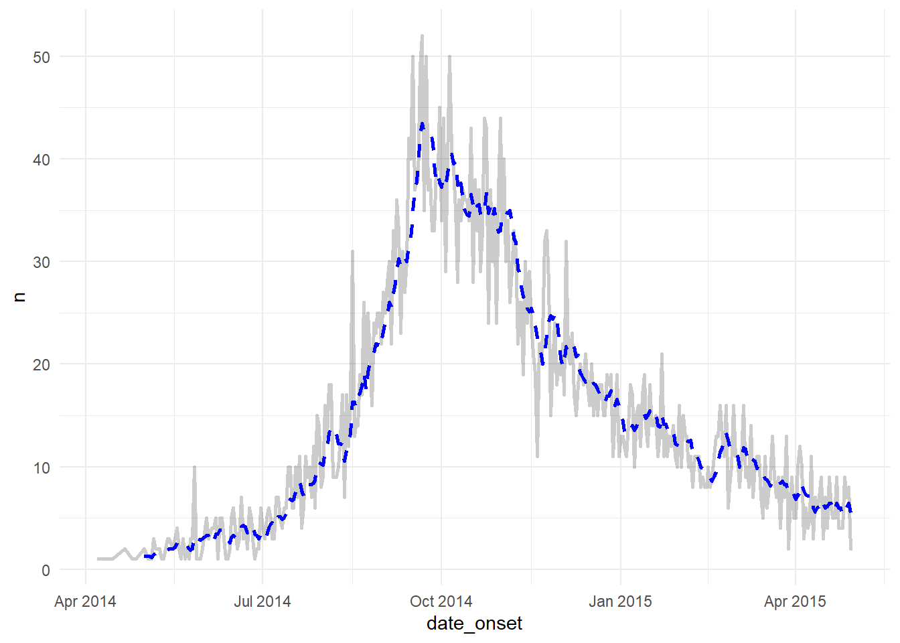

# output: bookdown::gitbook:

Placeholder


## Dịch tễ học ứng dụng và y tế công cộng với R {.unnumbered}
## Sổ tay này được sử dụng như thế nào {.unnumbered}
## Lời cảm ơn {.unnumbered}
### Những người đóng góp {.unnumbered}
### Tài trợ và hỗ trợ {.unnumbered}
### Cảm hứng {.unnumbered}
## Điều khoản sử dụng và đóng góp {.unnumbered}
### Giấy phép {.unnumbered}
### Trích dẫn {.unnumbered}
### Đóng góp {.unnumbered}

<!--chapter:end:index.Rmd-->

# (PART) Về cuốn sách này {.unnumbered}


<!--chapter:end:new_pages/cat_about_book.Rmd-->


# Biên tập và ghi chú kỹ thuật {#editorial-style}

Placeholder


## Cách tiếp cận và phong cách
### R packages {.unnumbered}
### Phong cách viết code {.unnumbered}
### Danh pháp {.unnumbered}
### Lưu ý {.unnumbered}
## Quyết định biên tập
## Các bản sửa đổi chính
## Thông tin phiên làm việc (R, RStudio, packages)

<!--chapter:end:new_pages/editorial_style.Rmd-->


# Tải sách và dữ liệu {#data-used}

Placeholder


## Tải sách ngoại tuyến
### Sử dụng link download {.unnumbered}
### Sử dụng package của chúng tôi {.unnumbered}
## Tải dữ liệu xuống để tiện theo dõi
### Sử dụng package của chúng tôi {.unnumbered}
### Tải từng thứ một {.unnumbered}
#### Dữ liệu linelist {.unnumbered}
#### Dữ liệu số trường hợp sốt rét {#data_malaria .unnumbered}
#### Dữ liệu thang đo Likert {.unnumbered}
#### Flexdashboard {.unnumbered}
#### Truy vết tiếp xúc {.unnumbered}
#### GIS {.unnumbered}
#### Cây phả hệ {.unnumbered}
#### Chuẩn hóa {.unnumbered}
#### Chuỗi thời gian và phát hiện ổ dịch {#data_outbreak .unnumbered}
#### Phân tích sống còn {#data_survey .unnumbered}
#### Shiny {#data_shiny .unnumbered}

<!--chapter:end:new_pages/data_used.Rmd-->

# (PART) Nhập môn về R {.unnumbered}


<!--chapter:end:new_pages/cat_basics.Rmd-->


# R Cơ bản {#basics}

Placeholder


## Tại sao sử dụng R?
## Các thuật ngữ chính
## Tài nguyên học liệu {#learning}
### Tài nguyên trong RStudio {.unnumbered}
### Cheatsheets {.unnumbered}
### Twitter {.unnumbered}
### Nguồn tài nguyên trực tuyến miễn phí {.unnumbered}
### Các ngôn ngữ khác ngoài Tiếng Anh {.unnumbered}
## Cài đặt
### R và RStudio {.unnumbered}
### Những phần mềm khác bạn *có thể* cần cài đặt {.unnumbered}
#### TinyTex {.unnumbered}
#### Pandoc {.unnumbered}
#### RTools {.unnumbered}
#### phantomjs {.unnumbered}
## RStudio {#rstudio}
### Làm quen {.unnumbered}
### Các cài đặt của RStudio {.unnumbered}
### Các phím tắt {.unnumbered}
## Hàm {#functions}
### Các hàm cơ bản {.unnumbered}
### Hàm với nhiều đối số {.unnumbered}
### Viết hàm {.unnumbered}
## Packages {#packages}
### Cài đặt và Gọi {.unnumbered}
#### Thư viện của bạn {.unnumbered}
#### Cài đặt từ CRAN {.unnumbered}
#### Làm thế nào để cài đặt và gọi {.unnumbered}
### Cú pháp code {.unnumbered}
### Trợ giúp về hàm {.unnumbered}
### Cập nhật packages {.unnumbered}
### Xóa packages {.unnumbered}
### Sự phụ thuộc {.unnumbered}
### Hàm bị che giấu {.unnumbered}
### Gỡ package {.unnumbered}
### Cài đặt phiên bản cũ hơn {.unnumbered}
### Packages đề xuất {.unnumbered}
## Scripts {#scripts}
### Bình luận {.unnumbered}
### Phong cách viết code {.unnumbered}
### Ví dụ về Script {.unnumbered}
### R markdown {.unnumbered}
### R notebooks {.unnumbered}
### Shiny {.unnumbered}
### Thu gọn Code {.unnumbered}
## Thư mục làm việc
### Gợi ý cách tiếp cận {.unnumbered}
### Thiết lập bằng lệnh {.unnumbered}
### Thiết lập thủ công {.unnumbered}
### Thiết lập bên trong một dự án R {.unnumbered}
### Thư mục làm việc với R markdown {.unnumbered}
### Cung cấp đường dẫn tệp {.unnumbered}
## Đối tượng {#objects}
### Mọi thứ đều là một đối tượng {.unnumbered}
### Định nghĩa một đối tượng (`<-`) {.unnumbered}
### Cấu trúc đối tượng {#objectstructure}
### Kiểu đối tượng {.unnumbered}
### Cột / Biến số (`$`) {.unnumbered}
### Truy cập / indexing đối tượng bằng dấu ngoặc vuông (`[ ]`) {.unnumbered}
### Xóa đối tượng {.unnumbered}
## Piping (`%>%`)
### **Pipes** {.unnumbered}
### Định nghĩa đối tượng trung gian {.unnumbered}
## Các toán tử và hàm chính {#operators}
### Toán tử gán {.unnumbered}
### Toán tử quan hệ và logic {.unnumbered}
### Giá trị Missing {.unnumbered}
### Toán học và thống kê
#### Toán tử toán học {.unnumbered}
#### Các hàm toán học {.unnumbered}
#### Ký hiệu khoa học {.unnumbered}
#### Làm tròn {.unnumbered}
#### Các hàm thống kê {.unnumbered}
#### Một số hàm hữu ích khác {.unnumbered}
### `%in%` {.unnumbered}
## Lỗi và cảnh báo
### Lỗi và Cảnh báo {.unnumbered}
### Mẹo cú pháp chung {.unnumbered}
### Trợ giúp viết code {.unnumbered}

<!--chapter:end:new_pages/basics.Rmd-->


# Chuyển đổi sang R {#transition-to-R}

Placeholder


## Từ Excel
### Lợi ích {.unnumbered}
### Tidy data {.unnumbered}
### Hàm {.unnumbered}
### Script {.unnumbered}
### Tài liệu liên quan đến chuyển đổi từ Excel-sang-R {.unnumbered}
### Tương tác giữa R và Excel {.unnumbered}
## Từ Stata
## Từ SAS
## Khả năng tương tác dữ liệu

<!--chapter:end:new_pages/transition_to_R.Rmd-->


# Package đề xuất {#packages-suggested}

Placeholder


## Packages từ CRAN  
## Packages từ Github  

<!--chapter:end:new_pages/packages_suggested.Rmd-->


# Dự án R {#r-projects}  

Placeholder


## Gợi ý sử dụng  
## Tạo một dự án R {}
### Di chuyển giữa các dự án {.unnumbered}
### Thiết lập {.unnumbered}  
### Tổ chức {.unnumbered}  
### Kiểm soát phiên bản {.unnumbered}  
## Các ví dụ  
## Nguồn {}

<!--chapter:end:new_pages/r_projects.Rmd-->


# Nhập xuất dữ liệu {#importing}

Placeholder


## Tổng quan
## Package **rio**
## Package **here** {#here}
## Đường dẫn tệp
### Đường dẫn tệp "tương đối" {.unnumbered}
### Đường dẫn tệp "tuyệt đối" {.unnumbered}
### Chọn tệp theo cách thủ công {.unnumbered}
## Nhập dữ liệu
### Trang tính Excel cụ thể {.unnumbered}
### Giá trị missing {#import_missing .unnumbered}
### Bỏ qua một số hàng {.unnumbered}
### Quản lý hàng tiêu đề thứ hai {.unnumbered}
### Xóa hàng tiêu đề thứ hai {.unnumbered}
#### Tạo từ điển dữ liệu {.unnumbered}
#### Kết hợp hai hàng tiêu đề {.unnumbered}
### Trang tính Google {.unnumbered}
## Nhập, xuất, tách, kết hợp - nhiều tệp
## Nhập từ Github {#import_github}
### Tệp CSV {.unnumbered}
### Tệp XLSX {.unnumbered}
### Shapefiles {.unnumbered}
## Nhập dữ liệu thủ công
### Nhập theo hàng {.unnumbered}
### Nhập theo cột {.unnumbered}
### Dán từ clipboard {.unnumbered}
## Nhập tệp gần đây nhất
### Ngày trong tên tệp {.unnumbered}
### Sử dụng thông tin tệp {.unnumbered}
## API {#import_api}
### Yêu cầu HTTP (HTTP request) {.unnumbered}
### Package {.unnumbered}
### Dữ liệu công khai {.unnumbered}
### Yêu cầu xác thực {.unnumbered}
## Xuất dữ liệu
### Với package **rio** {.unnumbered}
### Tới clipboard {.unnumbered}
## Tệp RDS {#import_rds}
## Tệp và danh sách Rdata {#import_rdata}
## Lưu biểu đồ
## Tài nguyên học liệu

<!--chapter:end:new_pages/importing.Rmd-->

# (PART) Quản lý dữ liệu {.unnumbered}


<!--chapter:end:new_pages/cat_data_management.Rmd-->


# Làm sạch số liệu và các hàm quan trọng {#cleaning}

Placeholder


### Các hàm quan trọng {.unnumbered}
### Thuật ngữ {.unnumbered}
## Quy trình làm sạch
## Gọi package
## Nhập dữ liệu
### Nhập {.unnumbered}
### Đánh giá {.unnumbered}
## Tên cột
### Làm sạch tự động {.unnumbered}
### Làm sạch tên cột thủ công {.unnumbered}
#### Thay đối tên cột theo vị trí {.unnumbered}
#### Đổi tên bằng hàm `select()` và `summarise()` {.unnumbered}
### Các thách thức khác {.unnumbered}
#### Cột trống tên trên file Excel {.unnumbered}
#### Hợp nhất tên cột và ô Excel {.unnumbered}
## Chọn hoặc đổi vị trí cột
### Giữ cột {.unnumbered}
### Hàm trợ giúp "tidyselect" {#clean_tidyselect .unnumbered}
### Xóa cột {.unnumbered}
### Hoạt động độc lập {.unnumbered}
#### Thêm vào quy trình làm sạch {.unnumbered}
## Loại bỏ trùng lặp
## Tạo và biến đổi cột
### Tạo cột mới {.unnumbered}
### Chuyển đổi kiểu dữ liệu của cột {.unnumbered}
### Dữ liệu được nhóm {.unnumbered}
### Biến đổi nhiều cột {#clean_across .unnumbered}
#### Lựa chọn cột với hàm `across()` {.unnumbered}
#### Hàm `across()` {.unnumbered}
### Hàm `coalesce()` {.unnumbered}
### Toán lũy tích {.unnumbered}
### Sử dụng **base** R {.unnumbered}
### Thêm vào chuỗi pipe {.unnumbered}
## Mã hóa lại giá trị
### Giá trị cụ thể {.unnumbered}
### Theo logic {.unnumbered}
### Logic đơn giản {.unnumbered}
#### `replace()` {.unnumbered}
#### `ifelse()` và `if_else()` {.unnumbered}
### Logic phức tạp {#clean_case_when .unnumbered}
### Giá trị missing {.unnumbered}
### Từ điển làm sạch {.unnumbered}
#### Thêm vào chuỗi làm sạch {.unnumbered}
## Biến danh mục số {#num_cats}
### Đánh giá phân phối {.unnumbered}
### `age_categories()` {.unnumbered}
### `cut()` {.unnumbered}
### Chia khoảng phân vị {.unnumbered}
### Nhóm có khoảng đều {.unnumbered}
### `case_when()` {.unnumbered}
### Thêm vào chuỗi làm sạch {.unnumbered}
## Thêm hàng
### Thêm từng hàng một {.unnumbered}
### Nối các hàng {.unnumbered}
## Lọc hàng
### Lọc đơn giản {.unnumbered}
### Lọc bỏ các giá trị missing {.unnumbered}
### Lọc bằng số thứ tự của hàng {.unnumbered}
### Lọc phức tạp {.unnumbered}
#### Kiểm tra dữ liệu {.unnumbered}
#### Cách lọc và xử lý các giá trị số và ngày bị missing {.unnumbered}
#### Thiết kế bộ lọc {.unnumbered}
### Độc lập {.unnumbered}
### Xem nhanh các bản ghi {.unnumbered}
#### Thêm vào chuỗi làm sạch {.unnumbered}
## Tính toán theo hàng
## Sắp xếp

<!--chapter:end:new_pages/cleaning.Rmd-->


# Làm việc với ngày tháng {#dates}

Placeholder


## Chuẩn bị
### Gọi packages {.unnumbered}  
### Nhập dữ liệu {.unnumbered}  
## Ngày hiện tại  
## Chuyển đổi sang Ngày  
### **base** R {.unnumbered}  
### **lubridate** {.unnumbered}  
### Kết hợp các cột {.unnumbered}  
## Ngày tháng trong Excel
## Ngày lộn xộn  
## Làm việc với kiểu dữ liệu ngày-giờ  
### Chuyển đổi ngày giờ {.unnumbered}  
### Chỉ chuyển đổi thời gian {.unnumbered}  
### Thời gian chính xác {.unnumbered}  
## Làm việc với ngày   
### Trích xuất các cấu phần của ngày {.unnumbered}  
### Tính toán ngày {.unnumbered}  
### Khoảng ngày {.unnumbered}  
## Hiển thị ngày  
### `format()` {.unnumbered}  
### Tháng-Năm {.unnumbered}  
## Tuần dịch tễ học {#dates_epi_wks}
### **lubridate** {.unnumbered}  
### Đếm theo tuần {.unnumbered}  
### Các thay thế cho tuần dịch tễ học {.unnumbered}  
## Chuyển đổi múi ngày giờ
## Phép toán về khoảng thời gian  
## Nguồn  

<!--chapter:end:new_pages/dates.Rmd-->


# Ký tự và chuỗi {#characters-strings}  

Placeholder


## Preparation { }
### Load packages {.unnumbered}  
### Import data  {.unnumbered}  
## Unite, split, and arrange { }
### Combine strings {.unnumbered}
### Dynamic strings {.unnumbered}
### Unite columns  {#str_unite .unnumbered}
### Split {.unnumbered}  
### Split columns {.unnumbered}  
### Arrange alphabetically {.unnumbered} 
### base R functions {.unnumbered}
## Clean and standardise  
### Change case {.unnumbered}
### Pad length  {#str_pad .unnumbered}
### Truncate {.unnumbered} 
### Standardize length {.unnumbered}
### Remove leading/trailing whitespace {.unnumbered}  
### Remove repeated whitespace within {.unnumbered}  
### Wrap into paragraphs {.unnumbered}  
## Handle by position { }
### Extract by character position {.unnumbered}  
### Extract by word position {.unnumbered} 
### Replace by character position {.unnumbered} 
### Evaluate length  {.unnumbered}
## Patterns { }
### Detect a pattern {.unnumbered}
#### Convert commas to periods {.unnumbered}  
### Replace all {.unnumbered}  
### Detect within logic {.unnumbered}
### Locate pattern position {.unnumbered}  
### Extract a match {.unnumbered}  
### Subset and count {.unnumbered}  
### Regex groups {.unnumbered}
## Special characters  
## Regular expressions (regex) 
## Regex and special characters { } 
## Resources { }

<!--chapter:end:new_pages/characters_strings.Rmd-->


# Factors {#factors}

Placeholder


## Chuẩn bị
### Gọi packages {.unnumbered}
### Nhập dữ liệu {.unnumbered}
### Thêm biến danh mục mới {#fct_newcat .unnumbered}
#### Tạo biến {.unnumbered}
#### Thứ tự mặc định của các giá trị {.unnumbered}
## Chuyển đổi sang factor
## Thêm hoặc xóa thứ bậc
### Thêm thứ bậc {#fct_add .unnumbered}
### Xóa thứ bậc {.unnumbered}
## Thay đổi trật tự của các thứ bậc {#fct_adjust}
### Thay đổi thủ công {.unnumbered}
### Đối với biểu đồ {.unnumbered}
### Đảo ngược thứ tự {.unnumbered}
### Theo tần suất {.unnumbered}
### Theo sự xuất hiện {.unnumbered}
### Theo thống kê tóm tắt của một cột khác {.unnumbered}
### Theo giá trị cuối {.unnumbered}
## Giá trị Missing {#fct_missing}
## Kết hợp các thứ bậc trong biến factor
### Kết hợp thủ công {.unnumbered}
### Rút gọn thành "Other" {.unnumbered}
### Rút gọn theo tần suất {.unnumbered}
## Hiển thị tất cả thứ bậc
### Trong biểu đồ {.unnumbered}
### Trong bảng {.unnumbered}
## Tuần dịch tễ
### Tuần dịch tễ trong biểu đồ {.unnumbered}
### Tuần dịch tễ trong dữ liệu {.unnumbered}
## Nguồn tham khảo

<!--chapter:end:new_pages/factors.Rmd-->


# Xoay trục dữ liệu {#pivoting}

Placeholder


## Chuẩn bị
### Gọi package {.unnumbered}
### Nhập dữ liệu {.unnumbered}
### Dữ liệu số trường hợp sốt rét {.unnumbered}
### Bộ dữ liệu các trường hợp `linelist` {.unnumbered}
## Định dạng dữ liệu "ngang-sang-dọc"
### Định dạng "ngang" {.unnumbered}
### `pivot_longer()` {.unnumbered}
### Xoay trục tiêu chuẩn {.unnumbered}
### Xoay trục dữ liệu trên nhiều định dạng cột {.unnumbered}
## Dọc-thành-ngang
### Dữ liệu {.unnumbered}
### Xoay trục ngang {.unnumbered}
## Điền
### Dữ liệu {.unnumbered}
### `fill()` {.unnumbered}
## Tài liệu tham khảo

<!--chapter:end:new_pages/pivoting.Rmd-->


# Nhóm dữ liệu {#grouping}

Placeholder


## Chuẩn bị
### Gọi package {.unnumbered}
### Nạp dữ liệu {.unnumbered}
## Nhóm
### Nhóm duy nhất {.unnumbered}
### Cột mới {.unnumbered}
### Thêm/bỏ cột-nhóm {.unnumbered}
## Giữ tất cả các nhóm
## Loại bỏ nhóm
## Tổng hợp (Summarise) {#group_summarise}
## Counts and tallies
### `tally()` {.unnumbered}
### `count()` {.unnumbered}
### Thêm giá trị đếm {.unnumbered}
### Thêm giá trị tổng {.unnumbered}
## Nhóm theo ngày
### Ngày trong bộ số liệu `linelist` {.unnumbered}
### Tuần trong bộ số liệu `linelist` {.unnumbered}
### Tháng trong bộ số liệu `linelist` {.unnumbered}
### Đếm ngày trong tuần {.unnumbered}
### Đếm ngày trong tháng {.unnumbered}
## Sắp xếp dữ liệu đã nhóm
## Lọc trên nhóm dữ liệu đã nhóm
### `filter()` {.unnumbered}
### Cắt hàng theo nhóm {.unnumbered}
### Lọc trên quy mô nhóm {#group_filter_grp_size .unnumbered}
## Thay đổi trên dữ liệu được nhóm
## Chọn trên dữ liệu được nhóm
## Tham khảo

<!--chapter:end:new_pages/grouping.Rmd-->


# Nối dữ liệu {#joining-matching}

Placeholder


## Chuẩn bị
### Gọi package {.unnumbered}
### Nhập dữ liệu {.unnumbered}
### Bộ dữ liệu mẫu {.unnumbered}
#### Dữ liệu linelist "thu nhỏ" {#joins_llmini .unnumbered}
#### Data frame thông tin bệnh viện {#joins_hosp_info .unnumbered}
### Làm sạch trước {.unnumbered}
## **Nối bằng dplyr**
### Cú pháp chung {.unnumbered}
### Nối trái và phải {.unnumbered}
#### "Tôi nên sử dụng phép nối phải hay phép nối trái?" {.unnumbered}
### Nối hoàn toàn {.unnumbered}
### Nối bên trong {.unnumbered}
### Nối một phần {.unnumbered}
### Anti join {.unnumbered}
#### Ví dụ `anti_join()` đơn giản {.unnumbered}
#### Ví dụ `anti_join()` phức tạp {.unnumbered}
## Khớp theo xác suất
### Khớp theo xác suất {.unnumbered}
### Loại bỏ trùng lặp theo xác suất {.unnumbered}
## Gắn vào và căn chỉnh
### Gắn các hàng {.unnumbered}
### Gắn các cột {.unnumbered}
#### Sử dụng `match()` để sắp xếp thứ tự {.unnumbered}
## Tài nguyên học liệu

<!--chapter:end:new_pages/joining_matching.Rmd-->


# Loại bỏ trùng lặp {#deduplication}

Placeholder


## Chuẩn bị
### Gọi package {.unnumbered}
### Nhập dữ liệu {.unnumbered}
#### Đây là data frame {#dedup_data .unnumbered}
## Loại bỏ trùng lặp
### Kiểm tra hàng trùng lặp {.unnumbered}
### Chỉ giữ lại các hàng duy nhất {.unnumbered}
### Loại bỏ phần tử trùng lặp trong một vectơ {.unnumbered}
### Sử dụng **base** R {.unnumbered}
## Cắt dòng
### Cắt theo nhóm {.unnumbered}
### Giữ lại tất cả nhưng đánh dấu các dòng {.unnumbered}
### Tính toán độ hoàn chỉnh của hàng {.unnumbered}
## Gộp các giá trị {#str_rollup}
### Gộp các giá trị thành một hàng {.unnumbered}
### Ghi đè các giá trị/hệ thống phân cấp {.unnumbered}
## Loại bỏ trùng lặp theo xác suất
## Tài nguyên học liệu

<!--chapter:end:new_pages/deduplication.Rmd-->


# Lặp, vòng lặp, và danh sách {#iteration}  

Placeholder


## Chuẩn bị {  }
### Load packages {.unnumbered}  
### Import data {.unnumbered}  
## *for loops* {  }
### *for loops* in R {#iter_loops .unnumbered}  
### Core components {.unnumbered}   
### Sequence {.unnumbered}  
### Operations  {.unnumbered}  
### Container {.unnumbered}
### Printing {.unnumbered}  
### Testing your for loop {.unnumbered}
### Looping plots {.unnumbered}
### Tracking progress of a loop {.unnumbered} 
## **purrr** and lists {#iter_purrr}
### Load packages {.unnumbered}  
### `map()` {.unnumbered}  
#### Example - import and combine Excel sheets {#iter_combined .unnumbered}  
### Split dataset and export {.unnumbered}  
#### Split dataset {.unnumbered}  
##### More than one `group_split()` column {.unnumbered}  
#### Export as Excel sheets {.unnumbered}  
#### Export as CSV files {.unnumbered}  
### Custom functions {.unnumbered}  
### Mapping a function across columns {.unnumbered}  
### Extract from lists {.unnumbered}  
#### Names of elements {.unnumbered}  
#### Elements by name or position {.unnumbered}  
#### `pluck()` {.unnumbered}  
### Convert list to data frame {.unnumbered}  
### Discard, keep, and compact lists {.unnumbered}  
### `pmap()` {.unnumbered}
## Apply functions  
## Resources { }

<!--chapter:end:new_pages/iteration.Rmd-->

# (PART) Phân tích dữ liệu {.unnumbered}


<!--chapter:end:new_pages/cat_analysis.Rmd-->


# Bảng mô tả {#tables-descriptive}

Placeholder


## Chuẩn bị
### Gọi packages {.unnumbered}
### Nhập dữ liệu {.unnumbered}
## Duyệt dữ liệu
### **skimr** package {.unnumbered}
### Thống kê tóm tắt {.unnumbered}
## **janitor** package {#tbl_janitor}
### tabyl đơn giản {.unnumbered}
### Bảng chéo {.unnumbered}
### "Tô điểm" cho tabyl {#tbl_adorn .unnumbered}
### In với tabyl {.unnumbered}
### Sử dụng trên các bảng khác {.unnumbered}
### Lưu với tabyl {.unnumbered}
### Thống kê {#janitor_age_out_stats .unnumbered}
### Các mẹo khác {.unnumbered}
## **dplyr** package
### Lấy số lượng {.unnumbered}
### Hiện tất cả các cấp độ {.unnumbered}
### Tỷ lệ {#tbl_dplyr_prop .unnumbered}
### Vẽ biểu đồ {.unnumbered}
### Tổng hợp thống kê {.unnumbered}
### Thống kê có điều kiện {.unnumbered}
### Gắn với nhau {.unnumbered}
#### Bách phân vị {.unnumbered}
### Tóm tắt dữ liệu tổng hợp {.unnumbered}
### `across()` trên nhiều cột {.unnumbered}
### Xoay trục ngang (Pivot wider) {#tbls_pivot_wider .unnumbered}
### Tổng các hàng {#tbl_dplyr_totals .unnumbered}
#### **janitor**'s `adorn_totals()` {.unnumbered}
#### `summarise()` trên dữ liệu "tổng" rồi sau đó `bind_rows()` {.unnumbered}
## **gtsummary** package {#tbl_gt}
### Bảng tổng hợp {.unnumbered}
### Các điều chỉnh {.unnumbered}
### Thống kê nhiều dòng cho các biến liên tục {.unnumbered}
## **base** R
### Tỷ lệ {.unnumbered}
### Tổng {.unnumbered}
### Chuyển đổi thành data frame {.unnumbered}
## Nguồn

<!--chapter:end:new_pages/tables_descriptive.Rmd-->


# Các kiểm định thống kê cơ bản {#stat-tests}

Placeholder


## Các bước chuẩn bị {  }
### Gọi các packages {.unnumbered}
### Nhập số liệu {.unnumbered}
## Các kiểm định trong **base** R {}
### Kiểm định t {.unnumbered} 
### Kiểm định Shapiro-Wilk {.unnumbered}  
### Kiểm định tổng thứ hạng Wilcoxon {.unnumbered}
### Kiểm định Kruskal-Wallis {.unnumbered}
### Kiểm định Chi bình phương {.unnumbered} 
## **rstatix** package {}
### Tóm tắt thống kê {.unnumbered}  
### Kiểm định t {.unnumbered}  
### Kiểm định Shapiro-Wilk {.unnumbered}  
### Kiểm định tổng thứ hạng Wilcoxon {.unnumbered}  
### Kiểm định Kruskal-Wallis {.unnumbered}  
### Kiểm định Chi bình phương {.unnumbered}  
## `gtsummary` package {#stats_gt}
### Kiểm định Chi bình phương {.unnumbered}
### Kiểm định t {.unnumbered} 
### Kiểm định tổng thứ hạng Wilcoxon {.unnumbered}
### Kiểm định Kruskal-wallis {.unnumbered}
## Tương quan 
## Nguồn {  }

<!--chapter:end:new_pages/stat_tests.Rmd-->


# Hồi quy đơn và đa biến {#regression}

Placeholder


## Chuẩn bị
### Gọi packages {.unnumbered}
### Nhập số liệu {.unnumbered}
### Làm sạch số liệu {.unnumbered}
#### Lưu trữ các biến giải thích {.unnumbered}
#### Chuyển đổi sang số 1 và số 0 {.unnumbered}
#### Loại bỏ các hàng có giá trị missing {.unnumbered}
## Phân tích đơn biến
### **base** R {.unnumbered}
#### Hồi quy tuyến tính {.unnumbered}
#### Hồi quy Logistic {.unnumbered}
#### Phân tích đơn biến sử dụng `glm()` {.unnumbered}
#### In kết quả {.unnumbered}
#### Vòng lặp cho nhiều mô hình đơn biến {.unnumbered}
### **gtsummary** package {#reg_gt_uni .unnumbered}
## Phân tích phân tầng
## Phân tích đa biến
### Thực hiện phân tích đa biến {.unnumbered}
#### Xây dựng mô hình {.unnumbered}
### Gộp kết quả phân tích đơn biến và đa biến {.unnumbered}
#### Gộp bằng package **gtsummary** {.unnumbered}
#### Gộp bằng package **dplyr** {.unnumbered}
## Biểu đồ Forest plot
### **ggplot2** package {.unnumbered}
### **easystats** packages {.unnumbered}
## Nguồn

<!--chapter:end:new_pages/regression.Rmd-->


# Dữ liệu Missing {#missing-data}

Placeholder


## Preparation { }
### Load packages {.unnumbered}  
### Import data {.unnumbered}
### Convert missing on import {.unnumbered}  
## Missing values in R { }
### `NA` {.unnumbered}  
### Versions of `NA` {.unnumbered}  
### `NULL` {.unnumbered}  
### `NaN` {.unnumbered}  
### `Inf` {.unnumbered}  
### Examples {.unnumbered}  
## Useful functions { }
### `is.na()` and `!is.na()` {.unnumbered}  
### `na.omit()` {.unnumbered}  
### `drop_na()` {.unnumbered}  
### `na.rm = TRUE` {.unnumbered}  
## Assess missingness in a data frame { }
### Quantifying missingness {.unnumbered}
### Visualizing missingness {.unnumbered}  
### Explore and visualize missingness relationships {.unnumbered} 
### "Shadow" columns {.unnumbered}
## Using data with missing values  
### Filter out rows with missing values {.unnumbered}
### Handling `NA` in `ggplot()` {.unnumbered}
### `NA` in factors {.unnumbered}
## Imputation { }
### Types of missing data {.unnumbered}
### Useful packages {.unnumbered}
### Mean Imputation {.unnumbered}
### Regression imputation {.unnumbered}
### LOCF and BOCF {.unnumbered}
### Multiple Imputation {.unnumbered}
## Resources { }

<!--chapter:end:new_pages/missing_data.Rmd-->


# Tỷ suất chuẩn hóa {#standardization}  

Placeholder


## Tổng quan  
## Chuẩn bị {  }
### Gọi packages {.unnumbered}
### Tải số liệu dân số {.unnumbered}  
### Tải số liệu tử vong {.unnumbered}  
### Làm sạch số liệu dân số và tử vong {.unnumbered}  
### Tải dân số tham chiếu {.unnumbered}  
### Làm sach dân số tham chiếu {.unnumbered}
### Tạo bộ số liệu với dân số chuẩn {#standard_all .unnumbered}  
## Package **dsr** {  }
### Tỷ suất chuẩn hóa {.unnumbered}
### Tỷ số của các tỷ suất chuẩn hóa {.unnumbered}
### Khác biệt của các tỷ suất chuẩn hóa {.unnumbered}
## Package **PHEindicatormethods** {#standard_phe  }
### Tỷ suất chuẩn hóa trực tiếp {.unnumbered}
### Tỷ suất chuẩn hóa gián tiếp {#standard_indirect .unnumbered}
## Tài nguyên học liệu {  }

<!--chapter:end:new_pages/standardization.Rmd-->

# Đường trung bình động {#moving-average}


Chương này bao gồm hai phương pháp tính toán và biểu diễn đường trung bình động:

1)  Tính toán với package **slider**\
2)  Tính toán *bên trong* lệnh `ggplot()` với package **tidyquant**

<!-- ======================================================= -->

## Chuẩn bị

### Gọi package {.unnumbered}

Đoạn code này hiển thị những package cần tải cho các phân tích. Trong sổ tay này, chúng tôi nhấn mạnh đến hàm `p_load()` từ **pacman**, hàm sẽ cài đặt package nếu cần *và* gọi nó ra để sử dụng. Bạn cũng có thể gọi các package đã cài đặt với `library()` từ **base** R. Xem chương [R cơ bản] để có thêm thông tin về các R package.


```r
pacman::p_load(
  tidyverse,      # for data management and viz
  slider,         # for calculating moving averages
  tidyquant       # for calculating moving averages within ggplot
)
```

### Nhập dữ liệu {.unnumbered}

Chúng ta nhập các trường hợp trong linelist đã được làm sạch từ một vụ dịch Ebola mô phỏng. Nếu bạn muốn theo dõi, [bấm để tải xuống linelist "đã được làm sạch"](https://github.com/appliedepi/epirhandbook_eng/raw/master/data/case_linelists/linelist_cleaned.rds) (tệp .rds). Nhập dữ liệu với hàm `import()` từ package **rio** (hàm này xử lý nhiều loại tệp như .xlsx, .csv, .rds - xem chương [Nhập xuất dữ liệu] để biết thêm chi tiết).


```r
# import the linelist
linelist <- import("linelist_cleaned.xlsx")
```

50 hàng đầu tiên của linelist được hiển thị dưới đây.


```{=html}
<div id="htmlwidget-612b2eeeaa856b5f64ec" style="width:100%;height:auto;" class="datatables html-widget"></div>
<script type="application/json" data-for="htmlwidget-612b2eeeaa856b5f64ec">{"x":{"filter":"top","filterHTML":"<tr>\n  <td data-type=\"character\" style=\"vertical-align: top;\">\n    <div class=\"form-group has-feedback\" style=\"margin-bottom: auto;\">\n      <input type=\"search\" placeholder=\"All\" class=\"form-control\" style=\"width: 100%;\"/>\n      <span class=\"glyphicon glyphicon-remove-circle form-control-feedback\"><\/span>\n    <\/div>\n  <\/td>\n  <td data-type=\"number\" style=\"vertical-align: top;\">\n    <div class=\"form-group has-feedback\" style=\"margin-bottom: auto;\">\n      <input type=\"search\" placeholder=\"All\" class=\"form-control\" style=\"width: 100%;\"/>\n      <span class=\"glyphicon glyphicon-remove-circle form-control-feedback\"><\/span>\n    <\/div>\n    <div style=\"display: none; position: absolute; width: 200px;\">\n      <div data-min=\"2\" data-max=\"13\"><\/div>\n      <span style=\"float: left;\"><\/span>\n      <span style=\"float: right;\"><\/span>\n    <\/div>\n  <\/td>\n  <td data-type=\"date\" style=\"vertical-align: top;\">\n    <div class=\"form-group has-feedback\" style=\"margin-bottom: auto;\">\n      <input type=\"search\" placeholder=\"All\" class=\"form-control\" style=\"width: 100%;\"/>\n      <span class=\"glyphicon glyphicon-remove-circle form-control-feedback\"><\/span>\n    <\/div>\n    <div style=\"display: none; position: absolute; width: 200px;\">\n      <div data-min=\"1399075200000\" data-max=\"1406419200000\"><\/div>\n      <span style=\"float: left;\"><\/span>\n      <span style=\"float: right;\"><\/span>\n    <\/div>\n  <\/td>\n  <td data-type=\"date\" style=\"vertical-align: top;\">\n    <div class=\"form-group has-feedback\" style=\"margin-bottom: auto;\">\n      <input type=\"search\" placeholder=\"All\" class=\"form-control\" style=\"width: 100%;\"/>\n      <span class=\"glyphicon glyphicon-remove-circle form-control-feedback\"><\/span>\n    <\/div>\n    <div style=\"display: none; position: absolute; width: 200px;\">\n      <div data-min=\"1399939200000\" data-max=\"1407024000000\"><\/div>\n      <span style=\"float: left;\"><\/span>\n      <span style=\"float: right;\"><\/span>\n    <\/div>\n  <\/td>\n  <td data-type=\"date\" style=\"vertical-align: top;\">\n    <div class=\"form-group has-feedback\" style=\"margin-bottom: auto;\">\n      <input type=\"search\" placeholder=\"All\" class=\"form-control\" style=\"width: 100%;\"/>\n      <span class=\"glyphicon glyphicon-remove-circle form-control-feedback\"><\/span>\n    <\/div>\n    <div style=\"display: none; position: absolute; width: 200px;\">\n      <div data-min=\"1400025600000\" data-max=\"1407110400000\"><\/div>\n      <span style=\"float: left;\"><\/span>\n      <span style=\"float: right;\"><\/span>\n    <\/div>\n  <\/td>\n  <td data-type=\"date\" style=\"vertical-align: top;\">\n    <div class=\"form-group has-feedback\" style=\"margin-bottom: auto;\">\n      <input type=\"search\" placeholder=\"All\" class=\"form-control\" style=\"width: 100%;\"/>\n      <span class=\"glyphicon glyphicon-remove-circle form-control-feedback\"><\/span>\n    <\/div>\n    <div style=\"display: none; position: absolute; width: 200px;\">\n      <div data-min=\"1400371200000\" data-max=\"1410566400000\"><\/div>\n      <span style=\"float: left;\"><\/span>\n      <span style=\"float: right;\"><\/span>\n    <\/div>\n  <\/td>\n  <td data-type=\"character\" style=\"vertical-align: top;\">\n    <div class=\"form-group has-feedback\" style=\"margin-bottom: auto;\">\n      <input type=\"search\" placeholder=\"All\" class=\"form-control\" style=\"width: 100%;\"/>\n      <span class=\"glyphicon glyphicon-remove-circle form-control-feedback\"><\/span>\n    <\/div>\n  <\/td>\n  <td data-type=\"character\" style=\"vertical-align: top;\">\n    <div class=\"form-group has-feedback\" style=\"margin-bottom: auto;\">\n      <input type=\"search\" placeholder=\"All\" class=\"form-control\" style=\"width: 100%;\"/>\n      <span class=\"glyphicon glyphicon-remove-circle form-control-feedback\"><\/span>\n    <\/div>\n  <\/td>\n  <td data-type=\"number\" style=\"vertical-align: top;\">\n    <div class=\"form-group has-feedback\" style=\"margin-bottom: auto;\">\n      <input type=\"search\" placeholder=\"All\" class=\"form-control\" style=\"width: 100%;\"/>\n      <span class=\"glyphicon glyphicon-remove-circle form-control-feedback\"><\/span>\n    <\/div>\n    <div style=\"display: none; position: absolute; width: 200px;\">\n      <div data-min=\"0\" data-max=\"67\"><\/div>\n      <span style=\"float: left;\"><\/span>\n      <span style=\"float: right;\"><\/span>\n    <\/div>\n  <\/td>\n  <td data-type=\"disabled\" style=\"vertical-align: top;\">\n    <div class=\"form-group has-feedback\" style=\"margin-bottom: auto;\">\n      <input type=\"search\" placeholder=\"All\" class=\"form-control\" style=\"width: 100%;\"/>\n      <span class=\"glyphicon glyphicon-remove-circle form-control-feedback\"><\/span>\n    <\/div>\n  <\/td>\n  <td data-type=\"number\" style=\"vertical-align: top;\">\n    <div class=\"form-group has-feedback\" style=\"margin-bottom: auto;\">\n      <input type=\"search\" placeholder=\"All\" class=\"form-control\" style=\"width: 100%;\"/>\n      <span class=\"glyphicon glyphicon-remove-circle form-control-feedback\"><\/span>\n    <\/div>\n    <div style=\"display: none; position: absolute; width: 200px;\">\n      <div data-min=\"0\" data-max=\"67\"><\/div>\n      <span style=\"float: left;\"><\/span>\n      <span style=\"float: right;\"><\/span>\n    <\/div>\n  <\/td>\n  <td data-type=\"factor\" style=\"vertical-align: top;\">\n    <div class=\"form-group has-feedback\" style=\"margin-bottom: auto;\">\n      <input type=\"search\" placeholder=\"All\" class=\"form-control\" style=\"width: 100%;\"/>\n      <span class=\"glyphicon glyphicon-remove-circle form-control-feedback\"><\/span>\n    <\/div>\n    <div style=\"width: 100%; display: none;\">\n      <select multiple=\"multiple\" style=\"width: 100%;\" data-options=\"[&quot;0-4&quot;,&quot;5-9&quot;,&quot;10-14&quot;,&quot;15-19&quot;,&quot;20-29&quot;,&quot;30-49&quot;,&quot;50-69&quot;,&quot;70+&quot;]\"><\/select>\n    <\/div>\n  <\/td>\n  <td data-type=\"factor\" style=\"vertical-align: top;\">\n    <div class=\"form-group has-feedback\" style=\"margin-bottom: auto;\">\n      <input type=\"search\" placeholder=\"All\" class=\"form-control\" style=\"width: 100%;\"/>\n      <span class=\"glyphicon glyphicon-remove-circle form-control-feedback\"><\/span>\n    <\/div>\n    <div style=\"width: 100%; display: none;\">\n      <select multiple=\"multiple\" style=\"width: 100%;\" data-options=\"[&quot;0-4&quot;,&quot;5-9&quot;,&quot;10-14&quot;,&quot;15-19&quot;,&quot;20-24&quot;,&quot;25-29&quot;,&quot;30-34&quot;,&quot;35-39&quot;,&quot;40-44&quot;,&quot;45-49&quot;,&quot;50-54&quot;,&quot;55-59&quot;,&quot;60-64&quot;,&quot;65-69&quot;,&quot;70-74&quot;,&quot;75-79&quot;,&quot;80-84&quot;,&quot;85+&quot;]\"><\/select>\n    <\/div>\n  <\/td>\n  <td data-type=\"character\" style=\"vertical-align: top;\">\n    <div class=\"form-group has-feedback\" style=\"margin-bottom: auto;\">\n      <input type=\"search\" placeholder=\"All\" class=\"form-control\" style=\"width: 100%;\"/>\n      <span class=\"glyphicon glyphicon-remove-circle form-control-feedback\"><\/span>\n    <\/div>\n  <\/td>\n  <td data-type=\"number\" style=\"vertical-align: top;\">\n    <div class=\"form-group has-feedback\" style=\"margin-bottom: auto;\">\n      <input type=\"search\" placeholder=\"All\" class=\"form-control\" style=\"width: 100%;\"/>\n      <span class=\"glyphicon glyphicon-remove-circle form-control-feedback\"><\/span>\n    <\/div>\n    <div style=\"display: none; position: absolute; width: 200px;\">\n      <div data-min=\"-13.2697246824573\" data-max=\"-13.209391925612\" data-scale=\"13\"><\/div>\n      <span style=\"float: left;\"><\/span>\n      <span style=\"float: right;\"><\/span>\n    <\/div>\n  <\/td>\n  <td data-type=\"number\" style=\"vertical-align: top;\">\n    <div class=\"form-group has-feedback\" style=\"margin-bottom: auto;\">\n      <input type=\"search\" placeholder=\"All\" class=\"form-control\" style=\"width: 100%;\"/>\n      <span class=\"glyphicon glyphicon-remove-circle form-control-feedback\"><\/span>\n    <\/div>\n    <div style=\"display: none; position: absolute; width: 200px;\">\n      <div data-min=\"8.45171855856465\" data-max=\"8.48802917129884\" data-scale=\"14\"><\/div>\n      <span style=\"float: left;\"><\/span>\n      <span style=\"float: right;\"><\/span>\n    <\/div>\n  <\/td>\n  <td data-type=\"character\" style=\"vertical-align: top;\">\n    <div class=\"form-group has-feedback\" style=\"margin-bottom: auto;\">\n      <input type=\"search\" placeholder=\"All\" class=\"form-control\" style=\"width: 100%;\"/>\n      <span class=\"glyphicon glyphicon-remove-circle form-control-feedback\"><\/span>\n    <\/div>\n  <\/td>\n  <td data-type=\"character\" style=\"vertical-align: top;\">\n    <div class=\"form-group has-feedback\" style=\"margin-bottom: auto;\">\n      <input type=\"search\" placeholder=\"All\" class=\"form-control\" style=\"width: 100%;\"/>\n      <span class=\"glyphicon glyphicon-remove-circle form-control-feedback\"><\/span>\n    <\/div>\n  <\/td>\n  <td data-type=\"number\" style=\"vertical-align: top;\">\n    <div class=\"form-group has-feedback\" style=\"margin-bottom: auto;\">\n      <input type=\"search\" placeholder=\"All\" class=\"form-control\" style=\"width: 100%;\"/>\n      <span class=\"glyphicon glyphicon-remove-circle form-control-feedback\"><\/span>\n    <\/div>\n    <div style=\"display: none; position: absolute; width: 200px;\">\n      <div data-min=\"0\" data-max=\"100\"><\/div>\n      <span style=\"float: left;\"><\/span>\n      <span style=\"float: right;\"><\/span>\n    <\/div>\n  <\/td>\n  <td data-type=\"number\" style=\"vertical-align: top;\">\n    <div class=\"form-group has-feedback\" style=\"margin-bottom: auto;\">\n      <input type=\"search\" placeholder=\"All\" class=\"form-control\" style=\"width: 100%;\"/>\n      <span class=\"glyphicon glyphicon-remove-circle form-control-feedback\"><\/span>\n    <\/div>\n    <div style=\"display: none; position: absolute; width: 200px;\">\n      <div data-min=\"11\" data-max=\"241\"><\/div>\n      <span style=\"float: left;\"><\/span>\n      <span style=\"float: right;\"><\/span>\n    <\/div>\n  <\/td>\n  <td data-type=\"number\" style=\"vertical-align: top;\">\n    <div class=\"form-group has-feedback\" style=\"margin-bottom: auto;\">\n      <input type=\"search\" placeholder=\"All\" class=\"form-control\" style=\"width: 100%;\"/>\n      <span class=\"glyphicon glyphicon-remove-circle form-control-feedback\"><\/span>\n    <\/div>\n    <div style=\"display: none; position: absolute; width: 200px;\">\n      <div data-min=\"20\" data-max=\"24\"><\/div>\n      <span style=\"float: left;\"><\/span>\n      <span style=\"float: right;\"><\/span>\n    <\/div>\n  <\/td>\n  <td data-type=\"character\" style=\"vertical-align: top;\">\n    <div class=\"form-group has-feedback\" style=\"margin-bottom: auto;\">\n      <input type=\"search\" placeholder=\"All\" class=\"form-control\" style=\"width: 100%;\"/>\n      <span class=\"glyphicon glyphicon-remove-circle form-control-feedback\"><\/span>\n    <\/div>\n  <\/td>\n  <td data-type=\"character\" style=\"vertical-align: top;\">\n    <div class=\"form-group has-feedback\" style=\"margin-bottom: auto;\">\n      <input type=\"search\" placeholder=\"All\" class=\"form-control\" style=\"width: 100%;\"/>\n      <span class=\"glyphicon glyphicon-remove-circle form-control-feedback\"><\/span>\n    <\/div>\n  <\/td>\n  <td data-type=\"character\" style=\"vertical-align: top;\">\n    <div class=\"form-group has-feedback\" style=\"margin-bottom: auto;\">\n      <input type=\"search\" placeholder=\"All\" class=\"form-control\" style=\"width: 100%;\"/>\n      <span class=\"glyphicon glyphicon-remove-circle form-control-feedback\"><\/span>\n    <\/div>\n  <\/td>\n  <td data-type=\"character\" style=\"vertical-align: top;\">\n    <div class=\"form-group has-feedback\" style=\"margin-bottom: auto;\">\n      <input type=\"search\" placeholder=\"All\" class=\"form-control\" style=\"width: 100%;\"/>\n      <span class=\"glyphicon glyphicon-remove-circle form-control-feedback\"><\/span>\n    <\/div>\n  <\/td>\n  <td data-type=\"character\" style=\"vertical-align: top;\">\n    <div class=\"form-group has-feedback\" style=\"margin-bottom: auto;\">\n      <input type=\"search\" placeholder=\"All\" class=\"form-control\" style=\"width: 100%;\"/>\n      <span class=\"glyphicon glyphicon-remove-circle form-control-feedback\"><\/span>\n    <\/div>\n  <\/td>\n  <td data-type=\"number\" style=\"vertical-align: top;\">\n    <div class=\"form-group has-feedback\" style=\"margin-bottom: auto;\">\n      <input type=\"search\" placeholder=\"All\" class=\"form-control\" style=\"width: 100%;\"/>\n      <span class=\"glyphicon glyphicon-remove-circle form-control-feedback\"><\/span>\n    <\/div>\n    <div style=\"display: none; position: absolute; width: 200px;\">\n      <div data-min=\"35.9\" data-max=\"38\" data-scale=\"1\"><\/div>\n      <span style=\"float: left;\"><\/span>\n      <span style=\"float: right;\"><\/span>\n    <\/div>\n  <\/td>\n  <td data-type=\"character\" style=\"vertical-align: top;\">\n    <div class=\"form-group has-feedback\" style=\"margin-bottom: auto;\">\n      <input type=\"search\" placeholder=\"All\" class=\"form-control\" style=\"width: 100%;\"/>\n      <span class=\"glyphicon glyphicon-remove-circle form-control-feedback\"><\/span>\n    <\/div>\n  <\/td>\n  <td data-type=\"number\" style=\"vertical-align: top;\">\n    <div class=\"form-group has-feedback\" style=\"margin-bottom: auto;\">\n      <input type=\"search\" placeholder=\"All\" class=\"form-control\" style=\"width: 100%;\"/>\n      <span class=\"glyphicon glyphicon-remove-circle form-control-feedback\"><\/span>\n    <\/div>\n    <div style=\"display: none; position: absolute; width: 200px;\">\n      <div data-min=\"0\" data-max=\"428.994082840237\" data-scale=\"14\"><\/div>\n      <span style=\"float: left;\"><\/span>\n      <span style=\"float: right;\"><\/span>\n    <\/div>\n  <\/td>\n  <td data-type=\"number\" style=\"vertical-align: top;\">\n    <div class=\"form-group has-feedback\" style=\"margin-bottom: auto;\">\n      <input type=\"search\" placeholder=\"All\" class=\"form-control\" style=\"width: 100%;\"/>\n      <span class=\"glyphicon glyphicon-remove-circle form-control-feedback\"><\/span>\n    <\/div>\n    <div style=\"display: none; position: absolute; width: 200px;\">\n      <div data-min=\"0\" data-max=\"2\"><\/div>\n      <span style=\"float: left;\"><\/span>\n      <span style=\"float: right;\"><\/span>\n    <\/div>\n  <\/td>\n<\/tr>","data":[["5fe599","8689b7","11f8ea","b8812a","893f25","be99c8","07e3e8","369449","f393b4","1389ca","2978ac","57a565","fc15ef","2eaa9a","bbfa93","c97dd9","f50e8a","3a7673","7f5a01","ddddee","99e8fa","567136","9371a9","bc2adf","403057","8bd1e8","f327be","42e1a9","90e5fe","959170","8ebf6e","e56412","6d788e","a47529","67be4e","da8ecb","148f18","2cb9a5","f5c142","70a9fe","3ad520","062638","c76676","baacc1","497372","23e499","38cc4a","3789ee","c71dcd","6b70f0"],[4,4,2,3,3,3,4,4,4,4,4,4,6,5,6,9,10,8,7,6,7,6,8,6,10,8,6,12,5,8,7,9,11,5,8,5,6,11,7,9,7,8,9,12,13,9,8,10,8,7],["2014-05-08",null,null,"2014-05-04","2014-05-18","2014-05-03","2014-05-22","2014-05-28",null,null,"2014-05-30","2014-05-28","2014-06-14","2014-06-07","2014-06-09",null,null,null,"2014-06-23","2014-06-18","2014-06-24",null,null,"2014-07-03",null,"2014-07-10","2014-06-14",null,"2014-06-18","2014-06-29","2014-07-02","2014-07-12","2014-07-12","2014-06-13","2014-07-15","2014-06-20",null,null,"2014-07-20",null,"2014-07-12","2014-07-19","2014-07-18","2014-07-18","2014-07-27",null,"2014-07-19","2014-07-26","2014-07-24",null],["2014-05-13","2014-05-13","2014-05-16","2014-05-18","2014-05-21","2014-05-22","2014-05-27","2014-06-02","2014-06-05","2014-06-05","2014-06-06","2014-06-13","2014-06-16","2014-06-17","2014-06-18","2014-06-19","2014-06-22","2014-06-23","2014-06-25","2014-06-26","2014-06-28","2014-07-02","2014-07-08","2014-07-09","2014-07-09","2014-07-10","2014-07-12","2014-07-12","2014-07-13","2014-07-13","2014-07-14","2014-07-15","2014-07-16","2014-07-17","2014-07-17","2014-07-18","2014-07-19","2014-07-22","2014-07-22","2014-07-24","2014-07-24","2014-07-25","2014-07-25","2014-07-27","2014-07-29","2014-07-30",null,"2014-08-01","2014-08-02","2014-08-03"],["2014-05-15","2014-05-14","2014-05-18","2014-05-20","2014-05-22","2014-05-23","2014-05-29","2014-06-03","2014-06-06","2014-06-07","2014-06-08","2014-06-15","2014-06-17","2014-06-17","2014-06-20","2014-06-19","2014-06-23","2014-06-24","2014-06-27","2014-06-28","2014-06-29","2014-07-03","2014-07-09","2014-07-09","2014-07-11","2014-07-11","2014-07-13","2014-07-14","2014-07-14","2014-07-13","2014-07-14","2014-07-17","2014-07-17","2014-07-18","2014-07-19","2014-07-20","2014-07-20","2014-07-22","2014-07-24","2014-07-26","2014-07-24","2014-07-27","2014-07-25","2014-07-27","2014-07-31","2014-08-01","2014-08-03","2014-08-02","2014-08-02","2014-08-04"],[null,"2014-05-18","2014-05-30",null,"2014-05-29","2014-05-24","2014-06-01","2014-06-07","2014-06-18","2014-06-09","2014-06-15",null,"2014-07-09",null,"2014-06-30","2014-07-11","2014-07-01","2014-06-25","2014-07-06","2014-07-02","2014-07-09","2014-07-07","2014-07-20",null,"2014-07-22","2014-07-16","2014-07-14","2014-07-20","2014-07-16","2014-07-19","2014-07-27","2014-07-19",null,"2014-07-26","2014-08-14","2014-08-01","2014-07-23","2014-08-28","2014-07-28","2014-07-19",null,"2014-08-03",null,null,null,"2014-08-06","2014-08-21","2014-09-13","2014-08-04",null],[null,"Recover","Recover",null,"Recover","Recover","Recover","Death","Recover","Death","Death","Death","Recover","Recover",null,"Recover",null,null,"Death","Death","Recover",null,null,null,"Death",null,"Death","Death",null,"Death","Recover","Death","Recover","Death","Recover",null,"Death","Recover","Recover","Death",null,null,"Death","Death","Death","Death","Recover",null,"Death","Death"],["m","f","m","f","m","f","f","f","m","f","m","m","m","f","f","m","f","f","f","f","m","m","f","m","f","m","m","f","m","f","f","f","m","m","f","m","f","f","f","m","f","m","f","m","m","f","m","f","m","m"],[2,3,56,18,3,16,16,0,61,27,12,42,19,7,7,13,35,17,11,11,19,54,14,28,6,3,31,6,67,14,10,21,20,45,1,12,3,15,20,36,7,13,14,3,10,1,0,20,26,14],["years","years","years","years","years","years","years","years","years","years","years","years","years","years","years","years","years","years","years","years","years","years","years","years","years","years","years","years","years","years","years","years","years","years","years","years","years","years","years","years","years","years","years","years","years","years","years","years","years","years"],[2,3,56,18,3,16,16,0,61,27,12,42,19,7,7,13,35,17,11,11,19,54,14,28,6,3,31,6,67,14,10,21,20,45,1,12,3,15,20,36,7,13,14,3,10,1,0,20,26,14],["0-4","0-4","50-69","15-19","0-4","15-19","15-19","0-4","50-69","20-29","10-14","30-49","15-19","5-9","5-9","10-14","30-49","15-19","10-14","10-14","15-19","50-69","10-14","20-29","5-9","0-4","30-49","5-9","50-69","10-14","10-14","20-29","20-29","30-49","0-4","10-14","0-4","15-19","20-29","30-49","5-9","10-14","10-14","0-4","10-14","0-4","0-4","20-29","20-29","10-14"],["0-4","0-4","55-59","15-19","0-4","15-19","15-19","0-4","60-64","25-29","10-14","40-44","15-19","5-9","5-9","10-14","35-39","15-19","10-14","10-14","15-19","50-54","10-14","25-29","5-9","0-4","30-34","5-9","65-69","10-14","10-14","20-24","20-24","45-49","0-4","10-14","0-4","15-19","20-24","35-39","5-9","10-14","10-14","0-4","10-14","0-4","0-4","20-24","25-29","10-14"],["Other","Missing","St. Mark's Maternity Hospital (SMMH)","Port Hospital","Military Hospital","Port Hospital","Missing","Missing","Missing","Missing","Port Hospital","Military Hospital","Missing","Missing","Other","Port Hospital","Port Hospital","Port Hospital","Missing","Other","Port Hospital","Port Hospital","St. Mark's Maternity Hospital (SMMH)","Missing","Other","Missing","St. Mark's Maternity Hospital (SMMH)","Military Hospital","Port Hospital","Central Hospital","Military Hospital","Central Hospital","Missing","Military Hospital","Other","Missing","Missing","Port Hospital","Port Hospital","Port Hospital","Missing","Central Hospital","Military Hospital","Other","Other","Other","Missing","St. Mark's Maternity Hospital (SMMH)","St. Mark's Maternity Hospital (SMMH)","Missing"],[-13.2157351064963,-13.2152339775486,-13.212910703914,-13.2363711169728,-13.2228638912441,-13.222625321098,-13.2331547837254,-13.2320975453153,-13.2225511595637,-13.2572163655863,-13.2206286746001,-13.253989309478,-13.2385127873491,-13.209391925612,-13.2157278814899,-13.2243437095992,-13.2336087079551,-13.21422143145,-13.2339681355349,-13.2535640411465,-13.2250089377786,-13.2160657166043,-13.2680671272333,-13.2266742923612,-13.2160179088168,-13.2482584611565,-13.2156319199566,-13.2142410663192,-13.2614879104088,-13.2452992638476,-13.2630592726116,-13.2343341712241,-13.2199077448676,-13.2227293309912,-13.2343062806506,-13.218781651651,-13.2483677722899,-13.2097478342339,-13.2680867723786,-13.2587535457526,-13.262635786914,-13.2697246824573,-13.2209026809759,-13.2330734719715,-13.2680923666905,-13.2547212675054,-13.2573683214693,-13.2137356012883,-13.2175973322257,-13.2486407324245],[8.46897295100924,8.45171855856465,8.46481700596819,8.4754761613651,8.46082377490923,8.46183062600728,8.46272931462646,8.46144367534271,8.46191259217774,8.47292327643506,8.48401630165138,8.45837125340844,8.47761705512509,8.47570184950483,8.47779946878972,8.47145134147474,8.47804840685363,8.48528034195779,8.46957530395867,8.45957352078114,8.47404889511544,8.48802917129884,8.473437335922,8.48408263734462,8.46242233645879,8.47026822126572,8.46398447480533,8.4641347894342,8.45623094629607,8.48334624336805,8.47493999153642,8.47832062438022,8.4693933891765,8.48480589906514,8.47121232619015,8.48438437371817,8.48466158574339,8.47714159984428,8.46238127010609,8.45568597813113,8.4632880274758,8.47940722413856,8.46353857052336,8.46178968158864,8.47508713872833,8.45825808128071,8.4532568143863,8.4732571907655,8.47911586641933,8.48480340615605],["f547d6",null,null,"f90f5f","11f8ea","aec8ec","893f25","133ee7",null,null,"996f3a","133ee7","37a6f6","9f6884","4802b1",null,null,null,"a75c7f","8e104d","ab634e",null,null,"b799eb",null,"5d9e4d","a15e13",null,"ea3740","beb26e","567136","894024","36e2e7","a2086d","7baf73","eb2277",null,null,"d6584f",null,"312ecf","52ea64","cfd79c","d145b7","174288",null,"53608c","3b096b","f5c142",null],["other",null,null,"other","other","other","other","other",null,null,"other","other","other","other","other",null,null,null,"other","other","other",null,null,"other",null,"other","other",null,"other","funeral","other","funeral","other","other","other","funeral",null,null,"other",null,"other","other","other","other","other",null,"funeral","other","other",null],[27,25,91,41,36,56,47,0,86,69,67,84,68,44,34,66,78,47,53,47,71,86,53,69,38,46,68,37,100,56,50,57,65,72,29,69,37,48,54,71,47,61,47,35,53,16,13,59,69,67],[48,59,238,135,71,116,87,11,226,174,112,186,174,90,91,152,214,137,117,131,150,241,131,161,80,69,188,66,233,142,110,182,164,214,26,157,39,154,133,168,100,125,123,67,134,31,36,125,183,169],[22,22,21,23,23,21,21,22,22,22,22,22,22,21,23,22,23,21,22,23,21,23,21,24,23,22,24,23,20,24,24,20,24,21,22,21,23,22,23,23,23,22,23,22,22,22,23,22,22,22],["no",null,null,"no","no","no",null,"no","no","no","no","no","no","no","no","no","no","no",null,"no","no","no","no","no",null,"no","no","no",null,null,"no","no",null,"no","no",null,null,"no","no",null,"no","no",null,"no","no","no","no","no","no",null],["no",null,null,"no","no","no",null,"no","no","no","no","no","no","no","no","no","yes","no",null,"no","no","no","yes","no",null,"no","no","yes",null,null,"no","no",null,"no","no",null,null,"no","no",null,"no","no",null,"no","yes","no","no","no","no",null],["yes",null,null,"no","yes","yes",null,"yes","yes","yes","yes","yes","yes","yes","yes","yes","yes","yes",null,"yes","yes","yes","yes","yes",null,"yes","yes","yes",null,null,"yes","yes",null,"yes","yes",null,null,"yes","yes",null,"yes","yes",null,"yes","yes","yes","yes","yes","no",null],["no",null,null,"no","no","no",null,"no","no","no","no","no","no","no","no","yes","no","no",null,"no","no","no","no","no",null,"no","no","no",null,null,"no","no",null,"no","no",null,null,"yes","yes",null,"no","no",null,"no","no","no","no","no","no",null],["yes",null,null,"no","yes","yes",null,"yes","yes","no","yes","no","no","no","yes","no","no","no",null,"no","yes","no","no","no",null,"no","no","no",null,null,"no","yes",null,"yes","yes",null,null,"yes","yes",null,"yes","yes",null,"yes","yes","no","yes","yes","yes",null],[36.8,36.9,36.9,36.8,36.9,37.6,37.3,37,36.4,35.9,36.5,36.9,36.5,37.1,36.5,37.3,37,38,38,36,37,36.7,36.9,36.5,37,36.5,37.6,36.6,36.6,36.2,36.4,37.1,37.5,37.5,37.4,36.9,36.4,37.3,37,37.8,36.5,37.5,36.7,37,37.3,36.6,36.5,36.6,37.6,36.8],[null,"09:36","16:48","11:22","12:60","14:13","14:33","09:25","11:16","10:55","16:03","11:14","12:42","11:06","09:10","08:45",null,"15:41","13:34","18:58","12:43","16:33","14:29","07:18","08:11","16:32","16:17","07:32","17:45",null,"13:24","14:43","02:33","11:36","17:28","16:27",null,"20:49",null,"11:38","14:25","13:42","21:22","13:33","19:06","17:14","20:09",null,"10:23","09:09"],[117.1875,71.8184429761563,16.0652496292635,22.4965706447188,71.4144019043841,41.6171224732461,62.0953890870657,0,16.8376536925366,22.7903289734443,53.4119897959184,24.2802636142907,22.4600343506408,54.320987654321,41.0578432556455,28.5664819944598,17.0320552013276,25.0412914912888,38.7172182043977,27.3876813705495,31.5555555555556,14.8069075945662,30.8839811199813,26.6193433895297,59.375,96.6183574879227,19.2394748755093,84.9403122130395,18.4199377406104,27.7722674072605,41.3223140495868,17.2080666586161,24.1671624033314,15.7218971089178,428.994082840237,27.9930220292912,243.261012491782,20.2395007589813,30.527446435638,25.15589569161,47,39.04,31.0661643201798,77.9683671196257,29.5165961238583,166.493236212279,100.308641975309,37.76,20.6037803457852,23.458562375267],[2,1,2,2,1,1,2,1,1,2,2,2,1,0,2,0,1,1,2,2,1,1,1,0,2,1,1,2,1,0,0,2,1,1,2,2,1,0,2,2,0,2,0,0,2,2,null,1,0,1]],"container":"<table class=\"white-space: nowrap\">\n  <thead>\n    <tr>\n      <th>case_id<\/th>\n      <th>generation<\/th>\n      <th>date_infection<\/th>\n      <th>date_onset<\/th>\n      <th>date_hospitalisation<\/th>\n      <th>date_outcome<\/th>\n      <th>outcome<\/th>\n      <th>gender<\/th>\n      <th>age<\/th>\n      <th>age_unit<\/th>\n      <th>age_years<\/th>\n      <th>age_cat<\/th>\n      <th>age_cat5<\/th>\n      <th>hospital<\/th>\n      <th>lon<\/th>\n      <th>lat<\/th>\n      <th>infector<\/th>\n      <th>source<\/th>\n      <th>wt_kg<\/th>\n      <th>ht_cm<\/th>\n      <th>ct_blood<\/th>\n      <th>fever<\/th>\n      <th>chills<\/th>\n      <th>cough<\/th>\n      <th>aches<\/th>\n      <th>vomit<\/th>\n      <th>temp<\/th>\n      <th>time_admission<\/th>\n      <th>bmi<\/th>\n      <th>days_onset_hosp<\/th>\n    <\/tr>\n  <\/thead>\n<\/table>","options":{"pageLength":5,"scrollX":true,"columnDefs":[{"className":"dt-right","targets":[1,8,10,14,15,18,19,20,26,28,29]}],"order":[],"autoWidth":false,"orderClasses":false,"orderCellsTop":true,"lengthMenu":[5,10,25,50,100]}},"evals":[],"jsHooks":[]}</script>
```

<!-- ======================================================= -->

## Tính toán với **slider**

**Sử dụng cách tiếp cận này để tính toán đường trung bình động trong một data frame trước khi vẽ biểu đồ.**

Package **slider** cung cấp một số hàm tạo "cửa sổ trượt" giúp tính toán trung bình động, tổng tích lũy, hồi quy động (rolling regression), v.v. Nó coi data frame như một vectơ của các hàng, cho phép lặp lại hàng qua một data frame.

Dưới đây là một số hàm phổ biến:

-   `slide_dbl()` - lặp qua một cột dạng *số* (từ "\_dbl") để thực hiện thao tác sử dụng cửa sổ trượt

    -   `slide_sum()` - hàm tắt tính tổng động (rolling sum) cho `slide_dbl()`\
    -   `slide_mean()` - hàm tắt tính trung bình động (rolling average) cho `slide_dbl()`

-   `slide_index_dbl()` - áp dụng cửa sổ cuộn trên một cột dạng số bằng cách sử dụng một cột riêng biệt để *lập chỉ mục* cửa sổ tiến trình (hữu ích nếu cuộn theo ngày mà một số ngày bị thiếu)

    -   `slide_index_sum()` - hàm tắt tính tổng động với chỉ mục\
    -   `slide_index_mean()` - hàm tắt tính trung bình động với chỉ mục

Package **slider** có nhiều hàm khác được đề cập đến trong phần Tài nguyên học liệu của chương này. Ở đây, chúng tôi sẽ đề cập ngắn gọn đến những điểm thông dụng nhất.

**Những đối số chính**

-   `.x`, đối số đầu tiên theo mặc định, là vectơ để lặp lại và để áp dụng hàm\

-   `.i =` cho các phiên bản "chỉ mục (index)" của hàm **slider** - cung cấp một cột để "lập chỉ mục" khi cuộn (xem phần [dưới đây](#roll_index))\

-   `.f =`, đối số thứ hai theo mặc định, có thể dùng theo một trong hai cách:

    -   Một hàm, được viết không có dấu ngoặc đơn, như `mean` hoặc\
    -   Một công thức, mà sẽ được chuyển đổi thành một hàm. Ví dụ `~ .x - mean(.x)` sẽ trả về kết quả của giá trị hiện tại trừ đi giá trị trung bình của cửa sổ giá trị

-   Để biết thêm chi tiết xem [tài liệu tham khảo](https://davisvaughan.github.io/slider/reference/slide.html) này

**Kích thước cửa sổ**

Xác định kích thước của cửa sổ bằng cách sử dụng một trong hai đối số `.before`, `.after`, hoặc cả hai đối số:

-   `.before =` - Cung cấp một số nguyên\
-   `.after =` - Cung cấp một số nguyên\
-   `.complete =` - Đặt giá trị này thành `TRUE` nếu bạn chỉ muốn tính toán được thực hiện trên các cửa sổ hoàn chỉnh

Ví dụ: Để có cửa sổ 7 ngày liên tục bao gồm giá trị hiện tại và sáu giá trị trước đó, hãy sử dụng `.before = 6`. Để có cửa sổ "trung tâm", hãy cung cấp cùng một giá trị số cho cả `.before =` và `.after =`.

Theo mặc định, `.complete =` sẽ nhận giá trị FALSE nên nếu cửa sổ hoàn chỉnh của các hàng không tồn tại, các hàm sẽ sử dụng các hàng sẵn có để thực hiện phép tính. Thiết lập giá trị thành TRUE giúp hạn chế việc các phép tính chỉ được thực hiện trên các cửa sổ hoàn chỉnh.

**Mở rộng cửa sổ**

Để có các tính toán *tích lũy*, hãy thiết lập đối số `.before =` thành `Inf`. Điều này giúp tiến hành tính toán cả trên giá trị hiện tại và tất cả các giá trị trước đó.

### Cuộn theo ngày {#roll_index .unnumbered}

Trường hợp sử dụng có khả năng xảy ra nhất của tính toán biến động trong dịch tễ học ứng dụng là kiểm tra một số liệu *theo thời gian*. Ví dụ: đo lường động các ca mới mắc, dựa trên số lượng trường hợp hàng ngày.

Nếu bạn có dữ liệu chuỗi thời gian đã được làm sạch với đủ giá trị cho tất cả các ngày, bạn có thể sử dụng hàm `slide_dbl()`, như đã được trình bày trong chương [Chuỗi thời gian và phát hiện ổ dịch](#timeseries_moving).

Tuy nhiên, trong nhiều trường hợp dịch tễ học ứng dụng, bạn có thể gặp những ngày trống trong dữ liệu của mình, những ngày mà không có sự kiện nào được ghi lại. Trong những trường hợp này, tốt nhất là sử dụng các phiên bản "chỉ mục" của các hàm **slider**.

### Dữ liệu được lập chỉ mục {.unnumbered}

Dưới đây, chúng tôi trình bày một ví dụ sử dụng `slide_index_dbl()` đối với các trường hợp của bộ dữ liệu linelist. Giả sử rằng mục tiêu của chúng ta là tính toán tỷ lệ mới mắc liên tục trong 7 ngày - tính tổng các trường hợp bằng cách sử dụng cửa sổ 7 ngày luân phiên. Nếu bạn đang tìm kiếm ví dụ về trung bình động, hãy xem phần bên dưới về [cuộn theo nhóm](#roll_slider_group).

Để bắt đầu, bộ dữ liệu `daily_counts` được tạo ra để phản ánh số lượng ca mắc hàng ngày từ `linelist`, như đã được tính toán với hàm `count()` trong **dplyr**.


```r
# make dataset of daily counts
daily_counts <- linelist %>% 
  count(date_hospitalisation, name = "new_cases")
```

Dưới đây là data frame `daily_counts` - bao gồm `nrow(daily_counts)` hàng, mỗi hàng đại diện cho một ngày, nhưng đặc biệt trong giai đoạn đầu của dịch, *có một số ngày không xuất hiện (không có ca mắc nào được tiếp nhận vào những ngày đó)*.


```{=html}
<div id="htmlwidget-9af5002998e1bf2eab0c" style="width:100%;height:auto;" class="datatables html-widget"></div>
<script type="application/json" data-for="htmlwidget-9af5002998e1bf2eab0c">{"x":{"filter":"none","data":[["2014-04-17","2014-04-20","2014-04-25","2014-04-27","2014-04-29","2014-05-02","2014-05-04","2014-05-05","2014-05-06","2014-05-08","2014-05-09","2014-05-10","2014-05-11","2014-05-13","2014-05-14","2014-05-15","2014-05-16","2014-05-17","2014-05-18","2014-05-20","2014-05-22","2014-05-23","2014-05-24","2014-05-25","2014-05-26","2014-05-27","2014-05-28","2014-05-29","2014-05-30","2014-05-31","2014-06-01","2014-06-02","2014-06-03","2014-06-05","2014-06-06","2014-06-07","2014-06-08","2014-06-09","2014-06-10","2014-06-11","2014-06-12","2014-06-13","2014-06-14","2014-06-15","2014-06-16","2014-06-17","2014-06-18","2014-06-19","2014-06-20","2014-06-21","2014-06-22","2014-06-23","2014-06-24","2014-06-25","2014-06-26","2014-06-27","2014-06-28","2014-06-29","2014-06-30","2014-07-01","2014-07-02","2014-07-03","2014-07-04","2014-07-05","2014-07-06","2014-07-07","2014-07-08","2014-07-09","2014-07-10","2014-07-11","2014-07-12","2014-07-13","2014-07-14","2014-07-15","2014-07-16","2014-07-17","2014-07-18","2014-07-19","2014-07-20","2014-07-21","2014-07-22","2014-07-23","2014-07-24","2014-07-25","2014-07-26","2014-07-27","2014-07-28","2014-07-29","2014-07-30","2014-07-31","2014-08-01","2014-08-02","2014-08-03","2014-08-04","2014-08-05","2014-08-06","2014-08-07","2014-08-08","2014-08-09","2014-08-10","2014-08-11","2014-08-12","2014-08-13","2014-08-14","2014-08-15","2014-08-16","2014-08-17","2014-08-18","2014-08-19","2014-08-20","2014-08-21","2014-08-22","2014-08-23","2014-08-24","2014-08-25","2014-08-26","2014-08-27","2014-08-28","2014-08-29","2014-08-30","2014-08-31","2014-09-01","2014-09-02","2014-09-03","2014-09-04","2014-09-05","2014-09-06","2014-09-07","2014-09-08","2014-09-09","2014-09-10","2014-09-11","2014-09-12","2014-09-13","2014-09-14","2014-09-15","2014-09-16","2014-09-17","2014-09-18","2014-09-19","2014-09-20","2014-09-21","2014-09-22","2014-09-23","2014-09-24","2014-09-25","2014-09-26","2014-09-27","2014-09-28","2014-09-29","2014-09-30","2014-10-01","2014-10-02","2014-10-03","2014-10-04","2014-10-05","2014-10-06","2014-10-07","2014-10-08","2014-10-09","2014-10-10","2014-10-11","2014-10-12","2014-10-13","2014-10-14","2014-10-15","2014-10-16","2014-10-17","2014-10-18","2014-10-19","2014-10-20","2014-10-21","2014-10-22","2014-10-23","2014-10-24","2014-10-25","2014-10-26","2014-10-27","2014-10-28","2014-10-29","2014-10-30","2014-10-31","2014-11-01","2014-11-02","2014-11-03","2014-11-04","2014-11-05","2014-11-06","2014-11-07","2014-11-08","2014-11-09","2014-11-10","2014-11-11","2014-11-12","2014-11-13","2014-11-14","2014-11-15","2014-11-16","2014-11-17","2014-11-18","2014-11-19","2014-11-20","2014-11-21","2014-11-22","2014-11-23","2014-11-24","2014-11-25","2014-11-26","2014-11-27","2014-11-28","2014-11-29","2014-11-30","2014-12-01","2014-12-02","2014-12-03","2014-12-04","2014-12-05","2014-12-06","2014-12-07","2014-12-08","2014-12-09","2014-12-10","2014-12-11","2014-12-12","2014-12-13","2014-12-14","2014-12-15","2014-12-16","2014-12-17","2014-12-18","2014-12-19","2014-12-20","2014-12-21","2014-12-22","2014-12-23","2014-12-24","2014-12-25","2014-12-26","2014-12-27","2014-12-28","2014-12-29","2014-12-30","2014-12-31","2015-01-01","2015-01-02","2015-01-03","2015-01-04","2015-01-05","2015-01-06","2015-01-07","2015-01-08","2015-01-09","2015-01-10","2015-01-11","2015-01-12","2015-01-13","2015-01-14","2015-01-15","2015-01-16","2015-01-17","2015-01-18","2015-01-19","2015-01-20","2015-01-21","2015-01-22","2015-01-23","2015-01-24","2015-01-25","2015-01-26","2015-01-27","2015-01-28","2015-01-29","2015-01-30","2015-01-31","2015-02-01","2015-02-02","2015-02-03","2015-02-04","2015-02-05","2015-02-06","2015-02-07","2015-02-08","2015-02-09","2015-02-10","2015-02-11","2015-02-12","2015-02-13","2015-02-14","2015-02-15","2015-02-16","2015-02-17","2015-02-18","2015-02-19","2015-02-20","2015-02-21","2015-02-22","2015-02-23","2015-02-24","2015-02-25","2015-02-26","2015-02-27","2015-02-28","2015-03-01","2015-03-02","2015-03-03","2015-03-04","2015-03-05","2015-03-06","2015-03-07","2015-03-08","2015-03-09","2015-03-10","2015-03-11","2015-03-12","2015-03-13","2015-03-14","2015-03-15","2015-03-16","2015-03-17","2015-03-18","2015-03-19","2015-03-20","2015-03-21","2015-03-22","2015-03-23","2015-03-24","2015-03-25","2015-03-26","2015-03-27","2015-03-28","2015-03-29","2015-03-30","2015-03-31","2015-04-01","2015-04-02","2015-04-03","2015-04-04","2015-04-05","2015-04-06","2015-04-07","2015-04-08","2015-04-09","2015-04-10","2015-04-11","2015-04-12","2015-04-13","2015-04-14","2015-04-15","2015-04-16","2015-04-17","2015-04-18","2015-04-19","2015-04-20","2015-04-21","2015-04-22","2015-04-23","2015-04-24","2015-04-25","2015-04-26","2015-04-27","2015-04-28","2015-04-29","2015-04-30"],[1,1,1,1,1,1,1,1,2,2,1,3,1,4,3,2,2,2,3,4,1,1,5,4,4,3,5,5,1,1,2,3,3,3,4,7,4,1,3,1,2,2,4,3,5,2,4,4,3,4,3,4,5,3,5,6,3,5,2,2,4,4,3,2,9,3,5,9,5,7,5,5,9,4,2,6,10,12,8,9,6,6,7,10,6,10,6,3,13,8,14,11,18,16,15,12,9,16,12,10,8,14,12,13,15,10,10,21,23,16,20,18,15,27,18,23,19,28,22,21,23,21,20,26,34,33,25,31,26,27,31,39,35,38,37,32,40,51,49,45,56,46,47,58,40,44,45,43,49,60,42,40,49,42,43,52,45,46,41,40,37,40,44,38,44,32,42,43,34,30,45,38,23,52,42,45,31,32,33,35,31,39,36,40,35,35,32,30,30,37,31,34,25,21,29,24,26,27,24,17,14,16,31,20,20,28,37,32,20,18,19,25,19,16,31,20,23,21,22,21,21,17,18,13,24,22,22,18,16,20,16,16,11,18,16,16,21,23,16,14,19,14,12,14,15,9,11,16,18,19,11,12,16,13,15,15,14,20,10,17,14,16,11,12,17,9,17,16,22,11,14,13,11,6,19,15,8,11,16,10,9,8,15,9,12,11,11,6,7,9,8,10,13,13,10,18,12,13,10,9,8,10,10,15,11,11,16,11,5,13,10,10,10,7,11,6,9,7,13,7,7,11,7,9,9,6,9,10,9,8,5,7,11,3,9,9,13,8,4,3,5,7,10,5,3,8,8,9,2,5,3,7,8,5,8,7,7,2,9,6,8,8,4]],"container":"<table class=\"display\">\n  <thead>\n    <tr>\n      <th>date_hospitalisation<\/th>\n      <th>new_cases<\/th>\n    <\/tr>\n  <\/thead>\n<\/table>","options":{"pageLength":6,"scrollX":true,"columnDefs":[{"className":"dt-right","targets":1}],"order":[],"autoWidth":false,"orderClasses":false,"lengthMenu":[6,10,25,50,100]}},"evals":[],"jsHooks":[]}</script>
```

Điều quan trọng là phải nhận ra rằng một hàm cuộn tiêu chuẩn (như `slide_dbl()` sẽ sử dụng cửa sổ của 7 *hàng*, không phải 7 *ngày*. Vì vậy, nếu có bất kỳ ngày nào trống, một số cửa sổ sẽ thực sự kéo dài hơn 7 ngày theo lịch!

Một cửa sổ động "thông minh" có thể được tạo với hàm `slide_index_dbl()`. "Chỉ mục" có nghĩa là hàm sử dụng một *cột riêng biệt* làm "chỉ mục" cho cửa sổ động. Cửa sổ đó không chỉ đơn giản dựa trên các hàng của data frame.

Nếu cột chỉ mục là ngày, bạn có thêm khả năng xác định phạm vi cửa sổ cho `.before =` và/hoặc `.after =` theo đơn vị `days()` và `months()` của **lubridate**. Nếu bạn thực hiện những điều này, hàm sẽ bao gồm những ngày trống trong cửa sổ như thể chúng ở đó (dưới dạng giá trị `NA`).

Hãy đưa ra một so sánh. Dưới đây, chúng tôi tính toán số trường hợp mới mắc biến động trong 7 ngày với các cửa sổ thông thường và được lập chỉ mục.


```r
rolling <- daily_counts %>% 
  mutate(                                # create new columns
    # Using slide_dbl()
    ###################
    reg_7day = slide_dbl(
      new_cases,                         # calculate on new_cases
      .f = ~sum(.x, na.rm = T),          # function is sum() with missing values removed
      .before = 6),                      # window is the ROW and 6 prior ROWS
    
    # Using slide_index_dbl()
    #########################
    indexed_7day = slide_index_dbl(
        new_cases,                       # calculate on new_cases
        .i = date_hospitalisation,       # indexed with date_onset 
        .f = ~sum(.x, na.rm = TRUE),     # function is sum() with missing values removed
        .before = days(6))               # window is the DAY and 6 prior DAYS
    )
```

Quan sát trong cột thông thường cho 7 hàng đầu tiên, cách số lượng ca mắc tăng đều đặn *mặc dù các hàng không cách nhau 7 ngày*! Cột "được lập chỉ mục" liền kề tính cho những ngày lịch trống này, vì vậy tổng 7 ngày của nó thấp hơn nhiều, ít nhất là khi khoảng thời gian các ca mắc cách nhau xa hơn trong thời kỳ dịch bệnh này.


```{=html}
<div id="htmlwidget-2c18265c4e3cf77ec260" style="width:100%;height:auto;" class="datatables html-widget"></div>
<script type="application/json" data-for="htmlwidget-2c18265c4e3cf77ec260">{"x":{"filter":"none","data":[["2014-04-17","2014-04-20","2014-04-25","2014-04-27","2014-04-29","2014-05-02","2014-05-04","2014-05-05","2014-05-06","2014-05-08","2014-05-09","2014-05-10","2014-05-11","2014-05-13","2014-05-14","2014-05-15","2014-05-16","2014-05-17","2014-05-18","2014-05-20","2014-05-22","2014-05-23","2014-05-24","2014-05-25","2014-05-26","2014-05-27","2014-05-28","2014-05-29","2014-05-30","2014-05-31","2014-06-01","2014-06-02","2014-06-03","2014-06-05","2014-06-06","2014-06-07","2014-06-08","2014-06-09","2014-06-10","2014-06-11","2014-06-12","2014-06-13","2014-06-14","2014-06-15","2014-06-16","2014-06-17","2014-06-18","2014-06-19","2014-06-20","2014-06-21","2014-06-22","2014-06-23","2014-06-24","2014-06-25","2014-06-26","2014-06-27","2014-06-28","2014-06-29","2014-06-30","2014-07-01","2014-07-02","2014-07-03","2014-07-04","2014-07-05","2014-07-06","2014-07-07","2014-07-08","2014-07-09","2014-07-10","2014-07-11","2014-07-12","2014-07-13","2014-07-14","2014-07-15","2014-07-16","2014-07-17","2014-07-18","2014-07-19","2014-07-20","2014-07-21","2014-07-22","2014-07-23","2014-07-24","2014-07-25","2014-07-26","2014-07-27","2014-07-28","2014-07-29","2014-07-30","2014-07-31","2014-08-01","2014-08-02","2014-08-03","2014-08-04","2014-08-05","2014-08-06","2014-08-07","2014-08-08","2014-08-09","2014-08-10","2014-08-11","2014-08-12","2014-08-13","2014-08-14","2014-08-15","2014-08-16","2014-08-17","2014-08-18","2014-08-19","2014-08-20","2014-08-21","2014-08-22","2014-08-23","2014-08-24","2014-08-25","2014-08-26","2014-08-27","2014-08-28","2014-08-29","2014-08-30","2014-08-31","2014-09-01","2014-09-02","2014-09-03","2014-09-04","2014-09-05","2014-09-06","2014-09-07","2014-09-08","2014-09-09","2014-09-10","2014-09-11","2014-09-12","2014-09-13","2014-09-14","2014-09-15","2014-09-16","2014-09-17","2014-09-18","2014-09-19","2014-09-20","2014-09-21","2014-09-22","2014-09-23","2014-09-24","2014-09-25","2014-09-26","2014-09-27","2014-09-28","2014-09-29","2014-09-30","2014-10-01","2014-10-02","2014-10-03","2014-10-04","2014-10-05","2014-10-06","2014-10-07","2014-10-08","2014-10-09","2014-10-10","2014-10-11","2014-10-12","2014-10-13","2014-10-14","2014-10-15","2014-10-16","2014-10-17","2014-10-18","2014-10-19","2014-10-20","2014-10-21","2014-10-22","2014-10-23","2014-10-24","2014-10-25","2014-10-26","2014-10-27","2014-10-28","2014-10-29","2014-10-30","2014-10-31","2014-11-01","2014-11-02","2014-11-03","2014-11-04","2014-11-05","2014-11-06","2014-11-07","2014-11-08","2014-11-09","2014-11-10","2014-11-11","2014-11-12","2014-11-13","2014-11-14","2014-11-15","2014-11-16","2014-11-17","2014-11-18","2014-11-19","2014-11-20","2014-11-21","2014-11-22","2014-11-23","2014-11-24","2014-11-25","2014-11-26","2014-11-27","2014-11-28","2014-11-29","2014-11-30","2014-12-01","2014-12-02","2014-12-03","2014-12-04","2014-12-05","2014-12-06","2014-12-07","2014-12-08","2014-12-09","2014-12-10","2014-12-11","2014-12-12","2014-12-13","2014-12-14","2014-12-15","2014-12-16","2014-12-17","2014-12-18","2014-12-19","2014-12-20","2014-12-21","2014-12-22","2014-12-23","2014-12-24","2014-12-25","2014-12-26","2014-12-27","2014-12-28","2014-12-29","2014-12-30","2014-12-31","2015-01-01","2015-01-02","2015-01-03","2015-01-04","2015-01-05","2015-01-06","2015-01-07","2015-01-08","2015-01-09","2015-01-10","2015-01-11","2015-01-12","2015-01-13","2015-01-14","2015-01-15","2015-01-16","2015-01-17","2015-01-18","2015-01-19","2015-01-20","2015-01-21","2015-01-22","2015-01-23","2015-01-24","2015-01-25","2015-01-26","2015-01-27","2015-01-28","2015-01-29","2015-01-30","2015-01-31","2015-02-01","2015-02-02","2015-02-03","2015-02-04","2015-02-05","2015-02-06","2015-02-07","2015-02-08","2015-02-09","2015-02-10","2015-02-11","2015-02-12","2015-02-13","2015-02-14","2015-02-15","2015-02-16","2015-02-17","2015-02-18","2015-02-19","2015-02-20","2015-02-21","2015-02-22","2015-02-23","2015-02-24","2015-02-25","2015-02-26","2015-02-27","2015-02-28","2015-03-01","2015-03-02","2015-03-03","2015-03-04","2015-03-05","2015-03-06","2015-03-07","2015-03-08","2015-03-09","2015-03-10","2015-03-11","2015-03-12","2015-03-13","2015-03-14","2015-03-15","2015-03-16","2015-03-17","2015-03-18","2015-03-19","2015-03-20","2015-03-21","2015-03-22","2015-03-23","2015-03-24","2015-03-25","2015-03-26","2015-03-27","2015-03-28","2015-03-29","2015-03-30","2015-03-31","2015-04-01","2015-04-02","2015-04-03","2015-04-04","2015-04-05","2015-04-06","2015-04-07","2015-04-08","2015-04-09","2015-04-10","2015-04-11","2015-04-12","2015-04-13","2015-04-14","2015-04-15","2015-04-16","2015-04-17","2015-04-18","2015-04-19","2015-04-20","2015-04-21","2015-04-22","2015-04-23","2015-04-24","2015-04-25","2015-04-26","2015-04-27","2015-04-28","2015-04-29","2015-04-30"],[1,1,1,1,1,1,1,1,2,2,1,3,1,4,3,2,2,2,3,4,1,1,5,4,4,3,5,5,1,1,2,3,3,3,4,7,4,1,3,1,2,2,4,3,5,2,4,4,3,4,3,4,5,3,5,6,3,5,2,2,4,4,3,2,9,3,5,9,5,7,5,5,9,4,2,6,10,12,8,9,6,6,7,10,6,10,6,3,13,8,14,11,18,16,15,12,9,16,12,10,8,14,12,13,15,10,10,21,23,16,20,18,15,27,18,23,19,28,22,21,23,21,20,26,34,33,25,31,26,27,31,39,35,38,37,32,40,51,49,45,56,46,47,58,40,44,45,43,49,60,42,40,49,42,43,52,45,46,41,40,37,40,44,38,44,32,42,43,34,30,45,38,23,52,42,45,31,32,33,35,31,39,36,40,35,35,32,30,30,37,31,34,25,21,29,24,26,27,24,17,14,16,31,20,20,28,37,32,20,18,19,25,19,16,31,20,23,21,22,21,21,17,18,13,24,22,22,18,16,20,16,16,11,18,16,16,21,23,16,14,19,14,12,14,15,9,11,16,18,19,11,12,16,13,15,15,14,20,10,17,14,16,11,12,17,9,17,16,22,11,14,13,11,6,19,15,8,11,16,10,9,8,15,9,12,11,11,6,7,9,8,10,13,13,10,18,12,13,10,9,8,10,10,15,11,11,16,11,5,13,10,10,10,7,11,6,9,7,13,7,7,11,7,9,9,6,9,10,9,8,5,7,11,3,9,9,13,8,4,3,5,7,10,5,3,8,8,9,2,5,3,7,8,5,8,7,7,2,9,6,8,8,4],[1,2,3,4,5,6,7,7,8,9,9,11,11,14,16,16,16,17,17,20,17,15,18,20,22,22,23,27,27,23,21,20,20,18,17,23,26,25,25,23,22,20,17,16,20,19,22,24,25,25,25,24,27,26,27,30,29,31,29,26,27,26,23,22,26,27,30,35,36,40,43,39,45,44,37,38,41,48,51,51,53,57,58,58,52,54,51,48,55,56,60,65,73,83,95,94,95,97,98,90,82,81,81,85,84,82,82,95,104,108,115,118,123,140,137,137,140,148,152,158,154,157,154,161,167,178,182,190,195,202,207,212,214,227,233,239,252,272,282,292,310,319,334,352,341,336,336,323,326,339,323,323,328,325,325,328,313,317,318,309,304,301,293,286,284,275,277,283,277,263,270,264,255,265,264,275,276,263,258,270,249,246,237,246,249,251,248,247,238,239,230,229,219,208,207,201,190,186,176,168,161,148,155,149,142,146,166,184,188,175,174,179,170,149,148,148,153,155,152,154,159,145,143,133,136,136,137,134,133,135,138,130,119,115,113,113,114,121,121,124,125,123,119,112,104,97,94,91,95,102,99,96,103,105,104,101,96,105,103,104,105,106,102,100,97,96,96,98,104,104,106,102,104,93,96,89,86,83,86,85,88,77,77,78,79,74,75,72,71,65,64,62,64,66,70,81,84,89,89,85,80,80,72,75,73,74,81,84,79,82,77,76,75,66,66,67,63,60,63,60,60,60,61,61,63,56,58,61,59,60,56,54,59,53,52,52,57,60,57,49,51,49,50,42,37,41,46,50,45,40,38,42,42,39,38,43,45,44,46,44,47,47,44],[1,2,2,2,3,3,3,4,5,7,7,10,10,11,14,14,15,14,16,16,12,11,14,15,19,18,23,27,27,23,21,20,20,13,16,22,24,22,22,23,22,20,17,16,20,19,22,24,25,25,25,24,27,26,27,30,29,31,29,26,27,26,23,22,26,27,30,35,36,40,43,39,45,44,37,38,41,48,51,51,53,57,58,58,52,54,51,48,55,56,60,65,73,83,95,94,95,97,98,90,82,81,81,85,84,82,82,95,104,108,115,118,123,140,137,137,140,148,152,158,154,157,154,161,167,178,182,190,195,202,207,212,214,227,233,239,252,272,282,292,310,319,334,352,341,336,336,323,326,339,323,323,328,325,325,328,313,317,318,309,304,301,293,286,284,275,277,283,277,263,270,264,255,265,264,275,276,263,258,270,249,246,237,246,249,251,248,247,238,239,230,229,219,208,207,201,190,186,176,168,161,148,155,149,142,146,166,184,188,175,174,179,170,149,148,148,153,155,152,154,159,145,143,133,136,136,137,134,133,135,138,130,119,115,113,113,114,121,121,124,125,123,119,112,104,97,94,91,95,102,99,96,103,105,104,101,96,105,103,104,105,106,102,100,97,96,96,98,104,104,106,102,104,93,96,89,86,83,86,85,88,77,77,78,79,74,75,72,71,65,64,62,64,66,70,81,84,89,89,85,80,80,72,75,73,74,81,84,79,82,77,76,75,66,66,67,63,60,63,60,60,60,61,61,63,56,58,61,59,60,56,54,59,53,52,52,57,60,57,49,51,49,50,42,37,41,46,50,45,40,38,42,42,39,38,43,45,44,46,44,47,47,44]],"container":"<table class=\"display\">\n  <thead>\n    <tr>\n      <th>date_hospitalisation<\/th>\n      <th>new_cases<\/th>\n      <th>reg_7day<\/th>\n      <th>indexed_7day<\/th>\n    <\/tr>\n  <\/thead>\n<\/table>","options":{"pageLength":12,"scrollX":true,"columnDefs":[{"className":"dt-right","targets":[1,2,3]}],"order":[],"autoWidth":false,"orderClasses":false,"lengthMenu":[10,12,25,50,100]}},"evals":[],"jsHooks":[]}</script>
```

Bây giờ bạn có thể vẽ biểu đồ những dữ liệu này bằng cách sử dụng `ggplot()`:


```r
ggplot(data = rolling)+
  geom_line(mapping = aes(x = date_hospitalisation, y = indexed_7day), size = 1)
```


<!-- ### Biến động theo tháng {.unnumbered} -->

<!-- Nếu bạn muốn tính toán thống kê theo tháng (ví dụ: tổng, trung bình, max), bạn có thể thực hiện điều này với **dplyr** như đã được mô tả trong chương [Nhóm dữ liệu]. Chỉ cần tạo cột "tháng", nhóm dữ liệu và chạy các phép tính của bạn với `summarise()`. -->

<!-- Tuy nhiên, nếu bạn muốn tính toán thống kê động trong vài tháng (ví dụ: cửa sổ động 2 tháng), bạn có thể sử dụng hàm `slide_period()` từ **slider**. -->

<!-- ```{r} -->
<!-- monthly_mean = function(data){ -->
<!--   summarise(data, mean = mean(new_cases, na.rm=T)) -->
<!-- } -->
<!-- linelist %>% -->
<!--   count(date_hospitalisation, name = "new_cases") %>% -->
<!--   mutate( -->
<!--     slide_period_dfr( -->
<!--       new_cases,  -->
<!--       .i = date_hospitalisation, -->
<!--       .period = "month", -->
<!--       .f = monthly_mean))  #~mean(.x, na.rm=T))) -->
<!--      #values_col = new_cases, -->
<!--       #index_col = date_hospitalisation -->
<!--     )) -->

<!-- ``` -->

### Biến động theo nhóm {.unnumbered}

Nếu bạn nhóm dữ liệu của mình trước khi sử dụng hàm **slider**, các cửa sổ trượt sẽ được áp dụng theo nhóm. Hãy cẩn thận để sắp xếp các hàng của bạn với thứ tự mong muốn *theo nhóm*.

Mỗi khi một nhóm mới được tạo, cửa sổ trượt sẽ bắt đầu lại. Do đó, một điều cần lưu ý là nếu dữ liệu của bạn được nhóm lại và bạn đã thiết lập `.complete = TRUE`, bạn sẽ có các giá trị trống ở mỗi lần dịch chuyển giữa các nhóm. Khi hàm di chuyển xuống dưới qua các hàng, mọi dịch chuyển trong cột được nhóm sẽ bắt đầu lại việc cộng dồn kích thước cửa sổ tối thiểu để cho phép tính toán.

Xem chương [Nhóm dữ liệu] trong sổ tay này để biết thêm chi tiết về nhóm dữ liệu.

Dưới đây, chúng tôi đếm các ca mắc trong linelist theo ngày *và* theo bệnh viện. Sau đó, chúng tôi sắp xếp các hàng theo thứ tự tăng dần, thứ tự đầu tiên theo bệnh viện và sau đó là theo ngày. Tiếp theo, chúng tôi đặt `group_by()`. Cuối cùng, chúng tôi có thể tạo trung bình động mới của mình.


```r
grouped_roll <- linelist %>%
     
  count(hospital, date_hospitalisation, name = "new_cases") %>% 
     
  arrange(hospital, date_hospitalisation) %>%   # arrange rows by hospital and then by date
     
  group_by(hospital) %>%              # group by hospital 
     
  mutate(                             # rolling average  
    mean_7day_hosp = slide_index_dbl(
      .x = new_cases,                 # the count of cases per hospital-day
      .i = date_hospitalisation,      # index on date of admission
      .f = mean,                      # use mean()                  
      .before = days(6)               # use the day and the 6 days prior
      )
  )
```

Đây là bộ dữ liệu mới:


```{=html}
<div id="htmlwidget-e676e6b4744724bfc972" style="width:100%;height:auto;" class="datatables html-widget"></div>
<script type="application/json" data-for="htmlwidget-e676e6b4744724bfc972">{"x":{"filter":"none","data":[["Central Hospital","Central Hospital","Central Hospital","Central Hospital","Central Hospital","Central Hospital","Central Hospital","Central Hospital","Central Hospital","Central Hospital","Central Hospital","Central Hospital","Central Hospital","Central Hospital","Central Hospital","Central Hospital","Central Hospital","Central Hospital","Central Hospital","Central Hospital","Central Hospital","Central Hospital","Central Hospital","Central Hospital","Central Hospital","Central Hospital","Central Hospital","Central Hospital","Central Hospital","Central Hospital","Central Hospital","Central Hospital","Central Hospital","Central Hospital","Central Hospital","Central Hospital","Central Hospital","Central Hospital","Central Hospital","Central Hospital","Central Hospital","Central Hospital","Central Hospital","Central Hospital","Central Hospital","Central Hospital","Central Hospital","Central Hospital","Central Hospital","Central Hospital","Central Hospital","Central Hospital","Central Hospital","Central Hospital","Central Hospital","Central Hospital","Central Hospital","Central Hospital","Central Hospital","Central Hospital","Central Hospital","Central Hospital","Central Hospital","Central Hospital","Central Hospital","Central Hospital","Central Hospital","Central Hospital","Central Hospital","Central Hospital","Central Hospital","Central Hospital","Central Hospital","Central Hospital","Central Hospital","Central Hospital","Central Hospital","Central Hospital","Central Hospital","Central Hospital","Central Hospital","Central Hospital","Central Hospital","Central Hospital","Central Hospital","Central Hospital","Central Hospital","Central Hospital","Central Hospital","Central Hospital","Central Hospital","Central Hospital","Central Hospital","Central Hospital","Central Hospital","Central Hospital","Central Hospital","Central Hospital","Central Hospital","Central Hospital","Central Hospital","Central Hospital","Central Hospital","Central Hospital","Central Hospital","Central Hospital","Central Hospital","Central Hospital","Central Hospital","Central Hospital","Central Hospital","Central Hospital","Central Hospital","Central Hospital","Central Hospital","Central Hospital","Central Hospital","Central Hospital","Central Hospital","Central Hospital","Central Hospital","Central Hospital","Central Hospital","Central Hospital","Central Hospital","Central Hospital","Central Hospital","Central Hospital","Central Hospital","Central Hospital","Central Hospital","Central Hospital","Central Hospital","Central Hospital","Central Hospital","Central Hospital","Central Hospital","Central Hospital","Central Hospital","Central Hospital","Central Hospital","Central Hospital","Central Hospital","Central Hospital","Central Hospital","Central Hospital","Central Hospital","Central Hospital","Central Hospital","Central Hospital","Central Hospital","Central Hospital","Central Hospital","Central Hospital","Central Hospital","Central Hospital","Central Hospital","Central Hospital","Central Hospital","Central Hospital","Central Hospital","Central Hospital","Central Hospital","Central Hospital","Central Hospital","Central Hospital","Central Hospital","Central Hospital","Central Hospital","Central Hospital","Central Hospital","Central Hospital","Central Hospital","Central Hospital","Central Hospital","Central Hospital","Central Hospital","Central Hospital","Central Hospital","Central Hospital","Central Hospital","Central Hospital","Central Hospital","Central Hospital","Central Hospital","Central Hospital","Central Hospital","Central Hospital","Central Hospital","Central Hospital","Central Hospital","Central Hospital","Central Hospital","Central Hospital","Central Hospital","Central Hospital","Central Hospital","Central Hospital","Central Hospital","Central Hospital","Central Hospital","Central Hospital","Central Hospital","Central Hospital","Central Hospital","Central Hospital","Central Hospital","Central Hospital","Central Hospital","Central Hospital","Central Hospital","Central Hospital","Central Hospital","Central Hospital","Central Hospital","Central Hospital","Military Hospital","Military Hospital","Military Hospital","Military Hospital","Military Hospital","Military Hospital","Military Hospital","Military Hospital","Military Hospital","Military Hospital","Military Hospital","Military Hospital","Military Hospital","Military Hospital","Military Hospital","Military Hospital","Military Hospital","Military Hospital","Military Hospital","Military Hospital","Military Hospital","Military Hospital","Military Hospital","Military Hospital","Military Hospital","Military Hospital","Military Hospital","Military Hospital","Military Hospital","Military Hospital","Military Hospital","Military Hospital","Military Hospital","Military Hospital","Military Hospital","Military Hospital","Military Hospital","Military Hospital","Military Hospital","Military Hospital","Military Hospital","Military Hospital","Military Hospital","Military Hospital","Military Hospital","Military Hospital","Military Hospital","Military Hospital","Military Hospital","Military Hospital","Military Hospital","Military Hospital","Military Hospital","Military Hospital","Military Hospital","Military Hospital","Military Hospital","Military Hospital","Military Hospital","Military Hospital","Military Hospital","Military Hospital","Military Hospital","Military Hospital","Military Hospital","Military Hospital","Military Hospital","Military Hospital","Military Hospital","Military Hospital","Military Hospital","Military Hospital","Military Hospital","Military Hospital","Military Hospital","Military Hospital","Military Hospital","Military Hospital","Military Hospital","Military Hospital","Military Hospital","Military Hospital","Military Hospital","Military Hospital","Military Hospital","Military Hospital","Military Hospital","Military Hospital","Military Hospital","Military Hospital","Military Hospital","Military Hospital","Military Hospital","Military Hospital","Military Hospital","Military Hospital","Military Hospital","Military Hospital","Military Hospital","Military Hospital","Military Hospital","Military Hospital","Military Hospital","Military Hospital","Military Hospital","Military Hospital","Military Hospital","Military Hospital","Military Hospital","Military Hospital","Military Hospital","Military Hospital","Military Hospital","Military Hospital","Military Hospital","Military Hospital","Military Hospital","Military Hospital","Military Hospital","Military Hospital","Military Hospital","Military Hospital","Military Hospital","Military Hospital","Military Hospital","Military Hospital","Military Hospital","Military Hospital","Military Hospital","Military Hospital","Military Hospital","Military Hospital","Military Hospital","Military Hospital","Military Hospital","Military Hospital","Military Hospital","Military Hospital","Military Hospital","Military Hospital","Military Hospital","Military Hospital","Military Hospital","Military Hospital","Military Hospital","Military Hospital","Military Hospital","Military Hospital","Military Hospital","Military Hospital","Military Hospital","Military Hospital","Military Hospital","Military Hospital","Military Hospital","Military Hospital","Military Hospital","Military Hospital","Military Hospital","Military Hospital","Military Hospital","Military Hospital","Military Hospital","Military Hospital","Military Hospital","Military Hospital","Military Hospital","Military Hospital","Military Hospital","Military Hospital","Military Hospital","Military Hospital","Military Hospital","Military Hospital","Military Hospital","Military Hospital","Military Hospital","Military Hospital","Military Hospital","Military Hospital","Military Hospital","Military Hospital","Military Hospital","Military Hospital","Military Hospital","Military Hospital","Military Hospital","Military Hospital","Military Hospital","Military Hospital","Military Hospital","Military Hospital","Military Hospital","Military Hospital","Military Hospital","Military Hospital","Military Hospital","Military Hospital","Military Hospital","Military Hospital","Military Hospital","Military Hospital","Military Hospital","Military Hospital","Military Hospital","Military Hospital","Military Hospital","Military Hospital","Military Hospital","Military Hospital","Military Hospital","Military Hospital","Military Hospital","Military Hospital","Military Hospital","Military Hospital","Military Hospital","Military Hospital","Military Hospital","Military Hospital","Military Hospital","Military Hospital","Military Hospital","Military Hospital","Military Hospital","Military Hospital","Military Hospital","Military Hospital","Military Hospital","Military Hospital","Military Hospital","Military Hospital","Military Hospital","Military Hospital","Military Hospital","Military Hospital","Military Hospital","Military Hospital","Military Hospital","Military Hospital","Military Hospital","Military Hospital","Military Hospital","Military Hospital","Military Hospital","Military Hospital","Military Hospital","Military Hospital","Military Hospital","Military Hospital","Military Hospital","Military Hospital","Military Hospital","Military Hospital","Military Hospital","Military Hospital","Military Hospital","Military Hospital","Military Hospital","Military Hospital","Military Hospital","Military Hospital","Military Hospital","Military Hospital","Military Hospital","Military Hospital","Military Hospital","Military Hospital","Military Hospital","Military Hospital","Military Hospital","Military Hospital","Missing","Missing","Missing","Missing","Missing","Missing","Missing","Missing","Missing","Missing","Missing","Missing","Missing","Missing","Missing","Missing","Missing","Missing","Missing","Missing","Missing","Missing","Missing","Missing","Missing","Missing","Missing","Missing","Missing","Missing","Missing","Missing","Missing","Missing","Missing","Missing","Missing","Missing","Missing","Missing","Missing","Missing","Missing","Missing","Missing","Missing","Missing","Missing","Missing","Missing","Missing","Missing","Missing","Missing","Missing","Missing","Missing","Missing","Missing","Missing","Missing","Missing","Missing","Missing","Missing","Missing","Missing","Missing","Missing","Missing","Missing","Missing","Missing","Missing","Missing","Missing","Missing","Missing","Missing","Missing","Missing","Missing","Missing","Missing","Missing","Missing","Missing","Missing","Missing","Missing","Missing","Missing","Missing","Missing","Missing","Missing","Missing","Missing","Missing","Missing","Missing","Missing","Missing","Missing","Missing","Missing","Missing","Missing","Missing","Missing","Missing","Missing","Missing","Missing","Missing","Missing","Missing","Missing","Missing","Missing","Missing","Missing","Missing","Missing","Missing","Missing","Missing","Missing","Missing","Missing","Missing","Missing","Missing","Missing","Missing","Missing","Missing","Missing","Missing","Missing","Missing","Missing","Missing","Missing","Missing","Missing","Missing","Missing","Missing","Missing","Missing","Missing","Missing","Missing","Missing","Missing","Missing","Missing","Missing","Missing","Missing","Missing","Missing","Missing","Missing","Missing","Missing","Missing","Missing","Missing","Missing","Missing","Missing","Missing","Missing","Missing","Missing","Missing","Missing","Missing","Missing","Missing","Missing","Missing","Missing","Missing","Missing","Missing","Missing","Missing","Missing","Missing","Missing","Missing","Missing","Missing","Missing","Missing","Missing","Missing","Missing","Missing","Missing","Missing","Missing","Missing","Missing","Missing","Missing","Missing","Missing","Missing","Missing","Missing","Missing","Missing","Missing","Missing","Missing","Missing","Missing","Missing","Missing","Missing","Missing","Missing","Missing","Missing","Missing","Missing","Missing","Missing","Missing","Missing","Missing","Missing","Missing","Missing","Missing","Missing","Missing","Missing","Missing","Missing","Missing","Missing","Missing","Missing","Missing","Missing","Missing","Missing","Missing","Missing","Missing","Missing","Missing","Missing","Missing","Missing","Missing","Missing","Missing","Missing","Missing","Missing","Missing","Missing","Missing","Missing","Missing","Missing","Missing","Missing","Missing","Missing","Missing","Missing","Missing","Missing","Missing","Missing","Missing","Missing","Missing","Missing","Missing","Missing","Missing","Missing","Missing","Missing","Missing","Missing","Missing","Missing","Missing","Missing","Missing","Missing","Missing","Missing","Missing","Missing","Missing","Missing","Missing","Missing","Missing","Missing","Missing","Missing","Missing","Missing","Missing","Other","Other","Other","Other","Other","Other","Other","Other","Other","Other","Other","Other","Other","Other","Other","Other","Other","Other","Other","Other","Other","Other","Other","Other","Other","Other","Other","Other","Other","Other","Other","Other","Other","Other","Other","Other","Other","Other","Other","Other","Other","Other","Other","Other","Other","Other","Other","Other","Other","Other","Other","Other","Other","Other","Other","Other","Other","Other","Other","Other","Other","Other","Other","Other","Other","Other","Other","Other","Other","Other","Other","Other","Other","Other","Other","Other","Other","Other","Other","Other","Other","Other","Other","Other","Other","Other","Other","Other","Other","Other","Other","Other","Other","Other","Other","Other","Other","Other","Other","Other","Other","Other","Other","Other","Other","Other","Other","Other","Other","Other","Other","Other","Other","Other","Other","Other","Other","Other","Other","Other","Other","Other","Other","Other","Other","Other","Other","Other","Other","Other","Other","Other","Other","Other","Other","Other","Other","Other","Other","Other","Other","Other","Other","Other","Other","Other","Other","Other","Other","Other","Other","Other","Other","Other","Other","Other","Other","Other","Other","Other","Other","Other","Other","Other","Other","Other","Other","Other","Other","Other","Other","Other","Other","Other","Other","Other","Other","Other","Other","Other","Other","Other","Other","Other","Other","Other","Other","Other","Other","Other","Other","Other","Other","Other","Other","Other","Other","Other","Other","Other","Other","Other","Other","Other","Other","Other","Other","Other","Other","Other","Other","Other","Other","Other","Other","Other","Other","Other","Other","Other","Other","Other","Other","Other","Other","Other","Other","Other","Other","Other","Other","Other","Other","Other","Other","Other","Other","Other","Other","Other","Other","Other","Other","Other","Other","Other","Other","Other","Other","Other","Other","Other","Other","Other","Other","Other","Other","Other","Other","Other","Other","Other","Other","Other","Other","Other","Other","Other","Other","Other","Other","Other","Other","Other","Other","Other","Other","Other","Other","Other","Other","Other","Other","Other","Port Hospital","Port Hospital","Port Hospital","Port Hospital","Port Hospital","Port Hospital","Port Hospital","Port Hospital","Port Hospital","Port Hospital","Port Hospital","Port Hospital","Port Hospital","Port Hospital","Port Hospital","Port Hospital","Port Hospital","Port Hospital","Port Hospital","Port Hospital","Port Hospital","Port Hospital","Port Hospital","Port Hospital","Port Hospital","Port Hospital","Port Hospital","Port Hospital","Port Hospital","Port Hospital","Port Hospital","Port Hospital","Port Hospital","Port Hospital","Port Hospital","Port Hospital","Port Hospital","Port Hospital","Port Hospital","Port Hospital","Port Hospital","Port Hospital","Port Hospital","Port Hospital","Port Hospital","Port Hospital","Port Hospital","Port Hospital","Port Hospital","Port Hospital","Port Hospital","Port Hospital","Port Hospital","Port Hospital","Port Hospital","Port Hospital","Port Hospital","Port Hospital","Port Hospital","Port Hospital","Port Hospital","Port Hospital","Port Hospital","Port Hospital","Port Hospital","Port Hospital","Port Hospital","Port Hospital","Port Hospital","Port Hospital","Port Hospital","Port Hospital","Port Hospital","Port Hospital","Port Hospital","Port Hospital","Port Hospital","Port Hospital","Port Hospital","Port Hospital","Port Hospital","Port Hospital","Port Hospital","Port Hospital","Port Hospital","Port Hospital","Port Hospital","Port Hospital","Port Hospital","Port Hospital","Port Hospital","Port Hospital","Port Hospital","Port Hospital","Port Hospital","Port Hospital","Port Hospital","Port Hospital","Port Hospital","Port Hospital","Port Hospital","Port Hospital","Port Hospital","Port Hospital","Port Hospital","Port Hospital","Port Hospital","Port Hospital","Port Hospital","Port Hospital","Port Hospital","Port Hospital","Port Hospital","Port Hospital","Port Hospital","Port Hospital","Port Hospital","Port Hospital","Port Hospital","Port Hospital","Port Hospital","Port Hospital","Port Hospital","Port Hospital","Port Hospital","Port Hospital","Port Hospital","Port Hospital","Port Hospital","Port Hospital","Port Hospital","Port Hospital","Port Hospital","Port Hospital","Port Hospital","Port Hospital","Port Hospital","Port Hospital","Port Hospital","Port Hospital","Port Hospital","Port Hospital","Port Hospital","Port Hospital","Port Hospital","Port Hospital","Port Hospital","Port Hospital","Port Hospital","Port Hospital","Port Hospital","Port Hospital","Port Hospital","Port Hospital","Port Hospital","Port Hospital","Port Hospital","Port Hospital","Port Hospital","Port Hospital","Port Hospital","Port Hospital","Port Hospital","Port Hospital","Port Hospital","Port Hospital","Port Hospital","Port Hospital","Port Hospital","Port Hospital","Port Hospital","Port Hospital","Port Hospital","Port Hospital","Port Hospital","Port Hospital","Port Hospital","Port Hospital","Port Hospital","Port Hospital","Port Hospital","Port Hospital","Port Hospital","Port Hospital","Port Hospital","Port Hospital","Port Hospital","Port Hospital","Port Hospital","Port Hospital","Port Hospital","Port Hospital","Port Hospital","Port Hospital","Port Hospital","Port Hospital","Port Hospital","Port Hospital","Port Hospital","Port Hospital","Port Hospital","Port Hospital","Port Hospital","Port Hospital","Port Hospital","Port Hospital","Port Hospital","Port Hospital","Port Hospital","Port Hospital","Port Hospital","Port Hospital","Port Hospital","Port Hospital","Port Hospital","Port Hospital","Port Hospital","Port Hospital","Port Hospital","Port Hospital","Port Hospital","Port Hospital","Port Hospital","Port Hospital","Port Hospital","Port Hospital","Port Hospital","Port Hospital","Port Hospital","Port Hospital","Port Hospital","Port Hospital","Port Hospital","Port Hospital","Port Hospital","Port Hospital","Port Hospital","Port Hospital","Port Hospital","Port Hospital","Port Hospital","Port Hospital","Port Hospital","Port Hospital","Port Hospital","Port Hospital","Port Hospital","Port Hospital","Port Hospital","Port Hospital","Port Hospital","Port Hospital","Port Hospital","Port Hospital","Port Hospital","Port Hospital","Port Hospital","Port Hospital","Port Hospital","Port Hospital","Port Hospital","Port Hospital","Port Hospital","Port Hospital","Port Hospital","Port Hospital","Port Hospital","Port Hospital","Port Hospital","Port Hospital","Port Hospital","Port Hospital","Port Hospital","Port Hospital","Port Hospital","Port Hospital","Port Hospital","Port Hospital","Port Hospital","Port Hospital","Port Hospital","Port Hospital","Port Hospital","Port Hospital","Port Hospital","Port Hospital","Port Hospital","Port Hospital","Port Hospital","Port Hospital","Port Hospital","Port Hospital","Port Hospital","Port Hospital","Port Hospital","Port Hospital","Port Hospital","Port Hospital","Port Hospital","Port Hospital","Port Hospital","Port Hospital","Port Hospital","Port Hospital","Port Hospital","Port Hospital","Port Hospital","Port Hospital","Port Hospital","Port Hospital","Port Hospital","Port Hospital","Port Hospital","Port Hospital","Port Hospital","Port Hospital","Port Hospital","Port Hospital","Port Hospital","Port Hospital","Port Hospital","St. Mark's Maternity Hospital (SMMH)","St. Mark's Maternity Hospital (SMMH)","St. Mark's Maternity Hospital (SMMH)","St. Mark's Maternity Hospital (SMMH)","St. Mark's Maternity Hospital (SMMH)","St. Mark's Maternity Hospital (SMMH)","St. Mark's Maternity Hospital (SMMH)","St. Mark's Maternity Hospital (SMMH)","St. Mark's Maternity Hospital (SMMH)","St. Mark's Maternity Hospital (SMMH)","St. Mark's Maternity Hospital (SMMH)","St. Mark's Maternity Hospital (SMMH)","St. Mark's Maternity Hospital (SMMH)","St. Mark's Maternity Hospital (SMMH)","St. Mark's Maternity Hospital (SMMH)","St. Mark's Maternity Hospital (SMMH)","St. Mark's Maternity Hospital (SMMH)","St. Mark's Maternity Hospital (SMMH)","St. Mark's Maternity Hospital (SMMH)","St. Mark's Maternity Hospital (SMMH)","St. Mark's Maternity Hospital (SMMH)","St. Mark's Maternity Hospital (SMMH)","St. Mark's Maternity Hospital (SMMH)","St. Mark's Maternity Hospital (SMMH)","St. Mark's Maternity Hospital (SMMH)","St. Mark's Maternity Hospital (SMMH)","St. Mark's Maternity Hospital (SMMH)","St. Mark's Maternity Hospital (SMMH)","St. Mark's Maternity Hospital (SMMH)","St. Mark's Maternity Hospital (SMMH)","St. Mark's Maternity Hospital (SMMH)","St. Mark's Maternity Hospital (SMMH)","St. Mark's Maternity Hospital (SMMH)","St. Mark's Maternity Hospital (SMMH)","St. Mark's Maternity Hospital (SMMH)","St. Mark's Maternity Hospital (SMMH)","St. Mark's Maternity Hospital (SMMH)","St. Mark's Maternity Hospital (SMMH)","St. Mark's Maternity Hospital (SMMH)","St. Mark's Maternity Hospital (SMMH)","St. Mark's Maternity Hospital (SMMH)","St. Mark's Maternity Hospital (SMMH)","St. Mark's Maternity Hospital (SMMH)","St. Mark's Maternity Hospital (SMMH)","St. Mark's Maternity Hospital (SMMH)","St. Mark's Maternity Hospital (SMMH)","St. Mark's Maternity Hospital (SMMH)","St. Mark's Maternity Hospital (SMMH)","St. Mark's Maternity Hospital (SMMH)","St. Mark's Maternity Hospital (SMMH)","St. Mark's Maternity Hospital (SMMH)","St. Mark's Maternity Hospital (SMMH)","St. Mark's Maternity Hospital (SMMH)","St. Mark's Maternity Hospital (SMMH)","St. Mark's Maternity Hospital (SMMH)","St. Mark's Maternity Hospital (SMMH)","St. Mark's Maternity Hospital (SMMH)","St. Mark's Maternity Hospital (SMMH)","St. Mark's Maternity Hospital (SMMH)","St. Mark's Maternity Hospital (SMMH)","St. Mark's Maternity Hospital (SMMH)","St. Mark's Maternity Hospital (SMMH)","St. Mark's Maternity Hospital (SMMH)","St. Mark's Maternity Hospital (SMMH)","St. Mark's Maternity Hospital (SMMH)","St. Mark's Maternity Hospital (SMMH)","St. Mark's Maternity Hospital (SMMH)","St. Mark's Maternity Hospital (SMMH)","St. Mark's Maternity Hospital (SMMH)","St. Mark's Maternity Hospital (SMMH)","St. Mark's Maternity Hospital (SMMH)","St. Mark's Maternity Hospital (SMMH)","St. Mark's Maternity Hospital (SMMH)","St. Mark's Maternity Hospital (SMMH)","St. Mark's Maternity Hospital (SMMH)","St. Mark's Maternity Hospital (SMMH)","St. Mark's Maternity Hospital (SMMH)","St. Mark's Maternity Hospital (SMMH)","St. Mark's Maternity Hospital (SMMH)","St. Mark's Maternity Hospital (SMMH)","St. Mark's Maternity Hospital (SMMH)","St. Mark's Maternity Hospital (SMMH)","St. Mark's Maternity Hospital (SMMH)","St. Mark's Maternity Hospital (SMMH)","St. Mark's Maternity Hospital (SMMH)","St. Mark's Maternity Hospital (SMMH)","St. Mark's Maternity Hospital (SMMH)","St. Mark's Maternity Hospital (SMMH)","St. Mark's Maternity Hospital (SMMH)","St. Mark's Maternity Hospital (SMMH)","St. Mark's Maternity Hospital (SMMH)","St. Mark's Maternity Hospital (SMMH)","St. Mark's Maternity Hospital (SMMH)","St. Mark's Maternity Hospital (SMMH)","St. Mark's Maternity Hospital (SMMH)","St. Mark's Maternity Hospital (SMMH)","St. Mark's Maternity Hospital (SMMH)","St. Mark's Maternity Hospital (SMMH)","St. Mark's Maternity Hospital (SMMH)","St. Mark's Maternity Hospital (SMMH)","St. Mark's Maternity Hospital (SMMH)","St. Mark's Maternity Hospital (SMMH)","St. Mark's Maternity Hospital (SMMH)","St. Mark's Maternity Hospital (SMMH)","St. Mark's Maternity Hospital (SMMH)","St. Mark's Maternity Hospital (SMMH)","St. Mark's Maternity Hospital (SMMH)","St. Mark's Maternity Hospital (SMMH)","St. Mark's Maternity Hospital (SMMH)","St. Mark's Maternity Hospital (SMMH)","St. Mark's Maternity Hospital (SMMH)","St. Mark's Maternity Hospital (SMMH)","St. Mark's Maternity Hospital (SMMH)","St. Mark's Maternity Hospital (SMMH)","St. Mark's Maternity Hospital (SMMH)","St. Mark's Maternity Hospital (SMMH)","St. Mark's Maternity Hospital (SMMH)","St. Mark's Maternity Hospital (SMMH)","St. Mark's Maternity Hospital (SMMH)","St. Mark's Maternity Hospital (SMMH)","St. Mark's Maternity Hospital (SMMH)","St. Mark's Maternity Hospital (SMMH)","St. Mark's Maternity Hospital (SMMH)","St. Mark's Maternity Hospital (SMMH)","St. Mark's Maternity Hospital (SMMH)","St. Mark's Maternity Hospital (SMMH)","St. Mark's Maternity Hospital (SMMH)","St. Mark's Maternity Hospital (SMMH)","St. Mark's Maternity Hospital (SMMH)","St. Mark's Maternity Hospital (SMMH)","St. Mark's Maternity Hospital (SMMH)","St. Mark's Maternity Hospital (SMMH)","St. Mark's Maternity Hospital (SMMH)","St. Mark's Maternity Hospital (SMMH)","St. Mark's Maternity Hospital (SMMH)","St. Mark's Maternity Hospital (SMMH)","St. Mark's Maternity Hospital (SMMH)","St. Mark's Maternity Hospital (SMMH)","St. Mark's Maternity Hospital (SMMH)","St. Mark's Maternity Hospital (SMMH)","St. Mark's Maternity Hospital (SMMH)","St. Mark's Maternity Hospital (SMMH)","St. Mark's Maternity Hospital (SMMH)","St. Mark's Maternity Hospital (SMMH)","St. Mark's Maternity Hospital (SMMH)","St. Mark's Maternity Hospital (SMMH)","St. Mark's Maternity Hospital (SMMH)","St. Mark's Maternity Hospital (SMMH)","St. Mark's Maternity Hospital (SMMH)","St. Mark's Maternity Hospital (SMMH)","St. Mark's Maternity Hospital (SMMH)","St. Mark's Maternity Hospital (SMMH)","St. Mark's Maternity Hospital (SMMH)","St. Mark's Maternity Hospital (SMMH)","St. Mark's Maternity Hospital (SMMH)","St. Mark's Maternity Hospital (SMMH)","St. Mark's Maternity Hospital (SMMH)","St. Mark's Maternity Hospital (SMMH)","St. Mark's Maternity Hospital (SMMH)","St. Mark's Maternity Hospital (SMMH)","St. Mark's Maternity Hospital (SMMH)","St. Mark's Maternity Hospital (SMMH)","St. Mark's Maternity Hospital (SMMH)","St. Mark's Maternity Hospital (SMMH)","St. Mark's Maternity Hospital (SMMH)","St. Mark's Maternity Hospital (SMMH)","St. Mark's Maternity Hospital (SMMH)","St. Mark's Maternity Hospital (SMMH)","St. Mark's Maternity Hospital (SMMH)","St. Mark's Maternity Hospital (SMMH)","St. Mark's Maternity Hospital (SMMH)","St. Mark's Maternity Hospital (SMMH)","St. Mark's Maternity Hospital (SMMH)","St. Mark's Maternity Hospital (SMMH)","St. Mark's Maternity Hospital (SMMH)","St. Mark's Maternity Hospital (SMMH)","St. Mark's Maternity Hospital (SMMH)","St. Mark's Maternity Hospital (SMMH)","St. Mark's Maternity Hospital (SMMH)","St. Mark's Maternity Hospital (SMMH)","St. Mark's Maternity Hospital (SMMH)","St. Mark's Maternity Hospital (SMMH)","St. Mark's Maternity Hospital (SMMH)","St. Mark's Maternity Hospital (SMMH)","St. Mark's Maternity Hospital (SMMH)","St. Mark's Maternity Hospital (SMMH)","St. Mark's Maternity Hospital (SMMH)","St. Mark's Maternity Hospital (SMMH)","St. Mark's Maternity Hospital (SMMH)","St. Mark's Maternity Hospital (SMMH)","St. Mark's Maternity Hospital (SMMH)","St. Mark's Maternity Hospital (SMMH)","St. Mark's Maternity Hospital (SMMH)","St. Mark's Maternity Hospital (SMMH)","St. Mark's Maternity Hospital (SMMH)","St. Mark's Maternity Hospital (SMMH)","St. Mark's Maternity Hospital (SMMH)","St. Mark's Maternity Hospital (SMMH)","St. Mark's Maternity Hospital (SMMH)","St. Mark's Maternity Hospital (SMMH)","St. Mark's Maternity Hospital (SMMH)","St. Mark's Maternity Hospital (SMMH)","St. Mark's Maternity Hospital (SMMH)","St. Mark's Maternity Hospital (SMMH)","St. Mark's Maternity Hospital (SMMH)","St. Mark's Maternity Hospital (SMMH)","St. Mark's Maternity Hospital (SMMH)","St. Mark's Maternity Hospital (SMMH)","St. Mark's Maternity Hospital (SMMH)"],["2014-05-06","2014-05-10","2014-05-13","2014-05-28","2014-06-06","2014-06-09","2014-06-14","2014-06-19","2014-07-09","2014-07-10","2014-07-11","2014-07-13","2014-07-14","2014-07-15","2014-07-17","2014-07-19","2014-07-27","2014-07-30","2014-08-01","2014-08-02","2014-08-04","2014-08-05","2014-08-07","2014-08-09","2014-08-12","2014-08-14","2014-08-15","2014-08-16","2014-08-17","2014-08-18","2014-08-19","2014-08-20","2014-08-21","2014-08-22","2014-08-23","2014-08-24","2014-08-26","2014-08-28","2014-08-29","2014-08-30","2014-08-31","2014-09-01","2014-09-02","2014-09-03","2014-09-04","2014-09-05","2014-09-06","2014-09-07","2014-09-09","2014-09-10","2014-09-11","2014-09-12","2014-09-13","2014-09-14","2014-09-15","2014-09-16","2014-09-17","2014-09-18","2014-09-19","2014-09-20","2014-09-21","2014-09-23","2014-09-24","2014-09-25","2014-09-26","2014-09-27","2014-09-28","2014-09-29","2014-09-30","2014-10-01","2014-10-02","2014-10-03","2014-10-04","2014-10-05","2014-10-06","2014-10-07","2014-10-08","2014-10-09","2014-10-10","2014-10-11","2014-10-12","2014-10-13","2014-10-14","2014-10-15","2014-10-16","2014-10-17","2014-10-18","2014-10-19","2014-10-20","2014-10-21","2014-10-22","2014-10-23","2014-10-24","2014-10-25","2014-10-26","2014-10-27","2014-10-28","2014-10-29","2014-10-30","2014-10-31","2014-11-01","2014-11-02","2014-11-03","2014-11-04","2014-11-05","2014-11-06","2014-11-07","2014-11-08","2014-11-09","2014-11-10","2014-11-12","2014-11-13","2014-11-14","2014-11-15","2014-11-16","2014-11-17","2014-11-18","2014-11-19","2014-11-22","2014-11-23","2014-11-24","2014-11-25","2014-11-27","2014-11-28","2014-11-29","2014-12-01","2014-12-02","2014-12-03","2014-12-05","2014-12-06","2014-12-07","2014-12-09","2014-12-10","2014-12-11","2014-12-12","2014-12-13","2014-12-14","2014-12-15","2014-12-16","2014-12-17","2014-12-20","2014-12-22","2014-12-23","2014-12-24","2014-12-25","2014-12-26","2014-12-27","2014-12-28","2014-12-29","2014-12-31","2015-01-02","2015-01-04","2015-01-05","2015-01-06","2015-01-07","2015-01-09","2015-01-10","2015-01-11","2015-01-13","2015-01-15","2015-01-18","2015-01-19","2015-01-20","2015-01-22","2015-01-23","2015-01-24","2015-01-25","2015-01-26","2015-01-29","2015-02-02","2015-02-05","2015-02-06","2015-02-07","2015-02-09","2015-02-11","2015-02-12","2015-02-13","2015-02-14","2015-02-15","2015-02-16","2015-02-17","2015-02-18","2015-02-19","2015-02-20","2015-02-21","2015-02-22","2015-02-23","2015-02-24","2015-02-27","2015-03-02","2015-03-06","2015-03-08","2015-03-11","2015-03-14","2015-03-16","2015-03-20","2015-03-21","2015-03-23","2015-03-26","2015-03-28","2015-03-29","2015-03-30","2015-04-02","2015-04-04","2015-04-05","2015-04-07","2015-04-10","2015-04-11","2015-04-13","2015-04-19","2015-04-20","2015-04-21","2015-04-22","2015-04-23","2015-04-26","2015-04-28","2014-04-17","2014-05-13","2014-05-14","2014-05-15","2014-05-16","2014-05-20","2014-05-22","2014-05-24","2014-05-25","2014-05-26","2014-05-28","2014-05-30","2014-06-02","2014-06-10","2014-06-11","2014-06-13","2014-06-15","2014-06-16","2014-06-26","2014-06-29","2014-07-03","2014-07-04","2014-07-06","2014-07-09","2014-07-10","2014-07-11","2014-07-14","2014-07-15","2014-07-18","2014-07-19","2014-07-20","2014-07-21","2014-07-22","2014-07-23","2014-07-24","2014-07-25","2014-07-26","2014-07-29","2014-07-30","2014-07-31","2014-08-01","2014-08-02","2014-08-03","2014-08-04","2014-08-05","2014-08-07","2014-08-08","2014-08-09","2014-08-10","2014-08-11","2014-08-12","2014-08-13","2014-08-14","2014-08-15","2014-08-16","2014-08-17","2014-08-18","2014-08-19","2014-08-20","2014-08-21","2014-08-22","2014-08-24","2014-08-25","2014-08-26","2014-08-27","2014-08-28","2014-08-30","2014-08-31","2014-09-01","2014-09-02","2014-09-03","2014-09-04","2014-09-05","2014-09-06","2014-09-07","2014-09-08","2014-09-09","2014-09-10","2014-09-11","2014-09-12","2014-09-13","2014-09-14","2014-09-15","2014-09-16","2014-09-17","2014-09-18","2014-09-19","2014-09-20","2014-09-21","2014-09-22","2014-09-23","2014-09-24","2014-09-25","2014-09-26","2014-09-27","2014-09-28","2014-09-29","2014-09-30","2014-10-01","2014-10-02","2014-10-03","2014-10-04","2014-10-05","2014-10-06","2014-10-07","2014-10-08","2014-10-09","2014-10-10","2014-10-11","2014-10-12","2014-10-13","2014-10-14","2014-10-15","2014-10-16","2014-10-17","2014-10-18","2014-10-19","2014-10-20","2014-10-21","2014-10-23","2014-10-24","2014-10-25","2014-10-26","2014-10-27","2014-10-28","2014-10-29","2014-10-30","2014-10-31","2014-11-01","2014-11-02","2014-11-03","2014-11-04","2014-11-05","2014-11-06","2014-11-07","2014-11-08","2014-11-10","2014-11-11","2014-11-12","2014-11-13","2014-11-14","2014-11-15","2014-11-16","2014-11-18","2014-11-20","2014-11-21","2014-11-22","2014-11-23","2014-11-24","2014-11-25","2014-11-26","2014-11-27","2014-11-28","2014-11-29","2014-11-30","2014-12-01","2014-12-02","2014-12-03","2014-12-04","2014-12-05","2014-12-06","2014-12-07","2014-12-08","2014-12-09","2014-12-10","2014-12-11","2014-12-12","2014-12-13","2014-12-14","2014-12-15","2014-12-16","2014-12-17","2014-12-18","2014-12-19","2014-12-20","2014-12-22","2014-12-24","2014-12-26","2014-12-27","2014-12-28","2014-12-29","2014-12-30","2014-12-31","2015-01-01","2015-01-02","2015-01-03","2015-01-04","2015-01-05","2015-01-06","2015-01-07","2015-01-08","2015-01-09","2015-01-10","2015-01-11","2015-01-12","2015-01-13","2015-01-14","2015-01-15","2015-01-16","2015-01-17","2015-01-18","2015-01-19","2015-01-20","2015-01-21","2015-01-22","2015-01-23","2015-01-24","2015-01-25","2015-01-26","2015-01-27","2015-01-28","2015-01-29","2015-01-30","2015-01-31","2015-02-01","2015-02-02","2015-02-03","2015-02-04","2015-02-05","2015-02-06","2015-02-07","2015-02-08","2015-02-09","2015-02-11","2015-02-13","2015-02-14","2015-02-15","2015-02-18","2015-02-19","2015-02-20","2015-02-21","2015-02-22","2015-02-23","2015-02-25","2015-02-27","2015-02-28","2015-03-01","2015-03-02","2015-03-03","2015-03-04","2015-03-05","2015-03-08","2015-03-09","2015-03-10","2015-03-11","2015-03-13","2015-03-14","2015-03-15","2015-03-17","2015-03-19","2015-03-20","2015-03-22","2015-03-24","2015-03-25","2015-03-26","2015-03-27","2015-04-02","2015-04-04","2015-04-05","2015-04-10","2015-04-11","2015-04-12","2015-04-14","2015-04-15","2015-04-17","2015-04-22","2015-04-23","2015-04-24","2015-04-26","2015-04-27","2015-04-29","2015-04-30","2014-04-27","2014-05-02","2014-05-09","2014-05-14","2014-05-17","2014-05-24","2014-05-26","2014-05-29","2014-06-01","2014-06-02","2014-06-03","2014-06-06","2014-06-07","2014-06-08","2014-06-10","2014-06-12","2014-06-14","2014-06-15","2014-06-17","2014-06-18","2014-06-19","2014-06-20","2014-06-21","2014-06-23","2014-06-24","2014-06-25","2014-06-26","2014-06-27","2014-06-28","2014-06-29","2014-06-30","2014-07-02","2014-07-05","2014-07-06","2014-07-07","2014-07-08","2014-07-09","2014-07-10","2014-07-11","2014-07-12","2014-07-13","2014-07-16","2014-07-17","2014-07-18","2014-07-19","2014-07-20","2014-07-21","2014-07-24","2014-07-25","2014-07-26","2014-07-27","2014-07-28","2014-07-30","2014-07-31","2014-08-01","2014-08-02","2014-08-03","2014-08-04","2014-08-05","2014-08-06","2014-08-07","2014-08-08","2014-08-09","2014-08-10","2014-08-11","2014-08-12","2014-08-13","2014-08-14","2014-08-15","2014-08-17","2014-08-18","2014-08-19","2014-08-20","2014-08-21","2014-08-22","2014-08-23","2014-08-24","2014-08-25","2014-08-26","2014-08-27","2014-08-28","2014-08-29","2014-08-30","2014-08-31","2014-09-01","2014-09-02","2014-09-03","2014-09-04","2014-09-05","2014-09-06","2014-09-07","2014-09-08","2014-09-09","2014-09-10","2014-09-11","2014-09-12","2014-09-13","2014-09-14","2014-09-15","2014-09-16","2014-09-17","2014-09-18","2014-09-19","2014-09-20","2014-09-21","2014-09-22","2014-09-23","2014-09-24","2014-09-25","2014-09-26","2014-09-27","2014-09-28","2014-09-29","2014-09-30","2014-10-01","2014-10-02","2014-10-03","2014-10-04","2014-10-05","2014-10-06","2014-10-07","2014-10-08","2014-10-09","2014-10-10","2014-10-11","2014-10-12","2014-10-13","2014-10-14","2014-10-15","2014-10-16","2014-10-17","2014-10-18","2014-10-19","2014-10-20","2014-10-21","2014-10-22","2014-10-23","2014-10-24","2014-10-25","2014-10-26","2014-10-27","2014-10-28","2014-10-29","2014-10-30","2014-10-31","2014-11-01","2014-11-02","2014-11-03","2014-11-04","2014-11-05","2014-11-06","2014-11-07","2014-11-08","2014-11-09","2014-11-10","2014-11-11","2014-11-12","2014-11-13","2014-11-14","2014-11-15","2014-11-16","2014-11-17","2014-11-18","2014-11-19","2014-11-20","2014-11-21","2014-11-22","2014-11-23","2014-11-24","2014-11-25","2014-11-26","2014-11-27","2014-11-28","2014-11-29","2014-11-30","2014-12-01","2014-12-02","2014-12-03","2014-12-04","2014-12-05","2014-12-06","2014-12-07","2014-12-08","2014-12-09","2014-12-10","2014-12-11","2014-12-12","2014-12-13","2014-12-14","2014-12-15","2014-12-16","2014-12-17","2014-12-18","2014-12-19","2014-12-20","2014-12-21","2014-12-22","2014-12-23","2014-12-24","2014-12-25","2014-12-26","2014-12-27","2014-12-28","2014-12-29","2014-12-30","2014-12-31","2015-01-01","2015-01-02","2015-01-03","2015-01-04","2015-01-05","2015-01-06","2015-01-07","2015-01-08","2015-01-09","2015-01-10","2015-01-11","2015-01-12","2015-01-13","2015-01-14","2015-01-15","2015-01-16","2015-01-17","2015-01-18","2015-01-20","2015-01-21","2015-01-22","2015-01-23","2015-01-24","2015-01-25","2015-01-26","2015-01-27","2015-01-28","2015-01-29","2015-01-30","2015-01-31","2015-02-01","2015-02-02","2015-02-03","2015-02-04","2015-02-05","2015-02-06","2015-02-07","2015-02-08","2015-02-09","2015-02-10","2015-02-11","2015-02-12","2015-02-13","2015-02-14","2015-02-15","2015-02-16","2015-02-17","2015-02-18","2015-02-19","2015-02-20","2015-02-21","2015-02-22","2015-02-24","2015-02-25","2015-02-26","2015-02-27","2015-02-28","2015-03-01","2015-03-02","2015-03-03","2015-03-04","2015-03-05","2015-03-06","2015-03-07","2015-03-08","2015-03-09","2015-03-10","2015-03-11","2015-03-13","2015-03-16","2015-03-17","2015-03-18","2015-03-19","2015-03-21","2015-03-22","2015-03-23","2015-03-24","2015-03-25","2015-03-26","2015-03-27","2015-03-28","2015-03-29","2015-03-30","2015-03-31","2015-04-01","2015-04-02","2015-04-03","2015-04-04","2015-04-05","2015-04-06","2015-04-08","2015-04-09","2015-04-10","2015-04-13","2015-04-14","2015-04-15","2015-04-17","2015-04-18","2015-04-19","2015-04-20","2015-04-21","2015-04-22","2015-04-23","2015-04-24","2015-04-25","2015-04-26","2015-04-27","2015-04-28","2015-04-29","2014-04-25","2014-04-29","2014-05-06","2014-05-11","2014-05-13","2014-05-15","2014-05-18","2014-05-20","2014-05-24","2014-05-25","2014-05-27","2014-05-28","2014-06-03","2014-06-07","2014-06-08","2014-06-10","2014-06-14","2014-06-18","2014-06-20","2014-06-23","2014-06-25","2014-06-27","2014-06-28","2014-07-03","2014-07-04","2014-07-05","2014-07-06","2014-07-08","2014-07-11","2014-07-12","2014-07-13","2014-07-14","2014-07-15","2014-07-17","2014-07-18","2014-07-19","2014-07-20","2014-07-21","2014-07-23","2014-07-24","2014-07-26","2014-07-27","2014-07-28","2014-07-30","2014-07-31","2014-08-01","2014-08-03","2014-08-04","2014-08-05","2014-08-06","2014-08-07","2014-08-08","2014-08-09","2014-08-10","2014-08-11","2014-08-12","2014-08-13","2014-08-14","2014-08-15","2014-08-16","2014-08-17","2014-08-18","2014-08-19","2014-08-20","2014-08-21","2014-08-22","2014-08-23","2014-08-24","2014-08-25","2014-08-26","2014-08-27","2014-08-28","2014-08-29","2014-08-30","2014-08-31","2014-09-01","2014-09-02","2014-09-03","2014-09-04","2014-09-05","2014-09-06","2014-09-07","2014-09-08","2014-09-09","2014-09-10","2014-09-11","2014-09-12","2014-09-13","2014-09-14","2014-09-15","2014-09-16","2014-09-17","2014-09-18","2014-09-19","2014-09-20","2014-09-21","2014-09-22","2014-09-23","2014-09-24","2014-09-25","2014-09-26","2014-09-27","2014-09-28","2014-09-29","2014-09-30","2014-10-01","2014-10-02","2014-10-03","2014-10-04","2014-10-05","2014-10-06","2014-10-07","2014-10-08","2014-10-09","2014-10-11","2014-10-12","2014-10-13","2014-10-14","2014-10-15","2014-10-16","2014-10-17","2014-10-18","2014-10-19","2014-10-20","2014-10-21","2014-10-22","2014-10-23","2014-10-24","2014-10-25","2014-10-26","2014-10-27","2014-10-28","2014-10-29","2014-10-30","2014-10-31","2014-11-01","2014-11-02","2014-11-03","2014-11-04","2014-11-05","2014-11-06","2014-11-07","2014-11-08","2014-11-09","2014-11-10","2014-11-11","2014-11-12","2014-11-13","2014-11-14","2014-11-15","2014-11-16","2014-11-17","2014-11-18","2014-11-19","2014-11-20","2014-11-21","2014-11-22","2014-11-23","2014-11-24","2014-11-25","2014-11-26","2014-11-27","2014-11-28","2014-11-29","2014-11-30","2014-12-01","2014-12-02","2014-12-03","2014-12-04","2014-12-05","2014-12-06","2014-12-07","2014-12-08","2014-12-09","2014-12-10","2014-12-11","2014-12-13","2014-12-14","2014-12-15","2014-12-16","2014-12-18","2014-12-19","2014-12-20","2014-12-22","2014-12-23","2014-12-24","2014-12-25","2014-12-26","2014-12-27","2014-12-28","2014-12-29","2014-12-30","2014-12-31","2015-01-01","2015-01-02","2015-01-03","2015-01-04","2015-01-05","2015-01-06","2015-01-07","2015-01-08","2015-01-10","2015-01-12","2015-01-13","2015-01-14","2015-01-15","2015-01-16","2015-01-17","2015-01-18","2015-01-19","2015-01-20","2015-01-22","2015-01-23","2015-01-24","2015-01-25","2015-01-26","2015-01-27","2015-01-28","2015-01-29","2015-01-30","2015-01-31","2015-02-01","2015-02-02","2015-02-03","2015-02-04","2015-02-05","2015-02-06","2015-02-07","2015-02-08","2015-02-09","2015-02-11","2015-02-13","2015-02-15","2015-02-17","2015-02-19","2015-02-20","2015-02-21","2015-02-23","2015-02-24","2015-02-25","2015-02-26","2015-02-27","2015-02-28","2015-03-02","2015-03-03","2015-03-04","2015-03-05","2015-03-07","2015-03-08","2015-03-09","2015-03-11","2015-03-13","2015-03-15","2015-03-16","2015-03-17","2015-03-18","2015-03-19","2015-03-20","2015-03-21","2015-03-22","2015-03-23","2015-03-24","2015-03-26","2015-03-27","2015-03-28","2015-03-30","2015-03-31","2015-04-02","2015-04-03","2015-04-05","2015-04-06","2015-04-08","2015-04-10","2015-04-12","2015-04-14","2015-04-15","2015-04-16","2015-04-19","2015-04-20","2015-04-22","2015-04-24","2015-04-26","2015-04-27","2015-04-30","2014-04-20","2014-05-04","2014-05-08","2014-05-10","2014-05-18","2014-05-20","2014-05-23","2014-05-25","2014-05-26","2014-05-27","2014-05-29","2014-05-31","2014-06-03","2014-06-05","2014-06-07","2014-06-08","2014-06-13","2014-06-16","2014-06-18","2014-06-19","2014-06-20","2014-06-21","2014-06-22","2014-06-23","2014-06-24","2014-06-25","2014-06-27","2014-06-29","2014-07-01","2014-07-02","2014-07-03","2014-07-04","2014-07-06","2014-07-07","2014-07-08","2014-07-09","2014-07-10","2014-07-11","2014-07-12","2014-07-13","2014-07-14","2014-07-15","2014-07-16","2014-07-18","2014-07-19","2014-07-20","2014-07-21","2014-07-22","2014-07-23","2014-07-24","2014-07-25","2014-07-26","2014-07-27","2014-07-28","2014-07-29","2014-07-30","2014-07-31","2014-08-01","2014-08-02","2014-08-03","2014-08-04","2014-08-05","2014-08-06","2014-08-07","2014-08-08","2014-08-09","2014-08-10","2014-08-11","2014-08-12","2014-08-13","2014-08-14","2014-08-15","2014-08-16","2014-08-17","2014-08-18","2014-08-19","2014-08-20","2014-08-21","2014-08-22","2014-08-23","2014-08-24","2014-08-25","2014-08-26","2014-08-27","2014-08-28","2014-08-29","2014-08-30","2014-08-31","2014-09-01","2014-09-02","2014-09-03","2014-09-04","2014-09-05","2014-09-06","2014-09-07","2014-09-08","2014-09-09","2014-09-10","2014-09-11","2014-09-12","2014-09-13","2014-09-14","2014-09-15","2014-09-16","2014-09-17","2014-09-18","2014-09-19","2014-09-20","2014-09-21","2014-09-22","2014-09-23","2014-09-24","2014-09-25","2014-09-26","2014-09-27","2014-09-28","2014-09-29","2014-09-30","2014-10-01","2014-10-02","2014-10-03","2014-10-04","2014-10-05","2014-10-06","2014-10-07","2014-10-08","2014-10-09","2014-10-10","2014-10-11","2014-10-12","2014-10-13","2014-10-14","2014-10-15","2014-10-16","2014-10-17","2014-10-18","2014-10-19","2014-10-20","2014-10-21","2014-10-22","2014-10-23","2014-10-24","2014-10-25","2014-10-26","2014-10-27","2014-10-28","2014-10-29","2014-10-30","2014-10-31","2014-11-01","2014-11-02","2014-11-03","2014-11-04","2014-11-05","2014-11-06","2014-11-07","2014-11-08","2014-11-09","2014-11-10","2014-11-11","2014-11-12","2014-11-13","2014-11-14","2014-11-15","2014-11-16","2014-11-17","2014-11-18","2014-11-19","2014-11-20","2014-11-21","2014-11-22","2014-11-23","2014-11-24","2014-11-25","2014-11-26","2014-11-27","2014-11-28","2014-11-29","2014-11-30","2014-12-01","2014-12-02","2014-12-03","2014-12-04","2014-12-05","2014-12-06","2014-12-07","2014-12-08","2014-12-09","2014-12-10","2014-12-11","2014-12-12","2014-12-13","2014-12-14","2014-12-15","2014-12-16","2014-12-17","2014-12-18","2014-12-19","2014-12-20","2014-12-21","2014-12-22","2014-12-23","2014-12-24","2014-12-25","2014-12-26","2014-12-27","2014-12-28","2014-12-29","2014-12-30","2015-01-01","2015-01-02","2015-01-03","2015-01-04","2015-01-05","2015-01-06","2015-01-07","2015-01-09","2015-01-10","2015-01-11","2015-01-12","2015-01-13","2015-01-14","2015-01-15","2015-01-16","2015-01-17","2015-01-18","2015-01-19","2015-01-20","2015-01-21","2015-01-22","2015-01-23","2015-01-24","2015-01-25","2015-01-26","2015-01-27","2015-01-28","2015-01-29","2015-01-30","2015-02-01","2015-02-02","2015-02-03","2015-02-04","2015-02-05","2015-02-06","2015-02-07","2015-02-08","2015-02-09","2015-02-10","2015-02-11","2015-02-12","2015-02-13","2015-02-14","2015-02-15","2015-02-16","2015-02-17","2015-02-18","2015-02-19","2015-02-20","2015-02-21","2015-02-22","2015-02-23","2015-02-24","2015-02-25","2015-02-26","2015-02-28","2015-03-01","2015-03-02","2015-03-03","2015-03-04","2015-03-05","2015-03-06","2015-03-07","2015-03-08","2015-03-09","2015-03-10","2015-03-11","2015-03-12","2015-03-13","2015-03-15","2015-03-16","2015-03-17","2015-03-18","2015-03-19","2015-03-20","2015-03-21","2015-03-22","2015-03-23","2015-03-24","2015-03-25","2015-03-26","2015-03-27","2015-03-28","2015-03-29","2015-03-30","2015-03-31","2015-04-01","2015-04-02","2015-04-03","2015-04-04","2015-04-05","2015-04-06","2015-04-07","2015-04-08","2015-04-09","2015-04-10","2015-04-12","2015-04-13","2015-04-14","2015-04-15","2015-04-17","2015-04-18","2015-04-19","2015-04-20","2015-04-21","2015-04-23","2015-04-24","2015-04-25","2015-04-26","2015-04-28","2015-04-29","2015-04-30","2014-05-05","2014-05-10","2014-05-18","2014-05-20","2014-05-24","2014-05-28","2014-06-01","2014-06-05","2014-06-06","2014-06-21","2014-06-22","2014-06-24","2014-07-06","2014-07-07","2014-07-08","2014-07-09","2014-07-13","2014-07-19","2014-07-21","2014-07-22","2014-07-23","2014-07-24","2014-07-28","2014-07-30","2014-08-02","2014-08-03","2014-08-04","2014-08-05","2014-08-08","2014-08-09","2014-08-12","2014-08-14","2014-08-15","2014-08-16","2014-08-17","2014-08-18","2014-08-19","2014-08-22","2014-08-23","2014-08-24","2014-08-26","2014-08-27","2014-08-28","2014-08-29","2014-08-31","2014-09-01","2014-09-02","2014-09-03","2014-09-04","2014-09-05","2014-09-06","2014-09-07","2014-09-08","2014-09-09","2014-09-10","2014-09-11","2014-09-12","2014-09-13","2014-09-14","2014-09-15","2014-09-16","2014-09-17","2014-09-18","2014-09-19","2014-09-20","2014-09-21","2014-09-23","2014-09-24","2014-09-25","2014-09-26","2014-09-27","2014-09-28","2014-09-29","2014-09-30","2014-10-01","2014-10-02","2014-10-03","2014-10-04","2014-10-05","2014-10-06","2014-10-07","2014-10-08","2014-10-09","2014-10-10","2014-10-11","2014-10-12","2014-10-14","2014-10-15","2014-10-16","2014-10-17","2014-10-18","2014-10-19","2014-10-20","2014-10-21","2014-10-23","2014-10-24","2014-10-25","2014-10-26","2014-10-27","2014-10-28","2014-10-29","2014-10-30","2014-10-31","2014-11-01","2014-11-02","2014-11-03","2014-11-04","2014-11-05","2014-11-07","2014-11-08","2014-11-09","2014-11-10","2014-11-11","2014-11-12","2014-11-14","2014-11-15","2014-11-16","2014-11-17","2014-11-18","2014-11-20","2014-11-22","2014-11-23","2014-11-24","2014-11-25","2014-11-26","2014-11-28","2014-11-29","2014-11-30","2014-12-03","2014-12-04","2014-12-07","2014-12-09","2014-12-10","2014-12-11","2014-12-13","2014-12-15","2014-12-16","2014-12-17","2014-12-18","2014-12-19","2014-12-20","2014-12-21","2014-12-22","2014-12-23","2014-12-25","2014-12-26","2014-12-28","2014-12-30","2014-12-31","2015-01-01","2015-01-02","2015-01-03","2015-01-05","2015-01-06","2015-01-07","2015-01-08","2015-01-17","2015-01-18","2015-01-19","2015-01-21","2015-01-24","2015-01-25","2015-01-26","2015-01-28","2015-01-29","2015-01-31","2015-02-01","2015-02-02","2015-02-04","2015-02-05","2015-02-09","2015-02-11","2015-02-12","2015-02-15","2015-02-16","2015-02-18","2015-02-19","2015-02-21","2015-02-23","2015-02-24","2015-02-26","2015-02-28","2015-03-02","2015-03-05","2015-03-06","2015-03-09","2015-03-10","2015-03-12","2015-03-13","2015-03-14","2015-03-15","2015-03-16","2015-03-18","2015-03-21","2015-03-26","2015-03-28","2015-03-31","2015-04-03","2015-04-06","2015-04-07","2015-04-09","2015-04-10","2015-04-11","2015-04-13","2015-04-15","2015-04-22","2015-04-24","2015-04-28","2015-04-29"],[1,1,1,2,1,1,1,1,1,1,1,1,2,1,1,2,1,1,2,1,2,1,1,2,1,3,1,1,1,2,3,2,2,2,1,2,2,2,1,2,3,3,2,1,1,2,3,2,2,1,2,3,2,4,1,4,2,4,5,3,5,6,1,5,4,3,1,1,4,2,2,5,8,7,1,4,1,2,5,5,2,6,3,3,2,7,3,4,5,1,2,4,3,4,3,2,4,1,1,6,2,9,2,2,5,1,4,2,4,5,1,3,2,4,3,4,1,3,3,1,2,3,1,1,1,2,2,3,2,1,2,1,1,1,2,2,2,1,1,3,1,2,2,1,2,2,3,1,1,2,1,1,2,2,2,1,2,2,1,2,1,1,1,1,1,1,2,2,2,1,1,1,1,2,1,3,1,1,1,1,1,1,2,2,1,2,1,2,3,1,1,1,3,1,1,1,1,2,1,1,1,1,1,2,2,1,2,1,3,1,2,1,1,1,2,3,1,2,1,1,2,1,1,1,1,1,1,1,2,1,1,1,1,2,2,1,1,1,1,1,1,1,2,1,2,1,2,1,2,2,1,4,1,1,2,2,3,3,7,2,2,3,1,2,1,2,1,4,2,5,3,2,4,2,2,2,4,4,3,2,4,2,3,1,7,5,5,3,7,3,6,1,6,7,6,6,1,4,2,8,8,8,5,11,7,6,9,4,3,5,10,8,11,4,5,6,4,5,5,7,6,5,7,4,8,7,4,10,6,4,2,6,5,4,5,9,7,6,3,7,8,5,8,4,4,5,6,7,9,9,9,6,2,5,1,3,5,6,6,4,1,2,2,3,3,8,3,5,6,3,3,5,4,4,3,6,2,1,5,4,4,2,2,5,7,6,1,2,3,4,1,2,2,4,4,2,2,2,1,3,4,1,2,1,2,5,5,3,4,2,5,2,2,5,1,5,2,6,3,3,1,3,2,2,4,2,3,1,4,1,3,2,1,1,5,2,2,1,1,2,2,2,1,4,1,4,3,4,2,1,1,1,6,2,1,3,3,4,1,2,1,3,2,2,1,1,2,2,2,1,2,3,2,2,1,1,3,1,1,1,1,2,2,1,1,1,1,1,1,1,1,2,2,2,2,3,1,1,1,2,3,1,1,2,1,2,2,1,2,1,1,1,2,1,3,2,2,2,2,2,1,1,1,1,3,1,3,2,1,1,4,1,1,4,1,1,3,1,2,3,2,2,1,2,4,4,6,7,1,2,3,2,3,6,3,3,4,3,4,7,7,7,3,3,4,3,6,2,9,8,8,6,4,7,9,9,5,8,9,9,6,8,7,6,8,9,10,9,13,8,11,15,11,10,18,12,11,11,6,15,18,11,9,12,11,9,18,11,15,13,7,9,11,9,12,8,7,16,17,11,13,10,15,1,10,12,16,7,8,6,13,9,7,4,4,8,10,5,3,4,9,5,8,7,3,10,3,5,4,9,2,3,4,7,2,2,4,7,7,5,4,4,3,2,3,9,4,7,9,3,6,3,4,2,1,7,4,6,4,5,10,6,4,5,3,2,6,5,6,3,4,7,5,4,4,5,2,3,4,3,3,2,5,4,5,3,6,6,3,6,4,3,3,3,5,3,3,2,3,5,3,2,4,2,6,2,3,2,1,5,2,4,2,5,3,2,5,1,1,1,4,2,5,3,3,5,3,2,4,2,4,2,5,3,4,5,2,2,3,1,3,1,2,2,4,1,3,3,5,3,1,5,2,2,1,2,3,5,1,2,1,4,2,1,2,2,3,2,3,2,3,2,1,2,2,3,1,2,1,1,4,1,2,1,1,1,1,1,1,1,1,1,1,1,1,1,1,1,1,2,1,1,1,1,2,1,1,1,1,4,2,1,1,1,1,1,1,4,2,1,3,1,1,2,3,1,2,1,4,2,1,2,1,1,8,1,3,2,1,1,1,1,2,2,3,2,2,4,1,1,6,5,3,3,4,3,1,3,2,2,4,6,4,2,8,4,2,2,8,4,11,4,5,2,10,12,8,5,8,10,8,4,7,9,4,10,7,6,3,9,8,6,4,12,6,4,6,8,11,7,8,8,10,4,5,4,10,8,2,8,9,3,8,7,1,4,5,4,9,6,4,4,3,6,3,3,6,1,3,7,4,3,5,3,2,1,6,4,5,2,6,3,5,4,3,3,2,6,4,3,3,5,2,3,4,1,6,3,3,2,4,2,3,2,2,4,3,4,4,5,2,1,2,3,1,2,2,2,2,2,2,5,4,1,4,3,1,3,5,1,3,2,5,1,5,1,1,2,4,1,3,2,1,1,4,4,1,1,4,1,2,1,2,2,1,2,1,1,1,1,2,1,2,1,2,1,3,2,2,3,1,2,3,1,2,1,1,2,3,1,2,1,1,2,2,3,1,3,1,2,1,1,1,1,2,1,1,1,3,2,3,1,1,1,1,1,1,1,1,2,1,1,1,1,2,1,2,2,1,1,2,3,2,1,3,2,1,1,2,2,2,2,1,2,2,2,2,2,1,2,1,1,2,2,1,2,1,4,1,1,3,4,1,1,3,2,3,3,2,4,1,2,5,3,4,2,3,6,3,4,3,4,2,4,1,4,4,3,3,3,1,7,7,3,5,5,9,9,7,9,9,9,9,7,9,4,2,5,12,14,7,3,9,6,11,11,15,15,13,11,12,11,12,15,19,14,21,16,14,16,12,14,11,20,15,17,17,11,12,14,11,13,13,16,15,5,10,9,13,6,8,11,7,3,10,8,18,17,7,14,8,7,12,10,6,15,16,13,10,9,8,11,9,15,12,10,8,6,9,10,4,8,7,7,2,6,17,9,5,13,11,14,6,3,6,10,6,4,10,7,6,6,8,9,5,3,8,8,5,5,6,8,4,4,3,4,4,7,5,3,8,8,5,4,6,5,4,2,3,3,4,5,3,3,2,4,4,5,3,5,2,4,4,2,3,4,5,1,8,6,8,3,4,5,2,5,3,3,6,4,1,2,2,5,4,2,5,2,2,1,5,2,1,2,3,1,7,6,5,5,3,2,2,3,5,2,3,7,2,3,4,1,4,4,2,5,1,6,2,2,6,1,1,2,1,3,1,3,2,2,2,3,2,3,5,5,2,1,1,1,4,2,1,2,3,2,1,1,2,3,2,3,1,1,4,3,4,2,1,1,1,1,1,1,1,1,1,1,1,1,1,1,1,2,1,2,3,1,1,1,1,1,3,2,1,1,1,2,1,1,1,1,1,1,2,3,1,2,1,1,2,1,1,1,2,2,3,1,2,3,3,5,2,5,1,1,3,3,5,7,5,1,3,1,1,5,2,4,6,4,3,2,4,3,3,3,4,3,2,5,2,4,3,5,2,2,2,2,2,1,6,1,4,4,2,2,1,2,2,2,3,1,3,5,3,2,1,2,4,8,2,3,1,2,3,2,2,1,2,3,3,3,4,1,3,3,2,1,4,2,2,2,3,1,1,2,1,1,2,2,1,3,1,1,1,1,3,1,1,1,3,1,2,3,1,2,2,2,2,2,1,1,1,2,1,3,1,1,3,2,1,1,2,2,2,1,1,2,1,2,1,2,1,1,4,3,2,3,1,2,1,1,1,1,1,2,1,1,1,1,1,1,1,1,2,1,1],[1,1,1,2,1,1,1,1,1,1,1,1,1.2,1.16666666666667,1.2,1.4,1,1,1.33333333333333,1.25,1.5,1.4,1.4,1.5,1.33333333333333,2,1.75,1.5,1.4,1.5,1.83333333333333,1.85714285714286,1.71428571428571,1.85714285714286,1.85714285714286,2,1.83333333333333,1.8,1.6,1.8,2,2.16666666666667,2.16666666666667,2,1.85714285714286,2,2.14285714285714,2,1.83333333333333,1.83333333333333,2,2.16666666666667,2,2.33333333333333,2.14285714285714,2.42857142857143,2.57142857142857,2.85714285714286,3.14285714285714,3.28571428571429,3.42857142857143,4.16666666666667,4,4.16666666666667,4,4,3.33333333333333,3,2.71428571428571,2.85714285714286,2.42857142857143,2.57142857142857,3.28571428571429,4.14285714285714,4.14285714285714,4.14285714285714,4,4,4,3.57142857142857,2.85714285714286,3.57142857142857,3.42857142857143,3.71428571428571,3.71428571428571,4,3.71428571428571,4,3.85714285714286,3.57142857142857,3.42857142857143,3.71428571428571,3.14285714285714,3.28571428571429,3.14285714285714,2.71428571428571,3.14285714285714,3,2.57142857142857,3,2.71428571428571,3.57142857142857,3.57142857142857,3.28571428571429,3.85714285714286,3.85714285714286,3.57142857142857,3.57142857142857,2.85714285714286,3.28571428571429,2.83333333333333,3.16666666666667,2.83333333333333,3.16666666666667,3,2.83333333333333,2.57142857142857,2.85714285714286,2.8,2.4,2,2.4,2,1.83333333333333,1.5,1.6,1.4,1.66666666666667,2,2,2,1.8,1.4,1.33333333333333,1.33333333333333,1.5,1.5,1.42857142857143,1.42857142857143,1.71428571428571,1.6,1.75,2,1.5,1.6,1.66666666666667,2,1.85714285714286,1.71428571428571,1.83333333333333,1.6,1.25,1.5,1.6,1.6,1.6,1.66666666666667,1.83333333333333,1.6,1.6,1.33333333333333,1.25,1.25,1,1,1,1.16666666666667,1.33333333333333,1.6,1.5,1,1,1,1.25,1.2,1.6,1.6,1.6,1.5,1.33333333333333,1.28571428571429,1.28571428571429,1.14285714285714,1.28571428571429,1.28571428571429,1.42857142857143,1.42857142857143,1.57142857142857,1.8,2,1,1,1.66666666666667,1.66666666666667,1.66666666666667,1,1,1.33333333333333,1.25,1.33333333333333,1.25,1,1,1.25,1.5,1.5,1.75,1.5,1.75,2,1.5,1.33333333333333,1.25,1.2,1.4,1.75,1,2,1.5,1.33333333333333,1.5,1.25,1.33333333333333,1,1,1,1,1,1.33333333333333,1,1,1,1,1.2,2,1.5,1,1,1,1,1,1,1.25,1.2,1.66666666666667,1.5,1.6,1.4,1.6,1.66666666666667,1.57142857142857,1.85714285714286,1.85714285714286,1.8,1.8,2,1.8,2.2,3,2.85714285714286,3,3.33333333333333,3,2.83333333333333,1.83333333333333,1.83333333333333,1.66666666666667,2,1.85714285714286,2.42857142857143,2.57142857142857,2.71428571428571,3,3.14285714285714,2.85714285714286,2.85714285714286,2.71428571428571,3,2.83333333333333,2.83333333333333,3.16666666666667,3.16666666666667,3,2.5,3.16666666666667,3.66666666666667,3.83333333333333,4,4.42857142857143,4.42857142857143,5.14285714285714,4.28571428571429,4.42857142857143,4.71428571428571,5.14285714285714,5,4.71428571428571,4.42857142857143,4.57142857142857,4.85714285714286,5,5.28571428571429,5.14285714285714,6.57142857142857,7,7.57142857142857,7.71428571428571,7.14285714285714,6.42857142857143,6.42857142857143,6.28571428571429,6.42857142857143,7.14285714285714,6.42857142857143,6.57142857142857,7,6.85714285714286,6.14285714285714,5.71428571428571,5.14285714285714,5.42857142857143,5.42857142857143,5.57142857142857,5.57142857142857,6,6.28571428571429,5.85714285714286,6.42857142857143,6.57142857142857,6.14285714285714,5.85714285714286,5.57142857142857,5.28571428571429,5.28571428571429,4.57142857142857,5.16666666666667,6,6,5.66666666666667,6.16666666666667,6.66666666666667,6.42857142857143,6.28571428571429,5.85714285714286,5.57142857142857,5.85714285714286,5.71428571428571,5.57142857142857,6.14285714285714,6.28571428571429,7,7.28571428571429,7,6.66666666666667,5.33333333333333,4.33333333333333,3.66666666666667,3.66666666666667,4,4.16666666666667,4.4,3.8,3,2.4,2.5,3.16666666666667,3.14285714285714,3.71428571428571,4.28571428571429,4.42857142857143,4.42857142857143,4.71428571428571,4.14285714285714,4.28571428571429,4,4,3.85714285714286,3.57142857142857,3.57142857142857,3.57142857142857,3.57142857142857,3.42857142857143,2.85714285714286,3.28571428571429,4.14285714285714,4.28571428571429,3.85714285714286,3.57142857142857,3.71428571428571,4,3.42857142857143,2.16666666666667,2.4,2.25,3,2.8,2.8,2.66666666666667,2.5,2.57142857142857,2.57142857142857,2.14285714285714,2.14285714285714,2,2,2.57142857142857,2.85714285714286,2.71428571428571,3.14285714285714,3.14285714285714,3.71428571428571,3.71428571428571,3.28571428571429,3.28571428571429,3,3.14285714285714,3.14285714285714,3.28571428571429,3.42857142857143,3.57142857142857,3,3.28571428571429,2.85714285714286,2.85714285714286,2.57142857142857,2.42857142857143,2.42857142857143,2.42857142857143,2.57142857142857,2.42857142857143,2.57142857142857,2.28571428571429,2.14285714285714,1.85714285714286,2.42857142857143,2.14285714285714,2.28571428571429,2,1.85714285714286,2.16666666666667,1.6,1.6,1.6,2.25,2,2.4,2.6,3.2,3,2.5,2.2,1.8,2.2,2.2,2,2.33333333333333,2.42857142857143,2.6,2.4,2.6,2.2,2.2,2.16666666666667,1.83333333333333,1.8,1.8,1.6,1.5,1.75,1.6,1.8,2,2.5,2,1.66666666666667,1.33333333333333,1.66666666666667,1.66666666666667,1.5,1.4,1.4,1.5,1.66666666666667,1.66666666666667,1.5,1.4,1.2,1,1,1,1,1.5,2,2,2,2.33333333333333,2,1.66666666666667,1.5,1.25,1.6,1.6,1.75,1.8,1.25,1.5,1.75,1.6,1.6,1.5,1.5,1.33333333333333,1.33333333333333,1.33333333333333,1.5,1.66666666666667,1.83333333333333,1.85714285714286,2,2.16666666666667,1.75,1.5,1.25,1.2,1.4,1.33333333333333,1.57142857142857,1.71428571428571,1.71428571428571,1.6,2.2,1.8,1.6,2.2,2,1.6,2,2,1.6,2,2,2.16666666666667,1.83333333333333,2,2.33333333333333,2.5,3,3.71428571428571,3.57142857142857,3.71428571428571,3.85714285714286,3.57142857142857,3.42857142857143,3.42857142857143,2.85714285714286,3.14285714285714,3.42857142857143,3.66666666666667,3.83333333333333,4,4.66666666666667,5.33333333333333,5.16666666666667,4.85714285714286,5,4.85714285714286,4.71428571428571,4,4.28571428571429,5,5.71428571428571,6,6.14285714285714,6.28571428571429,7.28571428571429,7.28571428571429,6.85714285714286,6.85714285714286,7.28571428571429,8,7.85714285714286,7.71428571428571,7.42857142857143,7.57142857142857,7.57142857142857,7.57142857142857,7.71428571428571,8.14285714285714,8.85714285714286,9,9.71428571428571,10.7142857142857,11,11,12.2857142857143,12.1428571428571,12.5714285714286,12.5714285714286,11.2857142857143,11.8571428571429,13,12,11.5714285714286,11.7142857142857,11.7142857142857,12.1428571428571,12.5714285714286,11.5714285714286,12.1428571428571,12.7142857142857,12,11.7142857142857,12,10.7142857142857,10.8571428571429,9.85714285714286,9,10.2857142857143,11.4285714285714,11.4285714285714,12,11.7142857142857,12.7142857142857,11.8571428571429,11,10.2857142857143,11,10.1428571428571,9.85714285714286,8.57142857142857,10.2857142857143,10.1428571428571,9.42857142857143,7.71428571428571,7.28571428571429,7.28571428571429,7.85714285714286,6.71428571428571,5.85714285714286,5.42857142857143,6.14285714285714,6.28571428571429,6.28571428571429,5.85714285714286,5.57142857142857,6.57142857142857,6.42857142857143,5.85714285714286,5.71428571428571,5.85714285714286,5.14285714285714,5.14285714285714,4.28571428571429,4.85714285714286,4.42857142857143,4.14285714285714,3.42857142857143,4.14285714285714,4.71428571428571,4.85714285714286,4.42857142857143,4.71428571428571,4.85714285714286,4.57142857142857,4,4.28571428571429,4.14285714285714,4.57142857142857,5.28571428571429,5.28571428571429,5.85714285714286,5.85714285714286,5.14285714285714,4.85714285714286,4,3.71428571428571,3.85714285714286,3.85714285714286,4,4.14285714285714,5.28571428571429,6,5.57142857142857,5.71428571428571,5.28571428571429,5,5.14285714285714,4.42857142857143,4.42857142857143,4.28571428571429,4.14285714285714,4.71428571428571,5.14285714285714,4.85714285714286,4.71428571428571,4.57142857142857,4.42857142857143,4.28571428571429,3.85714285714286,3.57142857142857,3.42857142857143,3.14285714285714,3.14285714285714,3.42857142857143,3.71428571428571,3.57142857142857,4,4.42857142857143,4.57142857142857,4.71428571428571,4.71428571428571,4.42857142857143,4.16666666666667,3.66666666666667,4,3.5,3.33333333333333,3.16666666666667,3.14285714285714,3.42857142857143,3.42857142857143,3,3.14285714285714,3,3.57142857142857,3.42857142857143,3.14285714285714,3,2.85714285714286,3,3,2.71428571428571,2.71428571428571,3,3.14285714285714,3.28571428571429,3.28571428571429,3.14285714285714,2.71428571428571,2.57142857142857,2.42857142857143,2.28571428571429,2.71428571428571,2.42857142857143,2.71428571428571,3.28571428571429,3.5,3.5,3.33333333333333,3.16666666666667,3.33333333333333,2.83333333333333,3.14285714285714,3.14285714285714,3.42857142857143,3.57142857142857,3.57142857142857,3.28571428571429,3.42857142857143,2.85714285714286,2.85714285714286,2.42857142857143,2,2,2.25,2.25,2.4,2.6,3,3.16666666666667,2.66666666666667,3.33333333333333,3.16666666666667,3,2.71428571428571,2.28571428571429,2.28571428571429,2.85714285714286,2.28571428571429,2.28571428571429,2.14285714285714,2.57142857142857,2.57142857142857,2.28571428571429,2,2,2.33333333333333,2.25,2.4,2.4,2.5,2.4,2.16666666666667,2.16666666666667,2,2.16666666666667,2,1.85714285714286,1.71428571428571,1.71428571428571,2,1.85714285714286,1.71428571428571,1,1,1,1,1,1,1,1,1,1,1,1,1,1,1,1,1.33333333333333,1.5,1.33333333333333,1,1,1.33333333333333,1.25,1.33333333333333,1,1,1.75,1.8,2,2,1.25,1.2,1,1,1.5,1.66666666666667,1.66666666666667,2,2,2,1.6,2,1.6,1.8,1.8,2.16666666666667,2,2,2,1.83333333333333,1.83333333333333,2.5,2.28571428571429,2.42857142857143,2.57142857142857,2.42857142857143,2.42857142857143,2.42857142857143,1.42857142857143,1.57142857142857,1.42857142857143,1.57142857142857,1.71428571428571,1.85714285714286,2.28571428571429,2.28571428571429,2.14285714285714,2.71428571428571,3,3.14285714285714,3.28571428571429,3.28571428571429,3.57142857142857,3.57142857142857,3.14285714285714,2.71428571428571,2.57142857142857,2.71428571428571,3,3.14285714285714,3.28571428571429,4,4.28571428571429,4.28571428571429,4,4.28571428571429,4.28571428571429,5.57142857142857,5,5.14285714285714,5.14285714285714,6.28571428571429,6.85714285714286,7.42857142857143,6.57142857142857,7.14285714285714,7.85714285714286,8.71428571428571,7.85714285714286,7.14285714285714,7.28571428571429,7.14285714285714,7.42857142857143,7,6.71428571428571,6.57142857142857,6.85714285714286,6.71428571428571,7,6.14285714285714,6.85714285714286,6.85714285714286,7,6.57142857142857,6.66666666666667,7.83333333333333,7,7.33333333333333,8,8.66666666666667,8,7.57142857142857,6.57142857142857,7,7,6.14285714285714,5.85714285714286,6.57142857142857,6.28571428571429,6.85714285714286,6.42857142857143,5.42857142857143,5.71428571428571,5.28571428571429,4.57142857142857,5.42857142857143,5.14285714285714,4.71428571428571,5.14285714285714,5,5.14285714285714,5,4.14285714285714,4.14285714285714,3.71428571428571,3.57142857142857,4.14285714285714,3.85714285714286,3.85714285714286,4.14285714285714,3.71428571428571,3.85714285714286,3.57142857142857,3.42857142857143,3.42857142857143,3.71428571428571,3.28571428571429,3.71428571428571,3.85714285714286,4.42857142857143,4.14285714285714,4,3.71428571428571,3.71428571428571,3.71428571428571,3.85714285714286,3.57142857142857,3.42857142857143,3.71428571428571,3.57142857142857,3.71428571428571,3.42857142857143,3,3.42857142857143,3.42857142857143,3.14285714285714,3.16666666666667,3.16666666666667,3.33333333333333,2.83333333333333,2.6,2.5,2.83333333333333,2.8,3,3.16666666666667,3.66666666666667,3.66666666666667,3.16666666666667,3,3,2.57142857142857,2.28571428571429,1.85714285714286,1.85714285714286,2,2,1.85714285714286,2.42857142857143,2.71428571428571,2.57142857142857,3,3.4,2.6,2.4,3.2,2.83333333333333,2.66666666666667,2.57142857142857,2.85714285714286,2.85714285714286,2.83333333333333,2.83333333333333,2.5,2.5,2.33333333333333,2.33333333333333,2.42857142857143,2,2,2,2.28571428571429,2.28571428571429,2.28571428571429,2,2.28571428571429,2.28571428571429,2.42857142857143,2,1.71428571428571,2,1.6,1.75,1.5,1.25,1.25,1.2,1.2,1.2,1.33333333333333,1.33333333333333,1.5,1.5,1.66666666666667,1.83333333333333,1.83333333333333,2.16666666666667,2.2,2.16666666666667,2.16666666666667,2,1.8,1.75,1.25,1.4,1.8,1.66666666666667,1.66666666666667,1.57142857142857,1.57142857142857,1.71428571428571,1.71428571428571,1.83333333333333,1.66666666666667,2,2,2,1.6,1.6,1.2,1.2,1.2,1.25,1.25,1.25,1.5,1.6,2.25,2,1.75,1.5,1,1,1,1,1,1.5,1.33333333333333,1,1,1,1.33333333333333,1.25,1.5,1.6,1.6,1.33333333333333,1.33333333333333,2,2,2,2,2,1.75,1.75,1.8,1.83333333333333,1.66666666666667,1.71428571428571,1.57142857142857,1.83333333333333,1.8,1.75,2,2,1.8,1.8,1.66666666666667,1.5,1.5,1.5,1.5,1.57142857142857,1.42857142857143,1.85714285714286,1.85714285714286,1.71428571428571,2,2.33333333333333,2.33333333333333,1.83333333333333,2.16666666666667,2.33333333333333,2.42857142857143,2.42857142857143,2.14285714285714,2.57142857142857,2.57142857142857,2.42857142857143,2.85714285714286,2.85714285714286,3,3,2.85714285714286,3.57142857142857,3.71428571428571,3.57142857142857,3.57142857142857,3.57142857142857,3.57142857142857,3.71428571428571,3,3.14285714285714,3.14285714285714,3.14285714285714,3,3.14285714285714,2.71428571428571,3.57142857142857,4,3.85714285714286,4.14285714285714,4.42857142857143,5.28571428571429,6.42857142857143,6.42857142857143,6.71428571428571,7.57142857142857,8.14285714285714,8.71428571428571,8.42857142857143,8.42857142857143,8,7,6.42857142857143,6.85714285714286,7.57142857142857,7.57142857142857,6.71428571428571,7.42857142857143,8,8.85714285714286,8.71428571428571,8.85714285714286,10,11.4285714285714,11.7142857142857,12.5714285714286,12.5714285714286,12.7142857142857,12.7142857142857,13.2857142857143,13.4285714285714,14.8571428571429,15.4285714285714,15.8571428571429,16.4285714285714,16,15.2857142857143,14.8571428571429,14.7142857142857,14.5714285714286,15,15.1428571428571,15,14.7142857142857,15.1428571428571,13.8571428571429,13.5714285714286,13,12.8571428571429,13.4285714285714,12.4285714285714,11.8571428571429,11.5714285714286,11.5714285714286,10.5714285714286,9.42857142857143,8.85714285714286,9.14285714285714,8.14285714285714,8.28571428571429,7.57142857142857,9.28571428571429,10.5714285714286,10,11,11.7142857142857,11.2857142857143,11.8571428571429,10.7142857142857,9.14285714285714,10.2857142857143,10.5714285714286,11.2857142857143,11.7142857142857,11.2857142857143,11,11.7142857142857,10.8571428571429,10.7142857142857,10.5714285714286,10.5714285714286,10.4285714285714,10.1428571428571,9.85714285714286,10,8.42857142857143,7.85714285714286,7.42857142857143,7.28571428571429,6.71428571428571,6.28571428571429,7.28571428571429,8,7.57142857142857,8.42857142857143,9,10.7142857142857,10.7142857142857,8.71428571428571,8.28571428571429,9,8,7,6.42857142857143,6.57142857142857,7,7,6.71428571428571,7.14285714285714,7.28571428571429,6.28571428571429,6.42857142857143,6.71428571428571,6.57142857142857,6.14285714285714,5.71428571428571,6.14285714285714,6.28571428571429,5.71428571428571,5,4.85714285714286,4.71428571428571,4.85714285714286,4.42857142857143,4.28571428571429,4.85714285714286,5.57142857142857,5.71428571428571,5.71428571428571,5.57142857142857,5.57142857142857,5.33333333333333,4.33333333333333,4,3.83333333333333,3.5,3.5,3.42857142857143,3.5,3.33333333333333,3.5,3.5,3.5,3.5,3.71428571428571,3.57142857142857,3.85714285714286,3.85714285714286,3.57142857142857,3.28571428571429,3.42857142857143,3.42857142857143,3.28571428571429,3.85714285714286,4.14285714285714,5,5,5,5,5.14285714285714,4.5,3.66666666666667,3.66666666666667,4,3.83333333333333,3.66666666666667,3.42857142857143,3,3.28571428571429,3.42857142857143,2.85714285714286,3,3.14285714285714,3.14285714285714,3,3,2.71428571428571,2.57142857142857,2.14285714285714,2.28571428571429,2.14285714285714,3,3.14285714285714,3.57142857142857,4.14285714285714,4.28571428571429,4.66666666666667,3.83333333333333,3.33333333333333,3.33333333333333,2.83333333333333,2.83333333333333,3.42857142857143,3.42857142857143,3.57142857142857,3.71428571428571,3.14285714285714,3.42857142857143,3.57142857142857,2.85714285714286,3.33333333333333,2.83333333333333,3.66666666666667,3.33333333333333,3,3.66666666666667,3.28571428571429,2.71428571428571,2.85714285714286,2.14285714285714,2.28571428571429,2.14285714285714,1.71428571428571,1.85714285714286,2,2,2.28571428571429,2.14285714285714,2.42857142857143,2.71428571428571,3.14285714285714,3.14285714285714,3,2.71428571428571,2.57142857142857,2.71428571428571,2.28571428571429,1.66666666666667,1.83333333333333,2.16666666666667,2.33333333333333,1.8,1.66666666666667,1.83333333333333,2,1.83333333333333,2,2,2,2.33333333333333,2.4,2.66666666666667,2.5,1,1,1,1,1,1,1,1,1,1,1,1,1,1,1,1.25,1.25,1.5,2.5,2,1.75,1.6,1,1,1.66666666666667,1.75,1.75,1.6,1.6,1.4,1.33333333333333,1.25,1.25,1,1,1,1.16666666666667,1.6,1.6,1.8,1.75,1.6,1.66666666666667,1.33333333333333,1.2,1.16666666666667,1.33333333333333,1.5,1.66666666666667,1.66666666666667,1.71428571428571,2,2.28571428571429,2.71428571428571,2.71428571428571,3,3,2.85714285714286,2.85714285714286,2.85714285714286,2.85714285714286,3.57142857142857,3.57142857142857,3.57142857142857,3.85714285714286,3.57142857142857,3,2.66666666666667,2.16666666666667,2.66666666666667,3.16666666666667,3.66666666666667,3.57142857142857,3.71428571428571,3.57142857142857,3.71428571428571,3.57142857142857,3.14285714285714,3.14285714285714,3.14285714285714,3.14285714285714,3.28571428571429,3.14285714285714,3.28571428571429,3.28571428571429,3.42857142857143,3.5,3,3,2.66666666666667,2.5,1.83333333333333,2.42857142857143,2.28571428571429,2.66666666666667,3,3,3.16666666666667,2.33333333333333,2.5,2.42857142857143,2.14285714285714,2,1.85714285714286,2,2.57142857142857,2.71428571428571,2.71428571428571,2.5,2.66666666666667,2.83333333333333,3.33333333333333,3.16666666666667,3.33333333333333,3.33333333333333,3.33333333333333,3.16666666666667,2.16666666666667,2.16666666666667,1.83333333333333,2,2,2.2,2.4,2.66666666666667,2.66666666666667,2.83333333333333,2.83333333333333,2.25,2,2.33333333333333,2.25,2.25,2.5,2.6,2,1.8,1.8,1.6,1.5,1.33333333333333,1.42857142857143,1.42857142857143,1.71428571428571,1.66666666666667,1.66666666666667,1.4,1,1.4,1.4,1.4,1.33333333333333,1.66666666666667,1.66666666666667,1.5,1.83333333333333,1,1.5,1.66666666666667,1.75,2,2,1.75,1.5,1.4,1.4,1.2,1.6,1.6,1.6,1.66666666666667,2,2,1.75,1.5,1.5,1.75,1.6,1.5,1.6,1.25,1.5,1.5,1.66666666666667,1.5,1.33333333333333,2,2.25,2.5,2.6,2.33333333333333,2.5,2,1.25,1,1,1,1.33333333333333,1.33333333333333,1.33333333333333,1.25,1,1,1,1,1,1.5,1.33333333333333,1.33333333333333]],"container":"<table class=\"display\">\n  <thead>\n    <tr>\n      <th>hospital<\/th>\n      <th>date_hospitalisation<\/th>\n      <th>new_cases<\/th>\n      <th>mean_7day_hosp<\/th>\n    <\/tr>\n  <\/thead>\n<\/table>","options":{"pageLength":12,"scrollX":true,"columnDefs":[{"className":"dt-right","targets":[2,3]}],"order":[],"autoWidth":false,"orderClasses":false,"lengthMenu":[10,12,25,50,100]}},"evals":[],"jsHooks":[]}</script>
```

Bây giờ chúng ta có thể vẽ các đường trung bình động, hiển thị dữ liệu theo nhóm bằng cách chỉ định `~ hospital` tới `facet_wrap()` trong `ggplot()`. Để giải trí, chúng tôi vẽ hai biểu đồ - một biểu đồ cột `geom_col()` thể hiện số lượng ca mắc hàng ngày và một biểu đồ đường `geom_line()` thể hiện đường trung bình động của 7 ngày.


```r
ggplot(data = grouped_roll)+
  geom_col(                       # plot daly case counts as grey bars
    mapping = aes(
      x = date_hospitalisation,
      y = new_cases),
    fill = "grey",
    width = 1)+
  geom_line(                      # plot rolling average as line colored by hospital
    mapping = aes(
      x = date_hospitalisation,
      y = mean_7day_hosp,
      color = hospital),
    size = 1)+
  facet_wrap(~hospital, ncol = 2)+ # create mini-plots per hospital
  theme_classic()+                 # simplify background  
  theme(legend.position = "none")+ # remove legend
  labs(                            # add plot labels
    title = "7-day rolling average of daily case incidence",
    x = "Date of admission",
    y = "Case incidence")
```


[***NGUY HIỂM:*** Nếu bạn gặp lỗi cho biết *"slide() was deprecated in tsibble 0.9.0 and is now defunct. Please use slider::slide() instead."*, điều đó có nghĩa là hàm `slide()` từ package **tsibble** đang đè lên hàm `slide()` từ package **slider**. Khắc phục lỗi này bằng cách cụ thể tên package trong lệnh, ví dụ `slider::slide_dbl()`.]{style="color: red;"}

<!-- Bạn có thể nhóm dữ liệu trước khi sử dụng hàm **slider**. Ví dụ: nếu bạn muốn tính tổng động trong 7 ngày tương tự như trên, nhưng theo bệnh viện, trên trung bình động thời gian chậm trễ từ khi bắt đầu có triệu chứng cho đến khi nhập viện (cột `days_onset_hosp`). -->

<!-- Bạn có thể nhóm dữ liệu theo tháng khởi phát triệu chứng bằng cách sử dụng `floor_date()` của **lubridate** như đã được mô tả trong chương [Nhóm dữ liệu]. Sau đó, sử dụng `slide_index_dbl()` như trên nhưng thiết lập phạm vi cửa sổ của bạn bằng cách sử dụng `months()` (cũng từ **lubridate**). -->

<!-- Nếu bạn muốn tính trung bình động theo *tháng*, bạn có thể sử dụng **lubridate** để nhóm dữ liệu theo tháng và sau đó áp dụng `slide_index_dbl()` như được trình bày dưới đây cho giá trị trung bình động trong ba tháng: -->

<!-- ```{r} -->
<!-- months_delay <- linelist %>% -->
<!--   arrange(date_onset) %>%    # drop rows missing date of onset -->

<!--   group_by(hospital) %>%  -->

<!--   #group_by(month_onset = floor_date(date_onset, "month")) %>% # create and group by month of onset -->

<!--   mutate( -->
<!--      delay_7d = slide_index_dbl( -->
<!--       days_onset_hosp,                  # calculate avg based on value in new_cases column -->
<!--       .i = date_onset,                 # index column is date_onset, so non-present dates are included in 7day window -->
<!--       .f = ~mean(.x, na.rm = TRUE),     # function is mean() with missing values removed -->
<!--       .before = days(7)), -->

<!--      delay_month = slide_index_dbl( -->
<!--       days_onset_hosp,                  # calculate avg based on value in new_cases column -->
<!--       .i = date_onset,                 # index column is date_onset, so non-present dates are included in 7day window  -->
<!--       .f = ~mean(.x, na.rm = TRUE),     # function is mean() with missing values removed -->
<!--       .before = months(1)))               # window is the month and the prior month -->

<!-- # window is the month and the prior month -->

<!-- ``` -->

<!-- ```{r} -->
<!-- ggplot(data = months_delay, mapping = aes(x = month_onset))+ -->
<!--   geom_line(mapping = aes(y = )) -->
<!-- ``` -->

<!-- ======================================================= -->

## Tính toán với **tidyquant** trong `ggplot()`

Package **tidyquant** cung cấp một cách tiếp cận khác để tính toán đường trung bình động - lần này chính là từ *bên trong* lệnh `ggplot()`.

Dữ liệu `linelist` dưới đây được đếm theo ngày khởi phát và được vẽ dưới dạng một đường mờ (`alpha` \<1). Được phủ lên trên là một đường được tạo bằng hàm `geom_ma()` từ package **tidyquant**, với cửa sổ được thiết lập là 7 ngày (`n = 7`) với màu sắc và độ dày được chỉ định.

Theo mặc định, `geom_ma()` sử dụng một đường trung bình động đơn giản (`ma_fun = "SMA"`), tuy nhiên, hàm này cũng có thể sử dụng các loại đường trung bình khác, chẳng hạn như:

-   "EMA" - đường trung bình động lũy thừa (exponential moving average) (thêm trọng số cho các quan sát gần đây)\
-   "WMA" - đường trung bình động có trọng số (weighted moving average) (`wts` được sử dụng để đánh trọng số các quan sát trong đường trung bình động)\
-   Các loại đường trung bình động khác có thể được tìm thấy trong tài liệu về hàm


```r
linelist %>% 
  count(date_onset) %>%                 # count cases per day
  drop_na(date_onset) %>%               # remove cases missing onset date
  ggplot(aes(x = date_onset, y = n))+   # start ggplot
    geom_line(                          # plot raw values
      size = 1,
      alpha = 0.2                       # semi-transparent line
      )+             
    tidyquant::geom_ma(                 # plot moving average
      n = 7,           
      size = 1,
      color = "blue")+ 
  theme_minimal()                       # simple background
```



Xem [tài liệu](https://cran.r-project.org/web/packages/tidyquant/vignettes/TQ04-charting-with-tidyquant.html) này để biết thêm chi tiết về các tùy chọn sẵn có trong **tidyquant**.

<!-- ## Hồi quy động -->

<!-- ```{r} -->
<!-- a <- linelist %>%  -->
<!--   separate(time_admission, into = c("hour", "minute"), sep = ":") %>%  -->

<!--   count(days_onset_hosp, hour) %>%  -->

<!--   mutate(reg_admit_hour = slide(., ~lm(days_onset_hosp ~ hour), .before = 3, .complete = T)) %>%  -->

<!--   mutate(coeff = reg_admit_hour[[1]]) -->

<!-- ggplot()+ -->
<!--   geom_point(aes(x = hour, y = days_onset_hosp)) -->

<!-- ``` -->

<!-- ```{r} -->
<!-- linelist %>% -->
<!--   mutate( -->
<!--   ) -->
<!-- ``` -->

<!-- ======================================================= -->

## Tài nguyên học liệu

Xem thông tin trực tuyến hữu ích về [vignette for the **slider** package](https://cran.r-project.org/web/packages/slider/vignettes/slider.html)

[Trang github](https://github.com/DavisVaughan/slider) về **Slider**

Một [vignette](https://davisvaughan.github.io/slider/articles/slider.html) **slider**

[tidyquant vignette](https://cran.r-project.org/web/packages/tidyquant/vignettes/TQ04-charting-with-tidyquant.html)

Nếu tình huống sử dụng của bạn yêu cầu "bỏ qua" các ngày cuối tuần và thậm chí là những ngày lễ, bạn có thể quan tâm đến package **almanac**.


<!--chapter:end:new_pages/moving_average.Rmd-->


# Chuỗi thời gian và phát hiện ổ dịch {#time-series}  

Placeholder


## Overview {  }
## Preparation {  }
### Packages {.unnumbered}
### Load data {.unnumbered}
### Clean data {.unnumbered}
### Download climate data {.unnumbered} 
### Load climate data {.unnumbered}
## Time series data {  }
### Duplicates {.unnumbered}
### Missings {.unnumbered}
## Descriptive analysis {  }
### Moving averages {#timeseries_moving .unnumbered}
### Periodicity {.unnumbered}
### Decomposition {.unnumbered}
### Autocorrelation {.unnumbered}
## Fitting regressions {  }
### Fourier terms {.unnumbered}
### Negative binomial {.unnumbered}
### Residuals {.unnumbered}
## Relation of two time series {  }
### Merging datasets {.unnumbered}
### Descriptive analysis {.unnumbered}
### Lags and cross-correlation {.unnumbered}
### Negative binomial with two variables {.unnumbered}
#### Residuals {.unnumbered}
## Outbreak detection {  }
### **trending** package {.unnumbered}
#### Cut-off date { -}
#### Add rows {.unnumbered}
#### Fourier terms {.unnumbered}
#### Split data and fit regression {.unnumbered}
#### Prediction validation {.unnumbered}
### **surveillance** package {.unnumbered}
#### Farrington method {.unnumbered}
#### GLRNB method {.unnumbered}
## Interrupted timeseries {  }
## Resources {  }

<!--chapter:end:new_pages/time_series.Rmd-->


# Mô hình hóa dịch bệnh {#epidemic-models}  

Placeholder


## Overview {  }
## Preparation {  }
## Estimating R<sub>t</sub> {  }
### EpiNow2 vs. EpiEstim {.unnumbered}
### EpiNow2 {.unnumbered}
#### Estimating delay distributions {.unnumbered}
#### Running **EpiNow2** {.unnumbered}
#### Analysing outputs {.unnumbered}
### EpiEstim {.unnumbered}
#### Using serial interval estimates from the literature {.unnumbered}
#### Using serial interval estimates from the data {.unnumbered}
#### Specifying estimation time windows {.unnumbered}
#### Analysing outputs {.unnumbered}
## Projecting incidence {  }
### EpiNow2 {.unnumbered}
### projections {.unnumbered}
#### Using serial interval estimates from the literature {.unnumbered}
#### Using serial interval estimates from the data {.unnumbered}
#### Projecting incidence {.unnumbered}
## Resources {  }

<!--chapter:end:new_pages/epidemic_models.Rmd-->


# Truy vết tiếp xúc {#contact-tracing}

Placeholder


## Preparation
### Load packages {.unnumbered}  
### Import data {.unnumbered}
#### Case data {.unnumbered}  
#### Contacts data {.unnumbered}  
#### Follow-up data {.unnumbered}  
#### Relationships data {.unnumbered}  
## Descriptive analyses  
### Demographics {.unnumbered}  
#### Age and Gender of contacts {.unnumbered}  
### Contacts per case {.unnumbered}  
## Contact Follow Up  
### Data cleaning {.unnumbered}  
### Plot over time {.unnumbered}  
### Daily individual tracking  {.unnumbered}  
### Analyse by group {.unnumbered}  
## KPI Tables  
## Transmission Matrices  
## Resources  

<!--chapter:end:new_pages/contact_tracing.Rmd-->


# Phân tích khảo sát {#survey-analysis}  

Placeholder


## Overview {  }
## Preparation {  }
### Packages {.unnumbered}
### Load data {.unnumbered}
### Clean data {.unnumbered}
## Survey data {  }
## Observation time {  }
## Weighting {  }
## Survey design objects {  }
### **Survey** package  
### **Srvyr** package  
## Descriptive analysis {  }
### Sampling bias 
### Demographic pyramids 
### Alluvial/sankey diagram
## Weighted proportions {  }
### **Survey** package 
### **Srvyr** package 
### **Sitrep** package 
### **Gtsummary** package
## Weighted ratios {  }
### **Survey** package 
### **Srvyr** package 
## Resources {  }

<!--chapter:end:new_pages/survey_analysis.Rmd-->


# Phân tích sống còn {#survival-analysis}  

Placeholder


## Tổng quan {}
## Chuẩn bị {  }
### Gọi packages {.unnumbered}  
### Nhập bộ số liệu {.unnumbered}  
### Quản lý và chuyển đổi số liệu {.unnumbered}
## Cơ bản về phân tích sống còn {}
### Tạo ra đối tượng kiểu surv {.unnumbered}
### Thực hiện các phân tích ban đầu {.unnumbered}
### Mối nguy tích lũy {.unnumbered}  
### Vẽ đường cong Kaplan-Meir  {.unnumbered}
## So sánh các đường cong sống sót 
### Kiểm định Log rank {.unnumbered}
## Phân tích bằng hồi quy Cox {}
### Fitting một mô hình Cox {.unnumbered}
### Biểu đồ Forest plot {.unnumbered}
## Các hiệp biến phụ thuộc vào thời gian trong mô hình sống còn {}
### Thiết lập hiệp biến phụ thuộc vào thời gian {.unnumbered} 
#### Thêm mã nhận dạng bệnh nhân {.unnumbered}  
#### Mở rộng hàng của các bệnh nhân {.unnumbered}  
### Hồi quy Cox với hiệp biến phụ thuộc vào thời gian {.unnumbered} 
## Tài nguyên học liệu {  }

<!--chapter:end:new_pages/survival_analysis.Rmd-->


# GIS cơ bản {#gis}

Placeholder


## Tổng quan
## Các thuật ngữ chính
### Phần mềm GIS {.unnumbered}
### Dữ liệu không gian {.unnumbered}
### Trực quan hóa dữ liệu không gian {.unnumbered}
## Bắt đầu với GIS
### Các loại bản đồ để trực quan hóa dữ liệu {.unnumbered}
## Chuẩn bị
### Gọi package {.unnumbered}
### Dữ liệu trường hợp mẫu {.unnumbered}
### Shapefiles phân cấp hành chính {.unnumbered}
### Dữ liệu dân số {.unnumbered}
### Các cơ sở y tế {.unnumbered}
## Vẽ đồ thị tọa độ
## Phép nối theo không gian
### Điểm trong đa giác {.unnumbered}
### Hàng xóm gần nhất {.unnumbered}
### Vùng đệm {.unnumbered}
### Các hàm nối theo không gian khác {.unnumbered}
## Bản đồ Choropleth
## Vẽ bản đồ với ggplot2
## Bản đồ cơ sở
### OpenStreetMap {.unnumbered}
## Bản đồ nhiệt mật độ đường viền 
### Bản đồ nhiệt chuỗi thời gian {.unnumbered}
## Thống kê không gian
### Mối quan hệ không gian {.unnumbered}
### Tự tương quan không gian {.unnumbered}
### Hồi quy không gian {.unnumbered}
## Tài nguyên học liệu

<!--chapter:end:new_pages/gis.Rmd-->

# (PART) Trực quan hóa dữ liệu {.unnumbered}


<!--chapter:end:new_pages/cat_data_viz.Rmd-->


# Trình bày bảng {#tables-presentation}  

Placeholder


## Chuẩn bị {  }
### Gọi packages {.unnumbered} 
### Nhập dữ liệu {.unnumbered}  
### Chuẩn bị bảng {.unnumbered}  
## Cơ bản về flextable {  }
### Tạo một flextable {.unnumbered}  
### Độ rộng cột {.unnumbered}
### Tiêu đề cột {.unnumbered}
### Đường viền và nền {.unnumbered}  
### Phông chữ và căn chỉnh {.unnumbered}
### Hợp nhất ô {.unnumbered}  
### Màu nền {.unnumbered}
## Định dạng có điều kiện {  }
## Kết hợp tất cả các code {#tbl_pres_all}  
## Lưu bảng của bạn {  }
### Lưu bảng đơn {.unnumbered}
### In bảng trong R markdown {.unnumbered}  
## Nguồn {  }

<!--chapter:end:new_pages/tables_presentation.Rmd-->


# ggplot cơ bản {#ggplot-basics}

Placeholder


## Chuẩn bị
### Gọi packages {.unnumbered}
### Nhập dữ liệu {.unnumbered}
### Làm sạch chung {.unnumbered}
### Xoay trục dài hơn {.unnumbered}
## Các khái niệm cơ bản của ggplot
## `ggplot()`
## Geoms
## Chọn dữ liệu cho biểu đồ {#ggplot_basics_mapping}
### Thẩm mỹ đồ thị {.unnumbered}
### Gán một giá trị tĩnh {.unnumbered}
### Vẽ theo tỷ lệ giá trị của cột {.unnumbered}
### Thực hiện phép gán ở đâu {#ggplot_basics_map_loc .unnumbered}
### Nhóm {#ggplotgroups .unnumbered}
## Facets / Chia nhỏ biểu đồ {#ggplot_basics_facet}
### `facet_wrap()` {.unnumbered}
### `facet_grid()` {.unnumbered}
### Giới hạn trục tự do hoặc cố định {.unnumbered}
### Trật tự thức bậc của Factor trong facets {.unnumbered}
## Lưu trữ biểu đồ
### Lưu biểu đồ {.unnumbered}
### Chỉnh sửa biều đồ đã lưu {.unnumbered}
### Xuất biểu đồ {.unnumbered}
## Nhãn
## Chủ đề {#ggplot_basics_themes}
### Chủ đề hoàn chỉnh {.unnumbered}
### Tùy chỉnh chủ đề {.unnumbered}
## Màu sắc
## Piping tới **ggplot2**
## Vẽ biểu đồ dữ liệu liên tục
### Histograms {.unnumbered}
### Box plots {.unnumbered}
### Violin, jitter, và sina plots {.unnumbered}
### Hai biến liên tục {.unnumbered}
### Ba biến liên tục {.unnumbered}
## Vẽ biểu đồ cho biến danh mục
### Chuẩn bị {.unnumbered}
#### Cấu trúc dữ liệu {.unnumbered}
#### Kiểu của cột và thứ tự các giá trị {.unnumbered}
### `geom_bar()` {#ggplot_basics_bars .unnumbered}
### `geom_col()` {.unnumbered}
### `geom_histogram()` {.unnumbered}
## Tài nguyên học liệu

<!--chapter:end:new_pages/ggplot_basics.Rmd-->


# Các tips với ggplot {#ggplot-tips}

Placeholder


## Chuẩn bị {}
### Gọi packages {.unnumbered}
### Nhập dữ liệu {.unnumbered}  
## Thang đo đối với màu sắc, tô màu, trục, v.v. {#ggplot_tips_colors}
### Phối màu
### Thang đo {#ggplot_tips_scales .unnumbered}  
### Các đối số của hàm Scale {.unnumbered}  
### Điều chỉnh thủ công {.unnumbered}  
### Thang đo liên tục trên trục {.unnumbered}  
#### Hiển thị phần trăm {.unnumbered}  
#### Thang đo Log {.unnumbered}  
### Thang đo Gradient {.unnumbered}  
### Bảng màu {.unnumbered}  
#### Colorbrewer và Viridis {.unnumbered}
## Thay đổi thứ tự của biến rời rạc {}  
#### **ggthemr** {.unnnumbered}  
## Đường đồng mức 
## Phân phối biên 
## Dán nhãn thông minh {}  
## Trục thời gian {}
## Làm nổi bật {}
## Vẽ nhiều tập dữ liệu  
## Ghép các biểu đồ {}
### `plot_grid()` {.unnumbered}
### Ghép các chú giải {.unnumbered}  
### Thêm biểu đồ phụ {.unnumbered} 
## Trục kép {}
## Packages giúp đỡ bạn  
### Giao diện kéo thả **ggplot2** với package **equisse**  {.unnumbered}
## Tổng hợp  
### Hiển thị số {.unnumbered}  
## Nguồn

<!--chapter:end:new_pages/ggplot_tips.Rmd-->


# Đường cong dịch bệnh {#epicurves}  

Placeholder


## Preparation
### Packages {.unnumbered}  
### Import data {.unnumbered}
### Set parameters {.unnumbered}
### Verify dates {.unnumbered}
## Epicurves with **incidence2** package { }
### Simple example {.unnumbered}
### Change time interval of case aggregation {.unnumbered}  
### Groups {.unnumbered}
### Filtered data {.unnumbered}
### Aggregated counts {.unnumbered}
### Facets/small multiples {.unnumbered}  
### Modifications with `plot()` {.unnumbered} 
### Modifications with ggplot2 {.unnumbered}
### Change colors  {.unnumbered}  
#### Specify a palette {.unnumbered}  
#### Specify manually {.unnumbered}  
### Adjust level order {.unnumbered}  
### Vertical gridlines {.unnumbered}  
### Cumulative incidence {.unnumbered}  
### Rolling average  {.unnumbered}
## Epicurves with ggplot2 { }
### Specify case bins {.unnumbered}  
### Weekly epicurve example {.unnumbered}  
#### Sunday weeks {.unnumbered}  
### Group/color by value {.unnumbered}
### Adjust colors {.unnumbered}  
### Adjust level order {.unnumbered}  
### Adjust legend {.unnumbered}
### Bars side-by-side {.unnumbered}  
### Axis limits {.unnumbered}  
### Date-axis labels/gridlines {.unnumbered} 
#### Demonstrations {.unnumbered}
### Aggregated data {.unnumbered} 
#### Plotting daily counts {.unnumbered}  
#### Plotting weekly counts {.unnumbered}
### Moving averages {.unnumbered}
### Faceting/small-multiples {.unnumbered}
#### Total epidemic in facet background {.unnumbered}
#### One facet with data {.unnumbered}  
## Tentative data  
### Using `annotate()` {.unnumbered}
### Bars color {.unnumbered}  
## Multi-level date labels  
## Dual-axis { }  
## Cumulative Incidence {}
## Resources { }

<!--chapter:end:new_pages/epicurves.Rmd-->


# Tháp dân số và thang đo Likert {#age-pyramid}  

Placeholder


## Chuẩn bị {}
### Gọi package {.unnumbered}
### Nhập dữ liệu {.unnumbered}  
### Làm sạch {.unnumbered}  
## **apyramid** package {}
### Dữ liệu Linelist {.unnumbered}  
#### Giá trị Missing {.unnumbered}  
#### Tỷ lệ, màu sắc, & thẩm mỹ {.unnumbered}  
### Dữ liệu được tổng hợp {.unnumbered}  
## `ggplot()` {#demo_pyr_gg}
### Chuẩn bị {.unnumbered}
### Xây dựng biểu đồ {.unnumbered} 
### So sánh với đường cơ sở  {.unnumbered} 
## Thang đo Likert {}
## Nguồn {}

<!--chapter:end:new_pages/age_pyramid.Rmd-->


# Biểu đồ nhiệt {#heatmaps}  

Placeholder


## Chuẩn bị { }
### Gọi packages {.unnumbered}  
## Ma trận lây truyền 
### Chuẩn bị dữ liệu {.unnumbered}  
#### Tạo data frame các trường hợp {.unnumbered} 
#### Tạo data frame nguồn lây nhiễm {.unnumbered}  
### Tạo biểu đồ nhiệt {.unnumbered}  
## Các chỉ số báo cáo theo thời gian { }
### Chuẩn bị dữ liệu {.unnumbered}
#### Tổng hợp và tóm tắt {.unnumbered}
### Tạo biểu đồ nhiệt {.unnumbered}
### Cơ bản {.unnumbered}  
### Làm sạch biểu đồ nhiệt {.unnumbered}
### Sắp xếp thứ tự trục y {.unnumbered}  
### Biểu diễn các giá trị {.unnumbered}  
## Nguồn { }

<!--chapter:end:new_pages/heatmaps.Rmd-->


# Sơ đồ và biểu đồ {#diagrams}  

Placeholder


## Chuẩn bị { }
### Gọi packages {.unnumbered}  
### Nhập dữ liệu {.unnumbered}  
## Sơ đồ flow { }
### Ví dụ đơn giản {.unnumbered} 
### Cú pháp  {.unnumbered}
### Ví dụ phức tạp  {.unnumbered}
### Kết quả đầu ra {.unnumbered}
### Đồ thị được tham số hóa {.unnumbered} 
## Sơ đồ Alluvial/Sankey { }
### Gọi packages {.unnumbered}  
### Vẽ đồ thị từ một tập dữ liệu {.unnumbered} 
## Chuỗi sự kiện trong thời gian { }
## Sơ đồ DAGs { }
## Tài nguyên học liệu { }

<!--chapter:end:new_pages/diagrams.Rmd-->


# Biểu đồ kết hợp {#combination-analysis}  

Placeholder


## Chuẩn bị {  }
### Gọi package {.unnumbered}
### Nhập dữ liệu {.unnumbered}  
### Định dạng lại giá trị {.unnumbered}  
## **ggupset** {  }
## `UpSetR` {  }
## Nguồn {  }

<!--chapter:end:new_pages/combination_analysis.Rmd-->


# Chuỗi lây nhiễm {#transmission-chains}

Placeholder


## Overview {  }
## Preparation {  }
### Load packages {.unnumbered}  
### Import data {.unnumbered}
### Creating an epicontacts object {.unnumbered}
## Handling {  }
### Subsetting {.unnumbered}
### Accessing IDs {.unnumbered}
## Visualization {  }
### Basic plotting {.unnumbered}
#### Visualising node attributes {.unnumbered}
#### Visualising edge attributes {.unnumbered}
### Temporal axis {.unnumbered}
#### Specifying transmission tree shape {.unnumbered}
#### Saving plots and figures {.unnumbered}
### Timelines {.unnumbered}
## Analysis {  }
### Summarising {.unnumbered}
### Pairwise characteristics {.unnumbered}
### Identifying clusters {.unnumbered}
### Calculating degrees {.unnumbered}
## Resources {  }

<!--chapter:end:new_pages/transmission_chains.Rmd-->


# Cây phả hệ {#phylogenetic-trees}  

Placeholder


## Overview {}
## Preparation {}
### Load packages {.unnumbered}  
### Import data {.unnumbered}  
### Clean and inspect {.unnumbered}  
## Simple tree visualization {}
### Different tree layouts {.unnumbered}  
### Simple tree plus sample data {.unnumbered}  
## Tree manipulation {}
### Zoom in {.unnumbered}  
### Collapsing branches {.unnumbered} 
### Subsetting a tree {.unnumbered} 
### Rotating nodes in a tree {.unnumbered} 
### Example subtree with sample data annotation {.unnumbered} 
## More complex trees: adding heatmaps of sample data {.unnumbered}
## Resources {}

<!--chapter:end:new_pages/phylogenetic_trees.Rmd-->


# Biểu đồ tương tác {#interactive-plots}  

Placeholder


## Preparation {  }
### Load packages {.unnumbered}  
### Start with a `ggplot()` {.unnumbered}  
### Import data {.unnumbered}
## Plot with `ggplotly()` {  }
## Modifications {  }
### File size {.unnumbered}  
### Buttons {.unnumbered}  
## Heat tiles {  }
## Resources {  }

<!--chapter:end:new_pages/interactive_plots.Rmd-->

# (PART) Báo cáo và dashboards {.unnumbered}


<!--chapter:end:new_pages/cat_reports_dashboards.Rmd-->


# Báo cáo với R Markdown {#rmarkdown}  

Placeholder


## Chuẩn bị {  }
## Bắt đầu {  }
### Cài đặt package rmarkdown  {.unnumbered}
### Bắt đầu một tệp Rmd mới {.unnumbered}
### Điều quan trọng cần phải biết {.unnumbered}
## Các cấu phần của R Markdown {  }
### YAML metadata {.unnumbered}
### Văn bản {.unnumbered}
#### Dòng mới {.unnumbered}  
#### Định dạng {.unnumbered}  
#### Màu sắc {.unnumbered}  
#### Tiêu đề và đầu mục {.unnumbered}  
#### Dấu đầu dòng và đánh số {.unnumbered}  
#### Chữ chú giải {.unnumbered}
### Đoạn Code {.unnumbered}
#### Code R trong văn bản {.unnumbered}  
### Ảnh {.unnumbered}  
### Bảng {.unnumbered}  
### Các phần được chia thẻ {.unnumbered}  
## Cấu trúc tệp {}
### Rmd khép kín {.unnumbered}  
#### Nguồn từ các tệp khác {.unnumbered}
### Runfile {.unnumbered}  
### Cấu trúc thư mục {.unnumbered}  
## Tạo tài liệu  
### Cách 1: Nút "Knit" {.unnumbered}  
### Cách 2: Lệnh `render()` {.unnumbered}
###  Cách 3: **reportfactory**  package {.unnumbered}  
## Báo cáo được tham số hóa {  }
### Cài đặt tham số {.unnumbered}
#### Cách 1: Đặt tham số trong YAML {.unnumbered}
#### Cách 2: Đặt tham số trong `render()` {.unnumbered}  
#### Cách 3:  Đặt tham số sử Giao diện Người dùng (GUI) {.unnumbered}  
### Ví dụ tham số hóa {.unnumbered} 
### Tham số hóa không có `params` {.unnumbered}
## Tạo vòng lặp nhiều báo cáo   {  }
## Mẫu  
### Tài liệu Word {.unnumbered}
### Tài liệu Powerpoint {.unnumbered}
### Tích hợp các mẫu vào YAML {.unnumbered}
### Định dạng tệp HTML {.unnumbered}
## Nội dung động 
### Bảng {.unnumbered}  
### Tiện ích HTML {.unnumbered}
## Tài nguyên {  }

<!--chapter:end:new_pages/rmarkdown.Rmd-->


# Tổ chức báo cáo định kỳ {#reportfactory}  

Placeholder


## Chuẩn bị
### Tải packages {.unnumbered}  
## Nhà máy mới  
## Tạo báo cáo  
## Biên soạn
### Biên soạn theo tên {.unnumbered}  
### Biên soạn theo số {.unnumbered}
### Biên soạn tất cả {.unnumbered}
### Biên soạn từ thư mục con {.unnumbered}  
### Tham số hóa {.unnumbered}
### Dùng "run-file" {.unnumbered}  
## Kết quả đầu ra 
## Mục khác  
### Knit {.unnumbered} 
### Scripts {.unnumbered}  
### Thêm {.unnumbered} 
## Tài nguyên {  }

<!--chapter:end:new_pages/reportfactory.Rmd-->


# Dashboards với R Markdown {#flexdashboard}

Placeholder


## Chuẩn bị  
### Gọi các packages {.unnumbered}  
### Nhập dữ liệu {.unnumbered}  
## Tạo R Markdown mới  
## Script  
### YAML {.unnumbered}  
### Đoạn Code {.unnumbered}  
### Văn bản tường thuật {.unnumbered}  
### Đầu mục {.unnumbered}  
## Thuộc tính mục  
## Bố cục {#layout}  
### Trang {.unnumbered}  
### Hướng {.unnumbered}  
### Tabs {.unnumbered} 
## Thêm nội dung  
### Chữ {.unnumbered}  
### Bảng {.unnumbered}  
### Đồ thị {.unnumbered}  
### Đồ thị tương tác {.unnumbered}  
### Tiện ích HTML {.unnumbered}
## Tổ chức Code 
## Shiny  
### Cài đặt {.unnumbered}  
### Ví dụ đã làm việc {.unnumbered}  
### Các ví dụ khác {.unnumbered}  
## Chia sẻ  
## Tài nguyên học liệu  

<!--chapter:end:new_pages/flexdashboard.Rmd-->


# Dashboards với Shiny {#shiny-basics}  

Placeholder


## Preparation  
### Load packages {.unnumbered}  
### Import data {.unnumbered}  
## The structure of a shiny app {  }
### Basic file structures {.unnumbered}  
### The server and the ui {.unnumbered}
### Before you start to build an app {.unnumbered}
## Building a UI 
## Loading data into our app
## Developing an app server
## Adding more functionality
### Adding static text {.unnumbered}  
### Adding a link {.unnumbered}
### Adding a download button {.unnumbered}
### Adding a facility selector {.unnumbered}  
### Adding another tab with a table {.unnumbered}
## Sharing shiny apps
## Further reading
## Recommended extension packages
## Recommended resources

<!--chapter:end:new_pages/shiny_basics.Rmd-->

# (PART) Tổng hợp {.unnumbered}


<!--chapter:end:new_pages/cat_misc.Rmd-->


# Viết hàm {#writing-functions} 

Placeholder


## Chuẩn bị {  }
### Gọi packages {-}
### Nhập dữ liệu {-}
## Hàm  
## Tại sao chúng ta sử dụng hàm? 
## Cách viết hàm trong R
## Cấu trúc và cú pháp cơ bản
## Các ví dụ  
### Trả về các bảng tỷ lệ cho một số cột {.unnumbered}  
## Sử dụng **purrr**: viết các hàm với vòng lặp
### Sửa đổi kiểu biến trên nhiều cột trong một bộ số liệu {.unnumbered}  
### Vòng lặp tạo biểu đồ cho nhiều giá trị khác nhau của biến {.unnumbered}
### Vòng lặp tạo bảng cho nhiều giá trị khác nhau của biến {.unnumbered}
## Mẹo và thực hành tốt để các hàm hoạt động tốt
### Đặt tên và cú pháp {.unnumbered}
### Tên cột và lượng giá tính gọn gàng {.unnumbered}  
### Kiểm tra và xử lý lỗi {.unnumbered}
## Nguồn

<!--chapter:end:new_pages/writing_functions.Rmd-->


# Tương tác với thư mục làm việc {#directories}  

Placeholder


## Chuẩn bị  
### **fs** package {.unnumbered}  
### In thư mục dưới dạng cây biểu đồ dendrogram {.unnumbered}  
## Liệt kê các tập tin trong một thư mục 
## Thông tin tệp  
## Kiểm tra sự tồn tại  
### Đối tượng R {.unnumbered}  
### Thư mục {.unnumbered}  
### Tệp {.unnumbered}  
## Tạo mới  
### Thư mục {.unnumbered}  
### Tệp {.unnumbered}  
### Tạo nếu không tồn tại {.unnumbered}  
## Xóa
### Đối tượng R {.unnumbered}  
### Thư mục {.unnumbered}  
### Tệp {.unnumbered}  
## Chạy các tệp khác  
### `source()` {.unnumbered}  
### `render()` {.unnumbered}  
### Chạy các tệp trong một thư mục {.unnumbered}
### Nhập tệp vào một thư mục  {.unnumbered}
## **base** R  
## Nguồn {  }

<!--chapter:end:new_pages/directories.Rmd-->


# Version control với Git và Github {#collaboration}

Placeholder


## What is Git?
## Why use the combo Git and Github?
### This sounds complicated, I am not a programmer {-}
## Setup
### Install Git {.unnumbered}
### Install an interface (optional but recommended) {.unnumbered}
### Github account {.unnumbered}
## Vocabulary, concepts and basic functions
### Repository {.unnumbered}
### Commits {.unnumbered}
### Branches {.unnumbered}
### Local and remote repositories {.unnumbered}
## Get started: create a new repository
### Start-up files {.unnumbered}
### Create a new repository in Github {.unnumbered}
### Clone from a Github repository {.unnumbered}
#### In Rstudio {.unnumbered}
#### In Github Desktop {.unnumbered}
### New Github repo from existing R project {.unnumbered}
### What does it look like now? {.unnumbered}
#### In RStudio {-}
#### In Github Desktop {-}
## Git + Github workflow
### Process overview {.unnumbered}
## Create a new branch
### In Rstudio Git pane {.unnumbered}
### In Github Desktop {.unnumbered}
### In console {.unnumbered}
## Commit changes
### In Rstudio {.unnumbered}
### In Github Desktop {.unnumbered}
### In console {.unnumbered}
### Amend a previous commit {.unnumbered}
## Pull and push changes up to Github
#### In Rstudio {.unnumbered}
#### In Github Desktop {.unnumbered}
#### Console {.unnumbered}
### I want to pull but I have local work {.unnumbered}
## Merge branch into Main 
### Locally in Github Desktop {.unnumbered}
### In console {.unnumbered}
### In Github: submitting pull requests {.unnumbered}
### Resolving conflicts {.unnumbered}
### Delete your branch {.unnumbered}
#### Github + Rstudio
#### In Github Desktop
### Forking {.unnumbered}
## What we learned
## Git commands {#git}
### Recommended learning {.unnumbered}
### Where to enter commands {.unnumbered}
### Sample commands {.unnumbered}
## Resources

<!--chapter:end:new_pages/collaboration.Rmd-->


# Các lỗi thường gặp {#errors}  

Placeholder


## Phiên giải thông báo lỗi  
## Các lỗi thường gặp 
### Lỗi đánh máy {.unnumbered}  
### Các lỗi liên quan đến Package {.unnumbered}  
### Các lỗi liên quan tới đối tượng {.unnumbered}  
### Các lỗi liên quan tới cú pháp hàm {.unnumbered}
### Các lỗi logic {.unnumbered}  
### Các lỗi liên quan tới Factor {.unnumbered}  
### Lỗi khi vẽ biểu đồ {.unnumbered}  
### Lỗi R Markdown {.unnumbered}  
### Tổng hợp {.unnumbered}  
## Nguồn { }

<!--chapter:end:new_pages/errors.Rmd-->


# Nhờ sự trợ giúp {#help}

Placeholder


## Đăng vấn đề lên Github 
## Ví dụ giả lập 
### Package **reprex**  {.unnumbered}  
### Bộ dữ liệu tối giản {.unnumbered}  
## Đăng lên diễn đàn   
## Tài liệu tham khảo { }

<!--chapter:end:new_pages/help.Rmd-->


# R trên ổ cứng mạng {#network-drives}  

Placeholder


## Tổng quan {  }
## RStudio với tư cách quản trị viên  
## Các lệnh hữu ích  
## Khắc phục các lỗi thường gặp {  }

<!--chapter:end:new_pages/network_drives.Rmd-->


# Data Table {#data-table}

Placeholder


## Giới thiệu về data table
## Gọi package và nhập dữ liệu
### Gọi package {.unnumbered}
### Nhập dữ liệu {.unnumbered}
## Đối số i: chọn và lọc hàng
### Sử dụng hàm trợ giúp để lọc {.unnumbered}
## Đối số j: chọn và tính toán trên cột
### Chọn cột {.unnumbered}
### Tính toán trên cột {.unnumbered}
## Đối số by: tính toán theo nhóm
## Thêm và cập nhật dữ liệu vào data table
## Tài nguyên học liệu

<!--chapter:end:new_pages/data_table.Rmd-->

